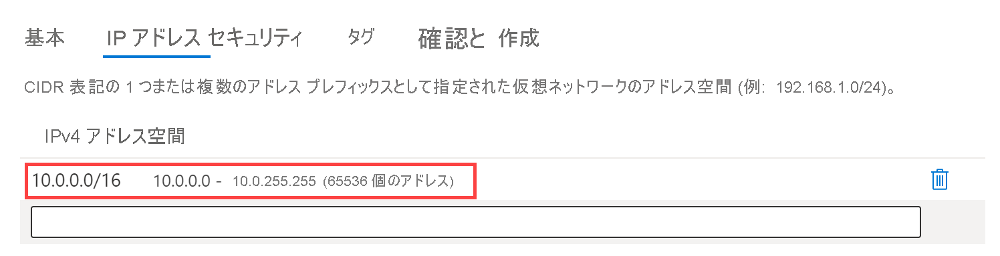
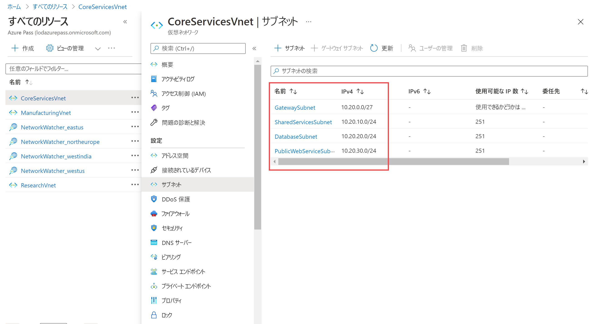

---
Exercise:
    title: 'M01-ユニット 4 Azure で仮想ネットワークを設計および実装する'
    module: 'モジュール - Azure 仮想ネットワークの概要'
---
# M01-ユニット 4 Azure で仮想ネットワークを設計および実装する

## 演習シナリオ 

これで、Azure portal に仮想ネットワークをデプロイする準備が整いました。

インフラストラクチャとアプリケーションを Azure に移行している架空の組織 Contoso Ltd, について考えてみます。ネットワーク エンジニアとしての役割では、3 つの仮想ネットワークとサブネットを計画および実装して、それらの仮想ネットワークのリソースをサポートする必要があります。

**CoreServicesVnet** 仮想ネットワークは、**米国東部**リージョンにデプロイします。この仮想ネットワークには、最も多くのリソースを配置します。VPN 接続を介してオンプレミス ネットワークに接続されます。このネットワークには、ビジネスの運営にとって重要な Web サービス、データベース、その他のシステムを配置します。ドメイン コントローラーや DNS などの共有サービスもここに配置されます。大きく成長することが見込まれるため、この仮想ネットワークには大きなアドレス空間が必要です。

**ManufacturingVnet** 仮想ネットワークは、組織の製造施設がある場所に近い**西ヨーロッパ** リージョンにデプロイされます。この仮想ネットワークには、製造施設の運用に使用するシステムが含まれます。組織では、システムでの温度などのデータの取得元として、多数の内部接続デバイスを予想しており、拡張できる IP アドレス空間が必要になります。

**ResearchVnet** 仮想ネットワークは、組織の研究開発チームがある場所に近い**アジア西部**リージョンにデプロイされます。研究開発チームは、この仮想ネットワークを使用します。チームのリソースのセットは小規模で安定しており、拡大することはないと予想されます。チームには、作業のための少数の仮想マシン用に少数の IP アドレスが必要です。

これから次のようなリソースを作成します。
 

| **仮想ネットワーク** | **リージョン**   | **仮想ネットワークのアドレス空間** | **サブネット**                | **サブネット**    |
| ------------------- | ------------ | --------------------------------- | ------------------------- | ------------- |
| CoreServicesVnet    | 米国東部      | 10.20.0.0/16                      |                           |               |
|                     |              |                                   | GatewaySubnet             | 10.20.0.0/27  |
|                     |              |                                   | SharedServicesSubnet      | 10.20.10.0/24 |
|                     |              |                                   | DatabaseSubnet            | 10.20.20.0/24 |
|                     |              |                                   | PublicWebServiceSubnet    | 10.20.30.0/24 |
| ManufacturingVnet   | 西ヨーロッパ  | 10.30.0.0/16                      |                           |               |
|                     |              |                                   | ManufacturingSystemSubnet | 10.30.10.0/24 |
|                     |              |                                   | SensorSubnet1             | 10.30.20.0/24 |
|                     |              |                                   | SensorSubnet2             | 10.30.21.0/24 |
|                     |              |                                   | SensorSubnet3             | 10.30.22.0/24 |
| ResearchVnet        |東南アジア| 10.40.0.0/16                      |                           |               |
|                     |              |                                   | ResearchSystemSubnet      | 10.40.0.0/24  |

これらの仮想ネットワークとサブネットは、既存のリソースに対応しながら、予想される成長にも対応できるような構造になっています。これらの仮想ネットワークとサブネットを作成して、ネットワーク インフラストラクチャの基盤を構築してみましょう。

この演習では、次のことを行います。

+ タスク 1: Contoso リソース グループを作成する
+ タスク 2: CoreServicesVnet 仮想ネットワークとサブネットを作成する
+ タスク 3: ManufacturingVnet 仮想ネットワークとサブネットを作成する
+ タスク 4: ResearchVnet 仮想ネットワークとサブネットを作成する
+ タスク 5: VNet とサブネットの作成を確認する

## タスク 1: Contoso リソース グループを作成する

1. [Azure portal](https://portal.azure.com/) に移動します。

2. ホーム ページの「**Azure サービス**」で、「**リソース グループ**」を選択します。  

3. 「リソース」グループで、「**+ 作成**」を選択します。

4. 次の表の情報を使用して、リソース グループを作成します。

| **タブ**         | **オプション**                                 | **値**            |
| --------------- | ------------------------------------------ | -------------------- |
| 基本          | リソース グループ                             | ContosoResourceGroup |
|                 | リージョン                                     | (米国) 米国東部         |
| タグ            | 変更は必要ありません                        |                      |
| Review + create | 設定を確認し、「**作成**」を選択します |                      |

5. 「リソース」グループで、**ContosoResourceGroup** がリストに表示されていることを確認します。

 

## タスク 2: CoreServicesVnet 仮想ネットワークとサブネットを作成する

1. Azure portal の「ホーム」ページで、「グローバル検索」バーに移動して、「**Virtual Networks**」を検索し、サービスの下で、仮想ネットワークを選択します。  
2. 「Virtual Network」ページで、「**作成**」を選択します。  
3. 次の表の情報を使用して、CoreServicesVnet 仮想ネットワークを作成します。  
   ‎

 

| **タブ**      | **オプション**         | **値**            |
| ------------ | ------------------ | -------------------- |
| 基本       | リソース グループ     | ContosoResourceGroup |
|              | 名前               | CoreServicesVnet     |
|              | リージョン             | (米国) 米国東部         |
| IP アドレス | IPv4 アドレス空間 | 10.20.0.0/16         |

 4. 次の表の情報を使用して、CoreServicesVnet サブネットを作成します。

 5. 各サブネットの作成を開始するには、「**+ サブネットの追加**」を選択します。各サブネットの作成を終了するには、「**追加**」を選択します。

| **サブネット**             | **オプション**           | **値**              |
| ---------------------- | -------------------- | ---------------------- |
| GatewaySubnet          | サブネット名          | GatewaySubnet          |
|                        | サブネット アドレス範囲 | 10.20.0.0/27           |
| SharedServicesSubnet   | サブネット名          | SharedServicesSubnet   |
|                        | サブネット アドレス範囲 | 10.20.10.0/24          |
| DatabaseSubnet         | サブネット名          | DatabaseSubnet         |
|                        | サブネット アドレス範囲 | 10.20.20.0/24          |
| PublicWebServiceSubnet | サブネット名          | PublicWebServiceSubnet |
|                        | サブネット アドレス範囲 | 10.20.30.0/24          |

 6. CoreServicesVnet とそれに関連するサブネットの作成を完了するには、「**Review + create**」を選択します。

 7. 構成が検証に合格したことを確認してから、「**作成**」を選択します。
 
 8. 以下の表に基づいて、VNet ごとに手順 1 〜 8 を繰り返します  

## タスク 3: ManufacturingVnet 仮想ネットワークとサブネットを作成する

| **タブ**      | **オプション**         | **値**             |
| ------------ | ------------------ | --------------------- |
| 基本       | リソース グループ     | ContosoResourceGroup  |
|              | 名前               | ManufacturingVnet     |
|              | リージョン             | (ヨーロッパ) 西ヨーロッパ  |
| IP アドレス | IPv4 アドレス空間 | 10.30.0.0/16          |

| **サブネット**                | **オプション**           | **値**                 |
| ------------------------- | -------------------- | ------------------------- |
| ManufacturingSystemSubnet | サブネット名          | ManufacturingSystemSubnet |
|                           | サブネット アドレス範囲 | 10.30.10.0/24             |
| SensorSubnet1             | サブネット名          | SensorSubnet1             |
|                           | サブネット アドレス範囲 | 10.30.20.0/24             |
| SensorSubnet2             | サブネット名          | SensorSubnet2             |
|                           | サブネット アドレス範囲 | 10.30.21.0/24             |
| SensorSubnet3             | サブネット名          | SensorSubnet3             |
|                           | サブネット アドレス範囲 | 10.30.22.0/24             |
 

## タスク 4: ResearchVnet 仮想ネットワークとサブネットを作成する

| **タブ**      | **オプション**         | **値**            |
| ------------ | ------------------ | -------------------- |
| 基本       | リソース グループ     | ContosoResourceGroup |
|              | 名前               | ResearchVnet         |
|              | リージョン             | 東南アジア       |
| IP アドレス | IPv4 アドレス空間 | 10.40.0.0/16         |

| **サブネット**           | **オプション**           | **値**            |
| -------------------- | -------------------- | -------------------- |
| ResearchSystemSubnet | サブネット名          | ResearchSystemSubnet |
|                      | サブネット アドレス範囲 | 10.40.0.0/24         |
 

## タスク 5: VNet とサブネットの作成を確認する

1. Azure portal のホーム ページで、「**すべてのリソース**」を選択します。

2. CoreServicesVnet、ManufacturingVnet、ResearchVnet がリストされていることを確認します。

3. Azure は、使用するリージョンごとに Network Watchers を作成することに注意してください。

4. 「**CoreServicesVnet**」を選択します。 

5. CoreServicesVnet の「**設定**」で、「**サブネット**」を選択します。

6. CoreServicesVnet | サブネットで、作成したサブネットがリストされていること、IP アドレスの範囲が正しいことを確認してください。

   

7. VNet ごとに手順 4 〜 6 を繰り返します。

お疲れさまでした! これで、リソース グループ、3 つの VNet、それらに関連付けられたサブネットが正常に作成されました。 
