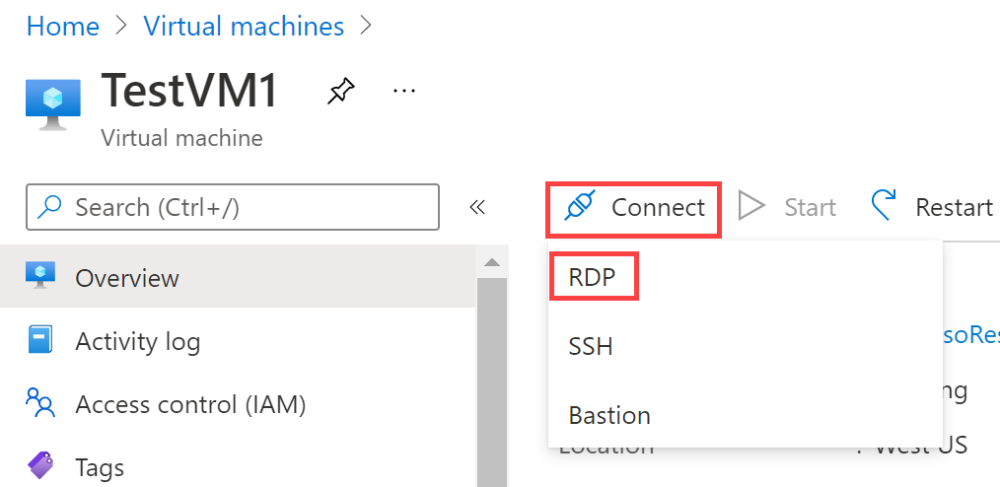

---
Exercise:
    title: 'M01-ユニット 6 Azure で DNS 設定を構成する'
    module: 'モジュール - Azure 仮想ネットワークの概要'
---

# M01 - ユニット 6 Azure で DNS 設定を構成する

## 演習シナリオ 
このユニットでは、Contoso Ltd の DNS 名前解決を構成します。contoso.com という名前のプライベート DNS ゾーンを作成し、登録と解決のために VNet をリンクしてから、2 つの仮想マシンを作成して構成をテストします。

この演習では、次のことを行います。

+ タスク 1: プライベート DNS ゾーンを作成する
+ タスク 2: 自動登録用のサブネットをリンクする
+ タスク 3: 仮想マシンを作成して構成をテストする
+ タスク 4: DNS ゾーンにレコードが存在することを確認する

## タスク 1: プライベート DNS ゾーンを作成する

1. [Azure Portal](https://portal.azure.com/) に移動します。

2. Azure ホーム ページの検索バーに「dns」と入力し、「**プライベート DNS ゾーン**」を選択します。  
   ‎

3. プライベート DNS ゾーンで、「**+ 作成**」を選択します。

4. 次の表の情報を使用して、プライベート DNS ゾーンを作成します。

| **タブ**         | **オプション**                             | **値**            |
| --------------- | -------------------------------------- | -------------------- |
| 基本          | リソース グループ                         | ContosoResourceGroup |
|                 | 名前                                   | Contoso.com          |
| タグ            | 変更は必要ありません                    |                      |
| Review + create | 設定を確認し、「作成」を選択します |                      |

5. デプロイが完了するまで待ってから、「**リソースに移動**」を選択します。

6. ゾーンが作成されたことを確認します。

## タスク 2: 自動登録用のサブネットをリンクする

1. Contoso.com の「**設定**」で、「**仮想ネットワーク リンク**」を選択します。

2. Contoso.com | 仮想ネットワーク リンクで、「**+ 追加**」を選択します。

3. 次の表の情報を使用して、仮想ネットワーク リンクを追加します。

| **オプション**                          | **値**                               |
| ----------------------------------- | --------------------------------------- |
| リンク名                           | CoreServicesVnetLink                    |
| サブスクリプション                        | 変更は必要ありません                     |
| 仮想ネットワーク                     | CoreServicesVnet (ContosoResourceGroup) |
| 自動登録を有効にする            | オン                                |
| 設定を確認し、「OK」を選択します |                                         |

4. 「**更新**」を選択します。

5. CoreServicesVnetLink が作成され、自動登録が有効になっていることを確認します。

6. 次の表の情報を使用して、ManufacturingVnet に対して手順 2 〜 5 を繰り返します。 

| **オプション**                          | **値**                                |
| ----------------------------------- | ---------------------------------------- |
| リンク名                           | ManufacturingVnetLink                    |
| サブスクリプション                        | 変更は必要ありません                      |
| 仮想ネットワーク                     | ManufacturingVnet (ContosoResourceGroup) |
| 自動登録を有効にする            | オン                                 |
| 設定を確認し、「OK」を選択します |                                          |

7. 「**更新**」を選択します。

8. ManufacturingVnetLink が作成され、自動登録が有効になっていることを確認します。

9. 次の表の情報を使用して、ResearchVnet に対して手順 2 〜 5 を繰り返します。 

| **オプション**                          | **値**                           |
| ----------------------------------- | ----------------------------------- |
| リンク名                           | ResearchVnetLink                    |
| サブスクリプション                        | 変更は必要ありません                 |
| 仮想ネットワーク                     | ResearchVnet (ContosoResourceGroup) |
| 自動登録を有効にする            | オン                            |
| 設定を確認し、「OK」を選択します |                                     |

10. 「**更新**」を選択します。

11. ResearchVnetLink が作成され、自動登録が有効になっていることを確認します。

 

##  タスク 3: 仮想マシンを作成して構成をテストする

このセクションでは、プライベート DNS ゾーン構成をテストするための 2 つのテスト VM を作成します。

### TestVM1 を作成する

1. Azure portal の「ホーム」ページで、グローバル検索を使用して、「**Virtual Networks**」と入力し、サービスの下で、仮想ネットワークを選択します。

2. 仮想マシンで、**「+ 作成」、「+ 仮想マシン」** を選択します。

3. 次の表の情報を使用して、最初の VM を作成します。

| **タブ**         | **オプション**                                                   | **値**                             |
| --------------- | ------------------------------------------------------------ | ------------------------------------- |
| 基本          | リソース グループ                                               | ContosoResourceGroup                  |
|                 | 仮想マシン名                                         | TestVM1                               |
|                 | リージョン                                                       | 米国東部                               |
|                 | 可用性オプション                                         | インフラストラクチャの冗長性は必要ありません |
|                 | イメージ                                                        | Windows Server 2022 Datacenter- Gen1  |
|                 | Azure Spot インスタンス                                          | 非選択                          |
|                 | サイズ                                                         | Standard_D2s_v3 - 2vcpus、8GiB メモリ |
|                 | ユーザー名                                                     | TestUser                              |
|                 | パスワード                                                     | TestPa$$w0rd!                         |
|                 | パブリック受信ポート                                         | 選択したポートを許可する                  |
|                 | 受信ポートの選択                                         | RDP (3389)                            |
| ディスク           | 変更は必要ありません                                          |                                       |
| ネットワーキング      | 仮想ネットワーク                                              | CoreServicesVnet                      |
|                 | サブネット                                                       | DatabaseSubnet (10.20.20.0/24)        |
|                 | パブリック IP                                                    | (新しい) TestVM1-ip                      |
|                 | NIC ネットワーク セキュリティ グループ                                   | Basic                                 |
|                 | パブリック受信ポート                                         | 選択したポートを許可する                  |
|                 | 受信ポートの選択                                         | RDP (3389)                            |
|                 | 負荷分散                                               | 非選択                          |
| 管理      | 変更は必要ありません                                          |                                       |
| 詳細        | 変更は必要ありません                                          |                                       |
| タグ            | 変更は必要ありません                                          |                                       |
| Review + create | 設定を確認し、「作成」を選択します                       |                                       |

4. デプロイの進行中に、TestVM2 の作成に進むことができます。

### TestVM2 を作成する

1. Azure portal の「ホーム」ページで、グローバル検索を使用して、「**Virtual Networks**」と入力し、サービスの下で、仮想ネットワークを選択します。

2. 仮想マシンで、**「+ 作成」、「+ 仮想マシン」** を選択します。

3. 次の表の情報を使用して、2 番目の VM を作成します。

| **タブ**         | **オプション**                                                   | **値**                             |
| --------------- | ------------------------------------------------------------ | ------------------------------------- |
| 基本          | リソース グループ                                               | ContosoResourceGroup                  |
|                 | 仮想マシン名                                         | TestVM2                               |
|                 | リージョン                                                       | 米国東部                               |
|                 | 可用性オプション                                         | インフラストラクチャの冗長性は必要ありません |
|                 | イメージ                                                        | Windows Server 2022 Datacenter- Gen1  |
|                 | Azure Spot インスタンス                                          | 非選択                          |
|                 | サイズ                                                         | Standard_D2s_v3 - 2vcpus、8GiB メモリ |
|                 | ユーザー名                                                     | TestUser                              |
|                 | パスワード                                                     | TestPa$$w0rd!                         |
|                 | パブリック受信ポート                                         | 選択したポートを許可する                  |
|                 | 受信ポートの選択                                         | RDP (3389)                            |
| ディスク           | 変更は必要ありません                                          |                                       |
| ネットワーキング      | 仮想ネットワーク                                              | CoreServicesVnet                      |
|                 | サブネット                                                       | DatabaseSubnet (10.20.20.0/24)        |
|                 | パブリック IP                                                    | (新しい) TestVM2-ip                      |
|                 | NIC ネットワーク セキュリティ グループ                                   | Basic                                 |
|                 | パブリック受信ポート                                         | 選択したポートを許可する                  |
|                 | 受信ポートの選択                                         | RDP (3389)                            |
|                 | 負荷分散                                               | 非選択                          |
| 管理      | 変更は必要ありません                                          |                                       |
| 詳細        | 変更は必要ありません                                          |                                       |
| タグ            | 変更は必要ありません                                          |                                       |
| Review + create | 設定を確認し、「**作成**」を選択します                   |                                       |

4. デプロイが完了したら、Azure portal のホーム ページに移動し、「**仮想マシン**」を選択します。

5. 両方の仮想マシンが作成されていることを確認します。

 

## タスク 4: DNS ゾーンにレコードが存在することを確認する

1. Azure portal のホーム ページで、「**プライベート DNS ゾーン**」を選択します。

2. プライベート DNS ゾーンで、「**contoso.com**」を選択します。

3. 次のように、両方の VM のホスト (A) レコードがリストされていることを確認します。

 

4. VM の名前と IP アドレスをメモします。

 

### RDP を使用してテスト VM に接続する

1. Azure portal のホーム ページで、「**仮想マシン**」を選択します。

2. 「**TestVM1**」を選択します。

3. TestVM1 で、**「接続」 &gt; 「RDP」** を選択します。

4. TestVM1 の | 「接続」で、「**RDP ファイルのダウンロード**」を選択します。

5. RDP ファイルをデスクトップに保存します。

6. Azure portal のホーム ページで、「**仮想マシン**」を選択します。

7. 「**TestVM2**」を選択します。

8. TestVM2 で、**「接続」 &gt; 「RDP」** を選択します。

9. TestVM2 の | 「接続」で、「**RDP ファイルのダウンロード**」を選択します。

10. RDP ファイルをデスクトップに保存します。

11. RDP ファイル、ユーザー名 **TestUser**、パスワード **TestPa$w0rd!** を使用して、TestVM1 に接続します。

12. RDP ファイル、ユーザー名 **TestUser**、パスワード **TestPa$w0rd!** を使用して、TestVM2 に接続します。

13. 両方の VM で、「**デバイスのプライバシー設定の選択**」で「**同意**」を選択します。

14. 両方の VM で、プロンプトが表示された場合は、「**ネットワーク**」で、「**はい**」を選択します。

15. TestVM1 で、コマンド プロンプトを開き、コマンド ipconfig/all を入力します。

16. IP アドレスが DNS ゾーンでメモしたものと同じであることを確認します。

17. コマンド ping TestVM2.contoso.com を入力します。

18. TestVM2 から 4 つの応答を受信することを確認します。

 

お疲れさまでした! プライベート DNS ゾーンを作成し、名前解決と自動登録リンクを追加し、構成で名前解決をテストしました。 
