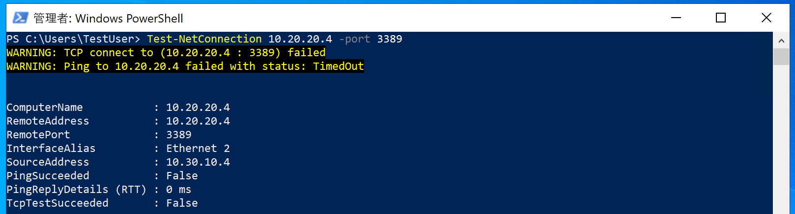
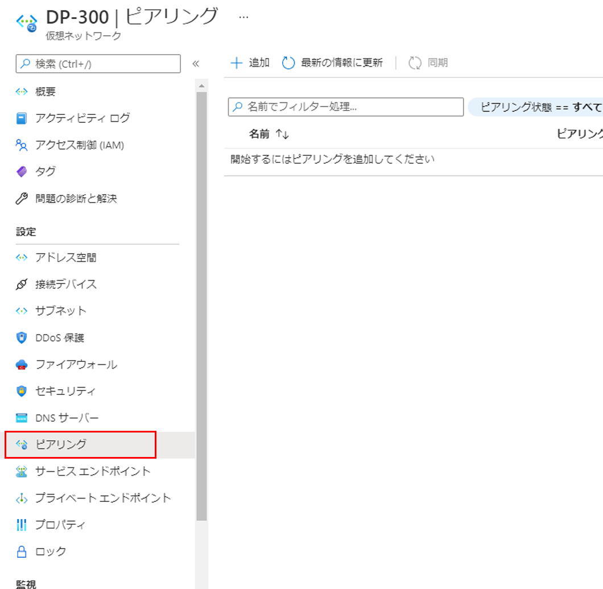

---
Exercise:
    title: 'M01-ユニット 8 グローバル仮想ネットワーク ピアリングを使用して 2 つの Azure 仮想ネットワークを接続する'
    module: 'モジュール - Azure 仮想ネットワークの概要'
---
# M01-ユニット 8 グローバル仮想ネットワーク ピアリングを使用して 2 つの Azure 仮想ネットワークを接続する

## 演習シナリオ 
このユニットでは、トラフィック フローを許可するピアリングを追加して、CoreServicesVnet と ManufacturingVnet 間の接続を構成します。 

このユニットでは、次のことを行います。

+ タスク 1: 仮想マシンを作成して構成をテストする
+ タスク 2: RDP を使用してテスト VM に接続する
+ タスク 3: VM 間の接続をテストする
+ タスク 4: CoreServicesVnet と ManufacturingVnet の間に VNet ピアリングを作成する
+ タスク 5: VM 間の接続をテストする
+ タスク 6: リソースをクリーン アップする

## タスク 1: 仮想マシンを作成して構成をテストする

このセクションでは、Manufacturing VNet 上にテスト VM を作成して、ManufacturingVnet から別の Azure 仮想ネットワーク内のリソースにアクセスできるかどうかをテストします。

### ManufacturingVM を作成する

1. Azure portal の「ホーム」ページで、グローバル検索を使用して、「**Virtual Networks**」と入力し、サービスの下で、仮想ネットワークを選択します。

2. 仮想マシンで、**「+ 作成」、「+ 仮想マシン」** を選択します。

3. 次の表の情報を使用して、VM を作成します。

| **タブ**         | **オプション**                                                   | **値**                             |
| --------------- | ------------------------------------------------------------ | ------------------------------------- |
| 基本          | リソース グループ                                               | ContosoResourceGroup                  |
|                 | 仮想マシン名                                         | ManufacturingVM                       |
|                 | リージョン                                                       | 西ヨーロッパ                           |
|                 | 可用性オプション                                         | インフラストラクチャの冗長性は必要ありません |
|                 | イメージ                                                        | Windows Server 2022 Datacenter- Gen1  |
|                 | Azure Spot インスタンス                                          | 非選択                          |
|                 | サイズ                                                         | Standard_D2s_v3 - 2vcpus、8GiB メモリ |
|                 | ユーザー名                                                     | TestUser                              |
|                 | パスワード                                                     | TestPa$$w0rd!                         |
|                 | パブリック受信ポート                                         | 選択したポートを許可する                  |
|                 | 受信ポートの選択                                         | RDP (3389)                            |
| ディスク           | 変更は必要ありません                                          |                                       |
| ネットワーキング      | 仮想ネットワーク                                              | ManufacturingVnet                     |
|                 | サブネット                                                       | ManufacturingSystemSubnet (10.30.10.0/24)|
|                 | パブリック IP                                                    | (新しい) ManufacturingVM-ip              |
|                 | NIC ネットワーク セキュリティ グループ                                   | Basic                                 |
|                 | パブリック受信ポート                                         | 選択したポートを許可する                  |
|                 | 受信ポートの選択                                         | RDP (3389)                            |
|                 | 負荷分散                                               | 非選択                          |
| 管理      | 変更は必要ありません                                          |                                       |
| 詳細        | 変更は必要ありません                                          |                                       |
| タグ            | 変更は必要ありません                                          |                                       |
| Review + create | 設定を確認し、「作成」を選択します                       |                                       |


4. デプロイが完了したら、**[リソースに移動]** を選択します。

## タスク 2: RDP を使用してテスト VM に接続する

1. Azure portal のホーム ページで、「**仮想マシン**」を選択します。

2. 「**ManufacturingVM**」を選択します。

3. ManufacturingVM で、**「接続」 &gt; 「RDP」** を選択します。

4. ManufacturingVM | 「接続」で、「**RDP ファイルのダウンロード**」を選択します。

5. RDP ファイルをデスクトップに保存します。

6. RDP ファイル、ユーザー名 **TestUser**、パスワード **TestPa$w0rd!** を使用して、ManufacturingVM に接続します。

7. Azure portal のホーム ページで、「**仮想マシン**」を選択します。

8. 「**TestVM1**」を選択します。

9. TestVM1 で、**「接続」 &gt; 「RDP」** を選択します。

10. TestVM1 の | 「接続」で、「**RDP ファイルのダウンロード**」を選択します。

11. RDP ファイルをデスクトップに保存します。

12. RDP ファイル、ユーザー名 **TestUser**、パスワード **TestPa$w0rd!** を使用して、TestVM1 に接続します。

13. 両方の VM で、「**デバイスのプライバシー設定の選択**」で「**同意**」を選択します。

14. 両方の VM の「**ネットワーク**」で、「**はい**」を選択します。

15. TestVM1 で、PowerShell プロンプトを開き、次のコマンド: ipconfig を実行します

16. IPv4 アドレスをメモします。 

 

## タスク 3: VM 間の接続をテストする

1. ManufacturingVM 上で PowerShell プロンプトを開きます。

2. 次のコマンドを使用して、CoreServicesVnet 上の TestVM1 への接続がないことを確認します。TestVM1 には必ず IPv4 アドレスを使用してください。

| PowerShell                               |
| ---------------------------------------- |
| Test-NetConnection 10.20.20.4 -port 3389 |


3. テスト接続が失敗するはずです。次のような結果が表示されます。
   

 

## タスク 4: CoreServicesVnet と ManufacturingVnet の間に VNet ピアリングを作成する

1. Azure ホーム ページで、「**仮想ネットワーク**」を選択してから、「**CoreServicesVnet**」を選択します。

2. CoreServicesVnet の「**設定**」で、「**ピアリング**」を選択します。
   

3. CoreServicesVnet の | 「ピアリング」で、「**+ 追加**」を選択します。

4. 次の表の情報を使用して、ピアリングを作成します。

| **セクション**                          | **オプション**                                    | **値**                             |
| ------------------------------------ | --------------------------------------------- | ------------------------------------- |
| この仮想ネットワーク                 |                                               |                                       |
|                                      | ピアリング リンク名                             | CoreServicesVnet-to-ManufacturingVnet |
|                                      | リモート バーチャル ネットワークのトラフィック             | 許可 (既定)                       |
|                                      | リモート バーチャル ネットワークから転送されたトラフィック | 許可 (既定)                       |
|                                      | 仮想ネットワーク ゲートウェイまたはルート サーバ       | なし (既定)                        |
| リモート 仮想ネットワーク               |                                               |                                       |
|                                      | ピアリング リンク名                             | ManufacturingVnet-to-CoreServicesVnet |
|                                      | バーチャル ネットワーク デプロイ モデル              | Resource Manager                      |
|                                      | リソース ID を知っている                         | 非選択                          |
|                                      | サブスクリプション                                  | MOC Subscription-lodxxxxxxxx          |
|                                      | 仮想ネットワーク                               | ManufacturingVnet                     |
|                                      | リモート バーチャル ネットワークのトラフィック             | 許可 (既定)                       |
|                                      | リモート バーチャル ネットワークから転送されたトラフィック | 許可 (既定)                       |
|                                      | 仮想ネットワーク ゲートウェイまたはルート サーバ       | なし (既定)                        |
| 設定を確認し、「追加」を選択します。 |                                               |                                       |
|                                      |                                               |                                       |


5. CoreServicesVnet の | 「ピアリング」で、**CoreServicesVnet-to-ManufacturingVnet** のピアリングが一覧表示されていることを確認します。

6. 「仮想ネットワーク」で、「**ManufacturingVnet**」を選択し、「**ManufacturingVnet-to-CoreServicesVnet**」ピアリングが一覧表示されていることを確認します。

 

## タスク 5: VM 間の接続をテストする

1. ManufacturingVM 上で PowerShell プロンプトを開きます。

2. 次のコマンドを使用して、CoreServicesVnet 上の TestVM1 への接続があることを確認します。 

| PowerShell                               |
| ---------------------------------------- |
| Test-NetConnection 10.20.20.4 -port 3389 |


3. テスト接続が成功すると、次のような結果が表示されます。
   

 

お疲れさまでした! ピアリングを追加することで、VNet 間の接続を正常に構成できました。 

## タスク 6: リソースをクリーン アップする

   > **注**: 新しく作成した Azure リソースのうち、使用しないリソースは必ず削除してください。使用しないリソースを削除しないと、予期しないコストが発生する場合があります。

1. Azure portal の **「Cloud Shell」** ウィンドウで **「PowerShell」** セッションを開きます。(必要に応じて、既定の設定を使用して、Cloud Shell ストレージを作成します。)

1. 次のコマンドを実行して、このモジュールのラボ全体で作成したすべてのリソース グループのリストを削除します。

   ```powershell
   Remove-AzResourceGroup -Name 'ContosoResourceGroup' -Force -AsJob
   ```

    > **注**: コマンドは非同期で実行されるので (-AsJob パラメーターによって決定されます)、別の PowerShell コマンドを同一 PowerShell セッション内ですぐに実行できますが、リソース グループが実際に削除されるまでに数分かかります。
