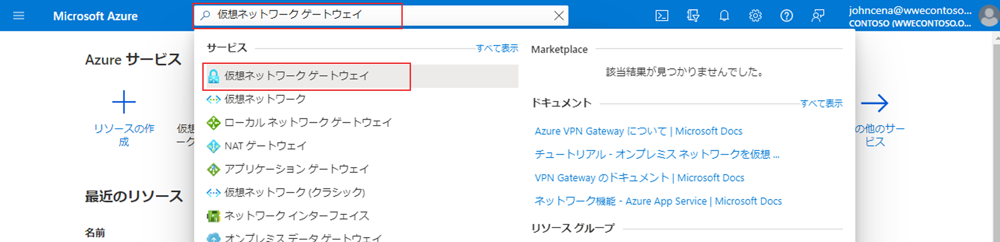
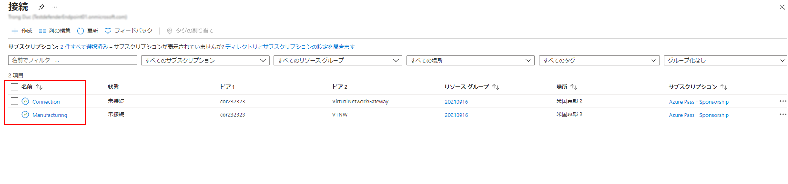

---
Exercise:
    title: 'M02-ユニット 3 仮想ネットワーク ゲートウェイを作成および構成する'
    module: 'モジュール - ハイブリッド ネットワークの設計と実装'
---


# M02-ユニット 3 仮想ネットワーク ゲートウェイを作成および構成する

この演習では、Contoso Core Services VNet と Manufacturing VNet を接続するように仮想ネットワーク ゲートウェイを構成します。 

この演習では、次のことを行います。

+ タスク 1: CoreServicesVnet and ManufacturingVnet を作成する
+ タスク 2: CoreServicesTestVM を作成する
+ タスク 3: ManufacturingTestVM を作成する
+ タスク 4: RDP を使用してテスト VM に接続する
+ タスク 5: VM 間の接続をテストする
+ タスク 6: CoreServicesVnet Gateway を作成する
+ タスク 7: ManufacturingVnet Gateway を作成する
+ タスク 8: CoreServicesVnet-to-ManufacturingVnet 
+ タスク 9: ManufacturingVnet を CoreServicesVnet に接続する
+ タスク 10: 接続が接続されていることを確認する 
+ タスク 11: VM 間の接続をテストする

## タスク 1: CoreServicesVnet and ManufacturingVnet を作成する

1. Azure portal の **「Cloud Shell」** ウィンドウで **「PowerShell」** セッションを開きます。

2. Cloud Shell ウィンドウのツールバーで、「ファイルのアップロード/ダウンロード」アイコンをクリックし、ドロップダウン メニューで「アップロード」をクリックして、次のファイル **azuredeploy.json** および **azuredeploy.parameters.json** を CloudShell ホーム ディレクトリにアップロードします。

3. 次の ARM テンプレートをデプロイして、この演習に必要な仮想ネットワークとサブネットを作成します。

   ```powershell
   $RGName = "ContosoResourceGroup"
   #create resource group if it doesnt exist
   New-AzResourceGroup -Name $RGName -Location East US
   New-AzResourceGroupDeployment -ResourceGroupName $RGName -TemplateFile azuredeploy.json -TemplateParameterFile azuredeploy.parameters.json
   ```

## タスク 2: CoreServicesTestVM を作成する

1. Azure portal の「ホーム」ページで、グローバル検索を使用して、「**Virtual Networks**」と入力し、サービスの下で、仮想ネットワークを選択します。

2. 仮想マシンで、**「+ 作成」、「+ 仮想マシン」** を選択します。

3. 次の表の情報を使用して、VM を作成します。

   | **タブ**         | **オプション**                                                   | **値**                             |
   | --------------- | ------------------------------------------------------------ | ------------------------------------- |
   | 基本          | リソース グループ                                               | ContosoResourceGroup                  |
   |                 | 仮想マシン名                                         | CoreServicesTestVM                    |
   |                 | リージョン                                                       | 米国東部                               |
   |                 | 可用性オプション                                         | インフラストラクチャの冗長性は必要ありません |
   |                 | イメージ                                                        | Windows Server 2022 Datacenter- Gen1  |
   |                 | Azure Spot インスタンス                                          | 非選択                          |
   |                 | サイズ                                                         | Standard_D2s_v3 - 2vcpus、8GiB メモリ |
   |                 | ユーザー名                                                     | TestUser                              |
   |                 | パスワード                                                     | TestPa$$w0rd!                         |
   |                 | パブリック受信ポート                                         | 選択したポートを許可する                  |
   |                 | 受信ポートの選択                                         | RDP (3389)                            |
   | ディスク           | 変更は必要ありません                                          |                                       |
   | ネットワーキング      | 仮想ネットワーク                                              | CoreServicesVnet                      |
   |                 | サブネット                                                       | DatabaseSubnet (10.20.20.0/24)        |
   |                 | パブリック IP                                                    | (新しい) CoreServicesTestVM-ip           |
   |                 | NIC ネットワーク セキュリティ グループ                                   | Basic                                 |
   |                 | パブリック受信ポート                                         | 選択したポートを許可する                  |
   |                 | 受信ポートの選択                                         | RDP (3389)                            |
   |                 | 負荷分散                                               | 非選択                          |
   | 管理      | 変更は必要ありません                                          |                                       |
   | 詳細        | 変更は必要ありません                                          |                                       |
   | タグ            | 変更は必要ありません                                          |                                       |
   | Review + create | 設定を確認し、「作成」を選択します                       |                                       |

4. デプロイが完了したら、**[リソースに移動]** を選択します。

## タスク 3: ManufacturingTestVM を作成する

1. Azure portal の「ホーム」ページで、グローバル検索を使用して、「**Virtual Networks**」と入力し、サービスの下で、仮想ネットワークを選択します。

2. 仮想マシンで、**「+ 作成」、「+ 仮想マシン」** を選択します。

3. 次の表の情報を使用して、VM を作成します。

   | **タブ**         | **オプション**                                                   | **値**                                 |
   | --------------- | ------------------------------------------------------------ | ----------------------------------------- |
   | 基本          | リソース グループ                                               | ContosoResourceGroup                      |
   |                 | 仮想マシン名                                         | ManufacturingTestVM                       |
   |                 | リージョン                                                       | 西ヨーロッパ                               |
   |                 | 可用性オプション                                         | インフラストラクチャの冗長性は必要ありません     |
   |                 | イメージ                                                        | Windows Server 2022 Datacenter- Gen1      |
   |                 | Azure Spot インスタンス                                          | 非選択                              |
   |                 | サイズ                                                         | Standard_D2s_v3 - 2vcpus、8GiB メモリ     |
   |                 | ユーザー名                                                     | TestUser                                  |
   |                 | パスワード                                                     | TestPa$$w0rd!                             |
   |                 | パブリック受信ポート                                         | 選択したポートを許可する                      |
   |                 | 受信ポートの選択                                         | RDP (3389)                                |
   | ディスク           | 変更は必要ありません                                          |                                           |
   | ネットワーキング      | 仮想ネットワーク                                              | ManufacturingVnet                         |
   |                 | サブネット                                                       | ManufacturingSystemSubnet (10.40.40.0/24) |
   |                 | パブリック IP                                                    | (新しい) ManufacturingTestVM-ip              |
   |                 | NIC ネットワーク セキュリティ グループ                                   | Basic                                     |
   |                 | パブリック受信ポート                                         | 選択したポートを許可する                      |
   |                 | 受信ポートの選択                                         | RDP (3389)                                |
   |                 | 負荷分散                                               | 非選択                              |
   | 管理      | 変更は必要ありません                                          |                                           |
   | 詳細        | 変更は必要ありません                                          |                                           |
   | タグ            | 変更は必要ありません                                          |                                           |
   | Review + create | 設定を確認し、「**作成**」を選択します                   |                                           |

4. デプロイが完了したら、**[リソースに移動]** を選択します。

## タスク 4: RDP を使用してテスト VM に接続する

1. Azure portal のホーム ページで、「**仮想マシン**」を選択します。
2. 「**ManufacturingTestVM**」を選択します。
3. 「**ManufacturingTestVM**」で、**「接続」 &gt; 「RDP」** を選択します。
4. 「**ManufacturingTestVM**」の **|** 「**接続**」で、「**RDP ファイルのダウンロード**」を選択します。
5. RDP ファイルをデスクトップに保存します。
6. RDP ファイル、ユーザー名 **TestUser**、パスワード **TestPa$w0rd!** を使用して、ManufacturingTestVM に接続します。
7. Azure portal のホーム ページで、「**仮想マシン**」を選択します。
8. 「**CoreServicesTestVM**」を選択します。
9. 「**CoreServicesTestVM**」で、**「接続」 &gt; 「RDP」** を選択します。
10. 「**CoreServicesTestVM**」の **|** 「**接続**」で、「**RDP ファイルのダウンロード**」を選択します。
11. RDP ファイルをデスクトップに保存します。
12. RDP ファイル、ユーザー名 **TestUser**、パスワード **TestPa$w0rd!** を使用して、CoreServicesTestVM に接続します。
13. 両方の VM で、「**デバイスのプライバシー設定の選択**」で「**同意**」を選択します。
14. 両方の VM の「**ネットワーク**」で、「**はい**」を選択します。
15. CoreServicesTestVM で、PowerShell プロンプトを開き、次のコマンド: ipconfig を実行します
16. IPv4 アドレスをメモします。 

 

## タスク 5: VM 間の接続をテストする

1. **ManufacturingTestVM** 上で PowerShell を開きます。

2. 次のコマンドを使用して、CoreServicesVnet 上の CoreServicesTestVM への接続がないことを確認します。CoreServicesTestVM には必ず IPv4 アドレスを使用してください。

   ```Powershell
   Test-NetConnection 10.20.20.4 -port 3389
   ```

3. テスト接続が失敗するはずです。次のような結果が表示されます。

   

 

##  タスク 6: CoreServicesVnet Gateway を作成する

1. 「**リソース、サービス、ドキュメントの検索 (G+/)」** で、「**仮想ネットワーク ゲートウェイ**」と入力し、結果から「**仮想ネットワーク ゲートウェイ**」を選択します。
   

2. 仮想ネットワーク ゲートウェイで、「**+ 作成**」を選択します。

3. 次の表の情報を使用して、仮想ネットワーク ゲートウェイを作成します。

   | **タブ**         | **セクション**       | **オプション**                                  | **値**                    |
   | --------------- | ----------------- | ------------------------------------------- | ---------------------------- |
   | 基本          | プロジェクトの詳細   | サブスクリプション                                | 変更は必要ありません          |
   |                 |                   | リソース グループ                               | ContosoResourceGroup         |
   |                 | インスタンスの詳細  | 名前                                        | CoreServicesVnetGateway      |
   |                 |                   | リージョン                                      | 米国東部                      |
   |                 |                   | ゲートウェイの種類                                | VPN                          |
   |                 |                   | VPN の種類                                    | ルート ベース                  |
   |                 |                   | SKU                                         | VpnGw1                       |
   |                 |                   | Generation                                  | Generation1                  |
   |                 |                   | 仮想ネットワーク                             | CoreServicesVnet             |
   |                 |                   | サブネット                                      | GatewaySubnet (10.20.0.0/27) |
   |                 | パブリック IP アドレス | パブリック IP アドレス                           | 新規作成                   |
   |                 |                   | パブリック IP アドレス名                      | CoreServicesVnetGateway-ip   |
   |                 |                   | パブリック IP アドレスの SKU                       | Basic                        |
   |                 |                   | アクティブ/アクティブ モードの有効化                   | 無効                     |
   |                 |                   | BGP を構成する                               | 無効                     |
   | Review + create |                   | 設定を確認し、「**作成**」を選択します。 |                              |

   > [!注] 
   >
   > 仮想ネットワーク ゲートウェイの作成には、最大で 45 分かかる場合があります。 

## タスク 7: ManufacturingVnet Gateway を作成する

1. 「**リソース、サービス、ドキュメントの検索 (G+/)」** で、「**仮想ネットワーク ゲートウェイ**」と入力し、結果から「**仮想ネットワーク ゲートウェイ**」を選択します。

2. 仮想ネットワーク ゲートウェイで、「**+ 作成**」を選択します。

3. 次の表の情報を使用して、仮想ネットワーク ゲートウェイを作成します。

   | **タブ**         | **セクション**       | **オプション**                                  | **値**                    |
   | --------------- | ----------------- | ------------------------------------------- | ---------------------------- |
   | 基本          | プロジェクトの詳細   | サブスクリプション                                | 変更は必要ありません          |
   |                 |                   | リソース グループ                               | ContosoResourceGroup         |
   |                 | インスタンスの詳細  | 名前                                        | ManufacturingVnetGateway     |
   |                 |                   | リージョン                                      | 西ヨーロッパ                  |
   |                 |                   | ゲートウェイの種類                                | VPN                          |
   |                 |                   | VPN の種類                                    | ルート ベース                  |
   |                 |                   | SKU                                         | VpnGw1                       |
   |                 |                   | Generation                                  | Generation1                  |
   |                 |                   | 仮想ネットワーク                             | ManufacturingVnet            |
   |                 |                   | サブネット                                      | GatewaySubnet (10.30.0.0/27) |
   |                 | パブリック IP アドレス | パブリック IP アドレス                           | 新規作成                   |
   |                 |                   | パブリック IP アドレス名                      | ManufacturingVnetGateway-ip  |
   |                 |                   | パブリック IP アドレスの SKU                       | Basic                        |
   |                 |                   | アクティブ/アクティブ モードの有効化                   | 無効                     |
   |                 |                   | BGP を構成する                               | 無効                     |
   | Review + create |                   | 設定を確認し、「**作成**」を選択します。 |                              |
   
   > [!注]
   >
   > 仮想ネットワーク ゲートウェイの作成には、最大で 45 分かかる場合があります。 

 

## タスク 8: CoreServicesVnet を ManufacturingVnet に接続する 

1. 「**リソース、サービス、ドキュメントの検索 (G+/)」** で、「**仮想ネットワーク ゲートウェイ**」と入力し、結果から「**仮想ネットワーク ゲートウェイ**」を選択します。

2. 仮想ネットワーク ゲートウェイで、「**CoreServicesVnetGateway**」を選択します。

3. CoreServicesGateway で、「**接続**」を選択してから、「**+ 追加**」を選択します。

   > [!注]
   >
   >  仮想ネットワーク ゲートウェイが完全に展開されるまで、この構成を完了することはできません。

4. 次の表の情報を使用して、接続を作成します。

   | **オプション**                     | **値**                         |
   | ------------------------------ | --------------------------------- |
   | 名前                           | CoreServicesGW-to-ManufacturingGW |
   | 接続の種類                | VNet-to-VNet                      |
   | 1 番目の仮想ネットワーク ゲートウェイ  | CoreServicesVnetGateway           |
   | 2 番目の仮想ネットワーク ゲートウェイ | ManufacturingVnetGateway          |
   | 共有キー (PSK)               | abc123                            |
   | Azure プライベート IP アドレスを使用する   | 非選択                      |
   | BGP を有効にする                     | 非選択                      |
   | IKE プロトコル                   | IKEv2                             |
   | サブスクリプション                   | 変更は必要ありません               |
   | リソース グループ                 | 変更は必要ありません               |
   | 場所                       | 米国東部                           |

5. 接続を作成するには、「**OK**」を選択します。
   

## タスク 9: ManufacturingVnet を CoreServicesVnet に接続する

1. 「**リソース、サービス、ドキュメントの検索 (G+/)」** で、「**仮想ネットワーク ゲートウェイ**」と入力し、結果から「**仮想ネットワーク ゲートウェイ**」を選択します。

2. 仮想ネットワーク ゲートウェイで、「**ManufacturingVnetGateway**」を選択します。

3. CoreServicesGateway で、「**接続**」を選択してから、「**+ 追加**」を選択します。

4. 次の表の情報を使用して、接続を作成します。

   | **オプション**                     | **値**                         |
   | ------------------------------ | --------------------------------- |
   | 名前                           | ManufacturingGW-to-CoreServicesGW |
   | 接続の種類                | VNet-to-VNet                      |
   | 1 番目の仮想ネットワーク ゲートウェイ  | ManufacturingVnetGateway          |
   | 2 番目の仮想ネットワーク ゲートウェイ | CoreServicesVnetGateway           |
   | 共有キー (PSK)               | abc123                            |
   | Azure プライベート IP アドレスを使用する   | 非選択                      |
   | BGP を有効にする                     | 非選択                      |
   | IKE プロトコル                   | IKEv2                             |
   | サブスクリプション                   | 変更は必要ありません               |
   | リソース グループ                 | 変更は必要ありません               |
   | 場所                       | 西ヨーロッパ                       |

5. 接続を作成するには、「**OK**」を選択します。

## タスク 10: 接続が接続されていることを確認する 

1. 「**リソース、サービス、ドキュメントの検索 (G+/)」** で、「**接続**」と入力し、結果から「**接続**」を選択します。

2. 両方の接続のステータスが「**接続済み**」になるまで待ちます。場合によっては、画面を更新する必要があります。 

   

 

## タスク 11: VM 間の接続をテストする

1. **ManufacturingTestVM** 上で PowerShell を開きます。

2. 次のコマンドを使用して、CoreServicesVnet 上の CoreServicesTestVM への接続があることを確認します。CoreServicesTestVM には必ず IPv4 アドレスを使用してください。

   ```Powershell
   Test-NetConnection 10.20.20.4 -port 3389
   ```

3. テスト接続が成功すると、次のような結果が表示されます。

   

 

お疲れさまでした! 仮想ネットワーク ゲートウェイを使用して、VNet-to-VNet 接続を構成しました。
