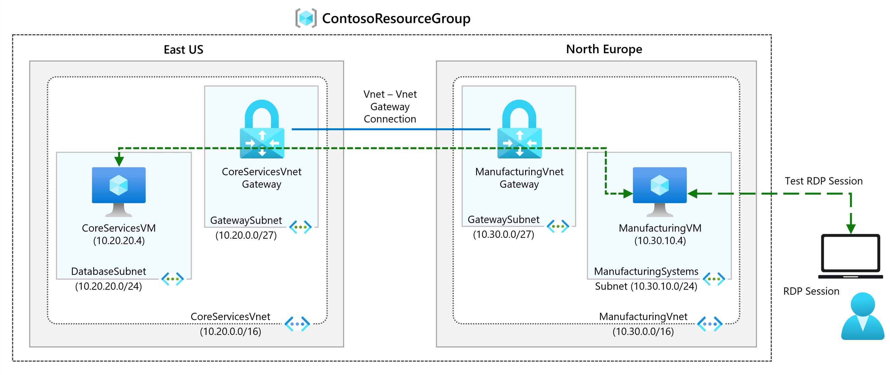
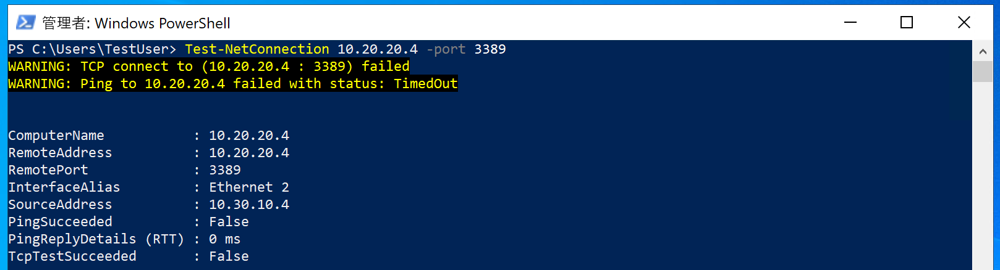
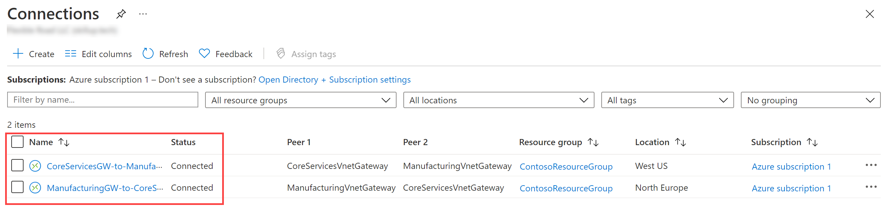
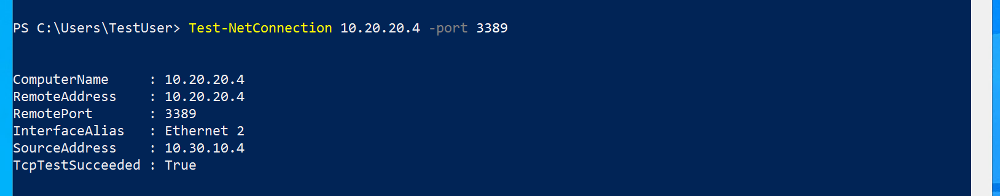

---
Exercise:
  title: M02 - ユニット 3 仮想ネットワーク ゲートウェイを作成および構成する
  module: Module 02 - Design and implement hybrid networking
  description: 仮想ネットワーク ゲートウェイを構成してテストします。
  duration: 70 minutes
  level: 400
  islab: true
---

# M02-ユニット 3 仮想ネットワーク ゲートウェイを作成および構成する

## 演習のシナリオ

この演習では、Contoso Core Services VNet と Manufacturing VNet を接続する仮想ネットワーク ゲートウェイを構成します。



## 推定時間: 70 分 (最大 45 分のデプロイ待機時間を含む)

## Azure リージョンの提供状況に関するメモ

リージョンの容量やクォータ制限によりデプロイが失敗した場合は、以下のガイドラインに従ってください。

+ 可能な限りラボの既定値を維持してください。
+ **[米国東部]** が利用できない場合は、影響を受ける CoreServices のリソースに近いバックアップ リージョン (例: **[米国東部 2]**、**[米国中部]**、または **[米国中南部]**) を利用してください。
+ 各仮想ネットワーク ゲートウェイは、その仮想ネットワークと同じリージョンのままにします。
+ ペアリングされたリソースは同じリージョン (VNet、VPN ゲートウェイ、パブリック IP、VM) に揃えておきます。
+ ゲートウェイ SKU の容量が利用不可である場合は、ラボで必須の設定を変更する前に、まず別の対応リージョンを試してみてください。

## 職務スキル

この演習では、以下のことを行います。

+ タスク 1: CoreServicesVnet と ManufacturingVnet を作成する
+ タスク 2:CoreServicesVM を作成する
+ タスク 3:ManufacturingVM を作成する
+ タスク 4:RDP を使用して VM に接続する
+ タスク 5: VM 間の接続をテストする
+ タスク 6: CoreServicesVnet ゲートウェイを作成する
+ タスク 7: ManufacturingVnet ゲートウェイを作成する
+ タスク 8:CoreServicesVnet を ManufacturingVnet に接続する
+ タスク 9: ManufacturingVnet を CoreServicesVnet に接続する
+ タスク 10: 接続が接続されていることを確認する
+ タスク 11: VM 間の接続をテストする


## タスク 1: CoreServicesVnet と ManufacturingVnet を作成する

1. Azure portal で、右上の [Cloud Shell] アイコンを選択します。 必要に応じて、シェルを構成します。  
    + **[PowerShell]** を選択します。
    + **[ストレージ アカウントは必要ありません]** と **[サブスクリプション]** を選択してから、**[適用]** を選択します。
    + ターミナルが作成され、プロンプトが表示されるまで待ちます。 

1. Cloud Shell 画面のツールバーで、**[ファイルの管理]** アイコンを選択し、ドロップダウン メニューで **[アップロード]** を選択して、**azuredeploy.json** と **azuredeploy.parameters.json** というファイルを Cloud Shell のホーム ディレクトリにアップロードします。

  >注: 自分のサブスクリプションで作業している場合、[テンプレート ファイル](https://github.com/MicrosoftLearning/AZ-700-Designing-and-Implementing-Microsoft-Azure-Networking-Solutions/tree/master/Allfiles/Exercises)は GitHub ラボ リポジトリで入手できます。

1. 次の ARM テンプレートをデプロイして、この演習に必要な仮想ネットワークとサブネットを作成します。

   ```powershell
   $RGName = "ContosoResourceGroup"
   #create resource group if it doesnt exist
   New-AzResourceGroup -Name $RGName -Location "eastus"
   New-AzResourceGroupDeployment -ResourceGroupName $RGName -TemplateFile azuredeploy.json -TemplateParameterFile azuredeploy.parameters.json
   ```
1. ポータルでは、3 つの仮想ネットワークが作成されたことを確認できます。
   
## タスク 2:CoreServicesVM を作成する

1. Azure portal の **[Cloud Shell]** ペイン内で **PowerShell** セッションを開きます。

1. Cloud Shell 画面のツール バーで、**[ファイルの管理]** アイコンを選択し、ドロップダウン メニューで **[アップロード]** を選択して、**CoreServicesVMazuredeploy.json** ファイルと **CoreServicesVMazuredeploy.parameters.json** ファイルを、ソース フォルダー **F:\Allfiles\Exercises\M02** から Cloud Shell のホーム ディレクトリに 1 つずつアップロードします。

1. 次の ARM テンプレートをデプロイして、この演習に必要な VM を作成します。

   >**注**: 管理者パスワードを入力するように求められます。 このパスワードは、演習の後半で必要になります。 

   ```powershell
   $RGName = "ContosoResourceGroup"
   
   New-AzResourceGroupDeployment -ResourceGroupName $RGName -TemplateFile CoreServicesVMazuredeploy.json -TemplateParameterFile CoreServicesVMazuredeploy.parameters.json
   ```
  
1. デプロイが完了したら、Azure portal のホーム ページに移動し、**[仮想マシン]** を選択します。

1. 仮想マシンが作成されていることを確認してください。

## タスク 3:ManufacturingVM を作成する

1. Azure portal の **[Cloud Shell]** ペイン内で **PowerShell** セッションを開きます。

1. Cloud Shell 画面のツール バーで、**[ファイルの管理]** アイコンを選択し、ドロップダウン メニューで **[アップロード]** を選択して、**ManufacturingVMazuredeploy.json** ファイルと **ManufacturingVMazuredeploy.parameters.json** ファイルを、ソース フォルダー **F:\Allfiles\Exercises\M02** から Cloud Shell のホーム ディレクトリに 1 つずつアップロードします。

  >注: 自分のサブスクリプションで作業している場合、[テンプレート ファイル](https://github.com/MicrosoftLearning/AZ-700-Designing-and-Implementing-Microsoft-Azure-Networking-Solutions/tree/master/Allfiles/Exercises)は GitHub ラボ リポジトリで入手できます。

1. 次の ARM テンプレートをデプロイして、この演習に必要な VM を作成します。

   >**注意**: 管理者パスワードの入力を求められます。このパスワードは次のタスクで必要になります。

   ```powershell
   $RGName = "ContosoResourceGroup"
   
   New-AzResourceGroupDeployment -ResourceGroupName $RGName -TemplateFile ManufacturingVMazuredeploy.json -TemplateParameterFile ManufacturingVMazuredeploy.parameters.json
   ```
  
1. デプロイが完了したら、Azure portal のホーム ページに移動し、**[仮想マシン]** を選択します。

1. 仮想マシンが作成されていることを確認してください。

## タスク 4: RDP を使って VM に接続する

1. Azure portal のホーム ページで、「**仮想マシン**」を選択します。

1. **ManufacturingVM** を選択します。

1. **ManufacturingVM** で、**[接続]** を選択してから **[接続]** を選択します。

1. **[RDP ファイルのダウンロード]** を選択します。

1. RDP ファイルをデスクトップに保存します。

1. RDP ファイル、およびデプロイ時に指定したユーザー名 **TestUser** とパスワードを使って、**ManufacturingVM** に接続します。 接続後、RDP セッションを最小化します。

1. Azure portal のホーム ページで、「**仮想マシン**」を選択します。

1. **[CoreServicesVM]** を選択します。

1. **[CoreServicesVM]** で **[接続]** を選択します。 **[接続]** ページで、**[ネイティブ RDP]** カード (**[最も人気]** および **[ローカル コンピューター]** とマーク) を選択します。

1. **[RDP ファイルのダウンロード]** を選択します。

1. RDP ファイルをデスクトップに保存します。

1. RDP ファイル、およびデプロイ時に指定したユーザー名 **TestUser** とパスワードを使って、**CoreServicesVM** に接続します。

1. 両方の VM で、**[デバイスのプライバシー設定の選択]** の **[同意する]** を選択します。

1. 両方の VM で、**[ネットワーク]** の **[はい]** を選択します。

1. **CoreServicesVM** で PowerShell を開き、次のコマンドを実行します: ipconfig

1. IPv4 アドレスをメモします。

## タスク 5: VM 間の接続をテストする

1. **ManufacturingVM** で、PowerShell を開きます。

1. 次のコマンドを使用して、CoreServicesVnet に CoreServicesVM への接続がないことを確認します。 CoreServicesVM には必ず IPv4 アドレスを使用してください。

   ```Powershell
   Test-NetConnection 10.20.20.4 -port 3389
   ```

1. テスト接続が失敗すると、次のような結果が表示されます。

   

## タスク 6: CoreServicesVnet ゲートウェイを作成する

1. Azure portal で「**ハイブリッド接続**」を検索して選択します。

1. [ハイブリッド接続] ページの左メニューで **[VPN Gateway]** を展開し、**[VPN ゲートウェイ]** を選択します。

1. [VPN ゲートウェイ] ページで、**[+ 作成]** を選択します。

1. 次の表の情報を使用して、仮想ネットワーク ゲートウェイを作成します。

   >**注**: Azure portal の SKU、Gen、アクティブ/アクティブ モード、BGP のデフォルト設定が変更されています。 これらの値は必ず下の表に合わせてデフォルトから変更してください。

   | **Tab**         | **セクション**       | **オプション**                                  | **Value**                    |
   | --------------- | ----------------- | ------------------------------------------- | ---------------------------- |
   | 基本          | プロジェクトの詳細   | サブスクリプション                                | 変更は必要ありません          |
   |                 |                   | ResourceGroup                               | ContosoResourceGroup         |
   |                 | インスタンスの詳細  | 名前                                        | CoreServicesVnetGateway      |
   |                 |                   | リージョン                                      | 米国東部                      |
   |                 |                   | ゲートウェイの種類                                | VPN                          |
   |                 |                   | SKU                                         | VpnGw1AZ                       |
   |                 |                   | Generation                                  | Generation1                  |
   |                 |                   | 仮想ネットワーク                             | CoreServicesVnet             |
   |                 |                   | Subnet                                      | GatewaySubnet (10.20.0.0/27) |
   |                 |                   | パブリック IP アドレスの種類                      | Standard                     |
   |                 | パブリック IP アドレス | パブリック IP アドレス                           | 新規作成                   |
   |                 |                   | パブリック IP アドレス名                      | CoreServicesVnetGateway-ip   |
   |                 |                   | アクティブ/アクティブ モードの有効化                   | 無効                     |
   |                 |                   | BGP の構成                               | 無効                     |
   | [確認および作成] |                   | 設定を確認し、 **[作成]** を選択します。 |                              |

   >**注**: 仮想ネットワーク ゲートウェイの作成には、最大で 15 分から 30 分かかる場合があります。 デプロイが完了するまで待機する必要はありません。 次のゲートウェイの作成に進みます。 

## タスク 7: ManufacturingVnet ゲートウェイを作成する

### GatewaySubnet を作成します

   >**注:** テンプレートによって、CoreServicesVnet の GatewaySubnet が作成されました。 ここでは、手動でサブネットを作成します。 

1. **ManufacturingVnet** を検索して選択します。

1. **[設定]** ブレードで、**[サブネット]** を選択し、**[+ サブネット]** を選択します。 

    | パラメーター | 値 |
    | --------------- | ----------------- | 
    | サブネットの目的 | **仮想ネットワーク ゲートウェイ** |
    | サイズ | **/27 (32 個のアドレス)** |

1. **[追加]** を選択します。 

### 仮想ネットワーク ゲートウェイを作成する

1. Azure portal で「**ハイブリッド接続**」を検索して選択します。

1. [ハイブリッド接続] ページの左メニューで **[VPN Gateway]** を展開し、**[VPN ゲートウェイ]** を選択します。

1. [VPN ゲートウェイ] ページで、**[+ 作成]** を選択します。

1. この情報と **[設定]** タブを使用して、仮想ネットワーク ゲートウェイを作成します。 

   >**注**: Azure portal の SKU、Gen、アクティブ/アクティブ モード、BGP のデフォルト設定が変更されています。 これらの値は必ず下の表に合わせてデフォルトから変更してください。

   | **Tab**         | **セクション**       | **オプション**                                  | **Value**                    |
   | --------------- | ----------------- | ------------------------------------------- | ---------------------------- |
   | 基本          | プロジェクトの詳細   | サブスクリプション                                | 変更は必要ありません          |
   |                 |                   | ResourceGroup                               | ContosoResourceGroup         |
   |                 | インスタンスの詳細  | Name                                        | ManufacturingVnetGateway     |
   |                 |                   | リージョン                                      | 西ヨーロッパ                  |
   |                 |                   | ゲートウェイの種類                                | VPN                          |
   |                 |                   | SKU                                         | VpnGw1AZ                     |
   |                 |                   | Generation                                  | Generation1                  |
   |                 |                   | 仮想ネットワーク                             | ManufacturingVnet            |
   |                 |                   | Subnet                                      | GatewaySubnet |
   |                 |                   | パブリック IP アドレスの種類                      | Standard                     |
   |                 | パブリック IP アドレス | パブリック IP アドレス                           | 新規作成                   |
   |                 |                   | パブリック IP アドレス名                      | ManufacturingVnetGateway-ip  |
   |                 |                   | アクティブ/アクティブ モードの有効化                   | 無効                     |
   |                 |                   | BGP の構成                               | 無効                     |
   | [確認および作成] |                   | 設定を確認し、 **[作成]** を選択します。 |                              |

   >**注**: 仮想ネットワーク ゲートウェイの作成には、最大で 15 分から 30 分かかる場合があります。

## タスク 8: CoreServicesVnet から ManufacturingVnet に接続する

1. Azure portal で「**ハイブリッド接続**」を検索して選択します。

1. [ハイブリッド接続] ページの左メニューで **[VPN Gateway]** を展開し、**[VPN ゲートウェイ]** を選択します。

1. VPN ゲートウェイ一覧で、**[CoreServicesVnetGateway]** を選択します。

1. CoreServicesGateway で、**[接続]** を選択し、**[+ 追加]** を選択します。

   >**注**: 仮想ネットワーク ゲートウェイが完全にデプロイされるまで、この構成を完了することはできません。

1. この情報と **[設定]** タブを使用して、仮想ネットワーク ゲートウェイを作成します。 


   | **オプション**                     | **Value**                         |
   | ------------------------------ | --------------------------------- |
   | 名前                           | CoreServicesGW-to-ManufacturingGW |
   | 接続の種類                | VNet 間                      |
   | リージョン                         | 米国東部                           |
   | 最初の仮想ネットワーク ゲートウェイ  | CoreServicesVnetGateway           |
   | 2 番目の仮想ネットワーク ゲートウェイ | ManufacturingVnetGateway          |
   | 共有キー (PSK)               | abc123                            |
   | Azure プライベート IP アドレスを使用します。   | オフ                      |
   | BGP を有効にする                     | オフ                      |
   | IKE プロトコル                   | IKEv2                             |
   | サブスクリプション                   | 変更は必要ありません               |
   | Resource group                 | 変更は必要ありません               |


1. 接続を作成するには、**[確認と作成]** を選択し、**[作成]** を選択します。

## タスク 9: ManufacturingVnet を CoreServicesVnet に接続する

1. Azure portal で「**ハイブリッド接続**」を検索して選択します。

1. [ハイブリッド接続] ページの左メニューで **[VPN Gateway]** を展開し、**[VPN ゲートウェイ]** を選択します。

1. VPN ゲートウェイ一覧で、**[ManufacturingVnetGateway]** を選択します。

1. CoreServicesGateway で、**[接続]** を選択し、**[+ 追加]** を選択します。

1. 次の表の情報を使用して、接続を作成します。

   | **オプション**                     | **Value**                         |
   | ------------------------------ | --------------------------------- |
   | 名前                           | ManufacturingGW-to-CoreServicesGW |
   | 接続の種類                | VNet 間                      |
   | Location                       | 西ヨーロッパ                      |
   | 最初の仮想ネットワーク ゲートウェイ  | ManufacturingVnetGateway          |
   | 2 番目の仮想ネットワーク ゲートウェイ | CoreServicesVnetGateway           |
   | 共有キー (PSK)               | abc123                            |
   | Azure プライベート IP アドレスを使用します。   | オフ                      |
   | BGP を有効にする                     | オフ                      |
   | IKE プロトコル                   | IKEv2                             |
   | サブスクリプション                   | 変更は必要ありません               |
   | Resource group                 | 変更は必要ありません               |


1. 接続を作成するには、**[確認と作成]** を選択し、**[作成]** を選択します。

## タスク 10: 接続が接続されていることを確認する

1. **[リソース、サービス、ドキュメント (G+/) の検索]** で、「**VPN**」を入力し、結果から **[接続]** を選択します。

1. 両方の接続の状態が **[接続済み]** になるまで待ちます。 場合によっては、スクリーンを更新する必要があります。

   

## タスク 11: VM 間の接続をテストする

1. **ManufacturingVM** で、PowerShell を開きます。

1. 次のコマンドを使用して、CoreServicesVnet に CoreServicesVM への接続が確立されたことを確認します。 CoreServicesVM には必ず IPv4 アドレスを使用してください。

   ```Powershell
   Test-NetConnection 10.20.20.4 -port 3389
   ```

1. テスト接続が成功すると、次のような結果が表示されます。

   

1. リモート デスクトップ接続のウィンドウを閉じます。

## Copilot を使用して学習を拡張する

Copilot は、Azure スクリプト ツールの使用方法を学習するのに役立ちます。 Copilot は、ラボでは対象外の、またはさらに詳しい情報が必要な領域でも役立ちます。 Edge ブラウザーを開き、Copilot (右上) を選択するか、*copilot.microsoft.com* に移動します。 次のプロンプトを試すには数分かかります。
+ Azure VPN ゲートウェイの主な種類は何ですか? また、それぞれの種類を使用する理由は何ですか?
+ Azure VPN ゲートウェイ SKU を選択する場合、どのような要因を考慮する必要がありますか? 例を示してください。
+ Azure VPN ゲートウェイに付随するコストはありますか?


## 自習トレーニングでさらに学習する

+ [Azure VPN Gateway の概要](https://learn.microsoft.com/training/modules/intro-to-azure-vpn-gateway/)。 このモジュールでは、Azure VPN Gateway の機能とそのしくみ、また、組織のニーズを満たすソリューションとして Azure VPN Gateway を使用することを選択すべきなのはどのような場合かについて説明します。
+ [Microsoft Azure での VPN ゲートウェイのトラブルシューティング](https://learn.microsoft.com/training/modules/troubleshoot-vpn-gateways/)。 このモジュールでは、サイト間 VPN とポイント対サイト VPN の監視とトラブルシューティングの方法について説明しています。

## 要点

以上でラボは完了です。 このラボの要点は次のとおりです。 

+ Azure VPN Gateway は、オンプレミス ネットワークと Azure 仮想ネットワークの間のセキュリティで保護された接続を提供するサービスです。
+ サイト間 (S2S) 接続は、IPsec/IKE VPN トンネルを使用してオンプレミス ネットワークを Azure 仮想ネットワークに接続します。 ハイブリッド クラウドのシナリオに最適です。
+ ポイント対サイト (P2S) 接続は、リモートの場所から個々のクライアントを Azure 仮想ネットワークに接続します。 VPN プロトコルは、OpenVPN、IKEv2、SSTP などです。 リモート ワーカーに便利です。
+ VNet 間接続は、IPsec/IKE VPN トンネルを使用して 2 つ以上の Azure 仮想ネットワークを接続します。 マルチリージョンまたはマルチ VNet のデプロイに適しています。
+ さまざまな VPN Gateway SKU で、さまざまなレベルのパフォーマンス、スループット、機能が提供されます。 

