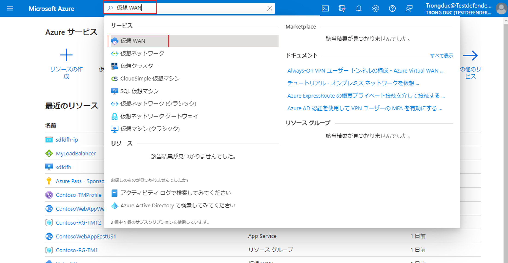
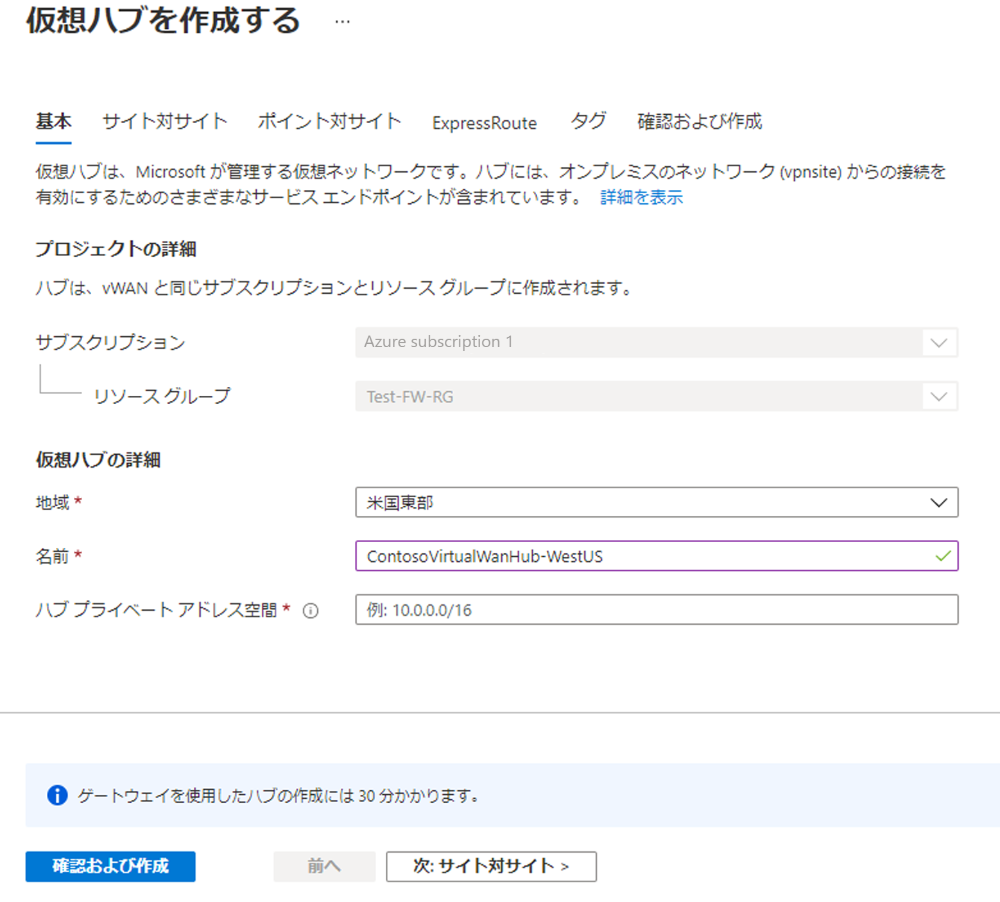

---
Exercise:
    title: 'M02-ユニット 7 Azure portal を使用して仮想 WAN を作成する'
    module: 'モジュール - ハイブリッド ネットワークの設計と実装'
---

# M02-ユニット 7 Azure portal を使用して仮想 WAN を作成する


この演習では、Contoso 用の仮想 WAN を作成します。

この演習では、次のことを行います。

+ タスク 1: Virtual WAN を作成する
+ タスク 2: Azure portal を使用してハブを作成する
+ タスク 3: VNet を仮想ハブに接続する
+ タスク 4: リソースをクリーン アップする


## タスク 1: Virtual WAN を作成する

1. ブラウザーから Azure portal に移動し、Azure アカウントでサインインします。

2. ポータルで、検索ボックスに「仮想 WAN」と入力し、結果一覧から「**仮想 WAN**」を選択します。

   

 

3. 「仮想 WAN」ページで「**+ 作成**」を選択します。 

4. 「WAN の作成」ページの「**基本**」タブで、次のフィールドに入力します。

   - **サブスクリプション:** 既存のサブスクリプションを使用する

   - **リソース グループ:** ContosoResourceGroup

   - **リソース グループの場所:** ドロップダウンからリソースの場所を選択します。WAN はグローバルなリソースであり、特定のリージョンに存在するものではありません。ただし、作成した WAN リソースを管理および検索するために、リージョンを選択する必要があります。

   - **名前:** ContosoVirtualWAN

   - **種類:** Standard 

5. フィールドへの入力を完了したら、「**Review + create**」を選択します。

6. 検証に合格したら、「**作成**」を選択して仮想 WAN を作成します。

## タスク 2: Azure portal を使用してハブを作成する

ハブには、サイト間、ExpressRoute、またはポイントツーサイト機能のゲートウェイが含まれています。仮想ハブ内にサイト間 VPN ゲートウェイを作成するには 30 分かかります。ハブを作成する前に、仮想 WAN を作成する必要があります。

1. 作成した仮想 WAN を探します。 
2. 「仮想 WAN」ページの「**接続**」で、「**ハブ**」を選択します。
3. 「ハブ」ページで、「**+ 新しいハブ**」を選択して「仮想ハブを作成する」ページを開きます。
   
4. 「仮想ハブを作成する」ページの「**基本**」タブで、次のフィールドを入力します。
   - **リージョン:** 米国西部
   - **名前:** ContosoVirtualWANHub-WestUS
   - **ハブのプライベート アドレス空間:** 10.60.0.0/24
5. 「**次へ: サイト間**」を選択します。
6. 「**サイト間**」タブで、次のフィールドを入力します。
   - **サイト間 (VPN ゲートウェイ) を作成しますか?:** はい
   - 「**AS 番号**」フィールドは編集できません。
   - **ゲートウェイのスケール ユニット:** 1 つのスケール ユニット = 500 Mbps
7. 「**Review + create**」を選択して検証します。
8. 「**作成**」を選択してハブを作成します。 
9. 30 分後に「**更新**」を実行して、「ハブ」ページでハブを確認します。 

## タスク 3: VNet を仮想ハブに接続する

1. 作成した仮想 WAN を探します。 

2. ContosoVirtualWAN、「**接続**」で、「**仮想ネットワーク接続**」を選択します。

   

3. ContosoVirtualWAN の | 「仮想ネットワーク接続」で、「**+ 接続の追加**」を選択します。

4. 「接続の追加」で、次の情報を使用して接続を作成します。

   - **接続名:** ContosoVirtualWAN-to-ResearchVNet

   - **ハブ:** ContosoVirtualWANHub-WestUS

   - **サブスクリプション:** 変更なし

   - **リソース グループ：** ContosoResourceGroup

   - **仮想ネットワーク:** ResearchVNet

   - **伝播しない:** はい

   - **ルート テーブルを関連付ける:** 既定

5. **「作成」** を選択します。

 

お疲れさまでした! 仮想 WAN と仮想 WAN ハブを作成し、ResearchVNet をハブに接続しました。

## タスク 4: リソースをクリーン アップする

   > **注**: 新しく作成した Azure リソースのうち、使用しないリソースは必ず削除してください。使用しないリソースを削除しないと、予期しないコストが発生する場合があります。

1. Azure portal の **「Cloud Shell」** ウィンドウで **「PowerShell」** セッションを開きます。

1. 次のコマンドを実行して、このモジュールのラボ全体で作成したすべてのリソース グループのリストを削除します。

   ```powershell
   Remove-AzResourceGroup -Name 'ContosoResourceGroup' -Force -AsJob
   ```

    > **注**: コマンドは非同期で実行されるので (-AsJob パラメーターによって決定されます)、別の PowerShell コマンドを同一 PowerShell セッション内ですぐに実行できますが、リソース グループが実際に削除されるまでに数分かかります。
