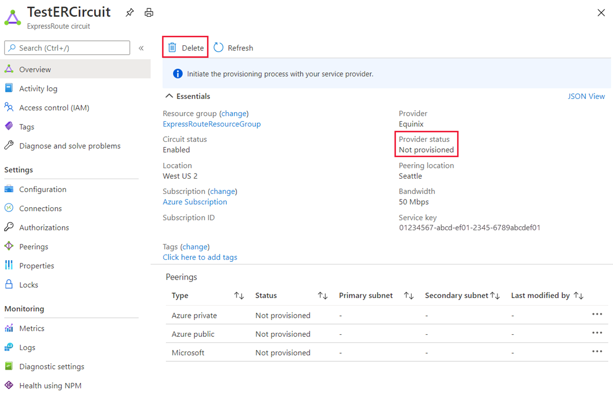

---
Exercise:
  title: M03 - ユニット 5 ExpressRoute 回線のプロビジョニング
  module: Module 03 - Design and implement Azure ExpressRoute
---
# M03-ユニット 5 ExpressRoute 回線のプロビジョニング

## 演習のシナリオ

この演習では、Azure portal と Azure Resource Manager デプロイ モデルを使用して、ExpressRoute 回線を作成します。

### 対話型ラボ シミュレーション

>**注**: 以前提供されていたラボ シミュレーションは廃止されました。

### 推定時間:15 分


### 職務スキル

この演習では、次のことを行います。

+ タスク 1: ExpressRoute 回線を作成してプロビジョニングする
+ タスク 2: サービス キーを取得する
+ タスク 3: ExpressRoute 回線をプロビジョニング解除する


## タスク 1: ExpressRoute 回線を作成してプロビジョニングする

1. ブラウザーから [Azure ポータル](https://portal.azure.com/) に移動し、Azure アカウントでサインインします。

   >**重要**: ExpressRoute 回路の課金は、サービス キーが発行されたときから始まります。 接続プロバイダーが回線をプロビジョニングする準備ができたら、この操作を実行します。

1. Azure portal メニューで、**ExpressRoute 回線**を検索して選択します。

1. **[ExpressRoute の作成]** ページで、**[リソース グループ]** を `ExpressRouteResourceGroup` として指定します。 次に、**[回復性]** で **[標準の回復性]** を選択します。

1. ***回線の詳細**について、正しい場所 (**[East US 2]**)、回線名 (**[TestERCircuit]**)、ピアリングの場所 (**[Seattle]**)、プロバイダー (**[Equinix]**)、帯域幅 (**[50 Mbps]**)、SKU レベル (**[Standard]**) およびデータ計測課金モデル (**[従量制課金]**) になっていることを確認します。

1. **[確認および作成]** を選択します。

1. ExpressRoute の構成が検証に合格することを確認してから、 **[作成]** を選択します。

![Azure portal - [ExpressRoute の作成] の [構成] タブ](../media/expressroute-create-configuration2.png)

+ [ポートの種類] により、サービス プロバイダーに接続するか、またはピアリングの場所で Microsoft のグローバル ネットワークに直接接続するかが決まります。
+ [新規作成またはクラシックからインポート] では、新しい回線を作成するか、従来の回線を Azure Resource Manager に移行するかを指定します。
+ [プロバイダー] は、サービスの要求先となるインターネット サービス プロバイダーです。
+ ピアリングの場所とは、Microsoft とピアリングしている物理的な場所です。

> [!Important]
>
> ピアリングの場所は、Microsoft とピアリングしている[物理的な場所](https://docs.microsoft.com/en-us/azure/expressroute/expressroute-locations)を示します。 この場所は "Location" プロパティにリンクされていません。それは、Azure Network Resource Provider が配置されている地理的な場所を参照します。 それらは関連付けられていませんが、回路のピアリングの場所と地理的に近い場所にある Network Resource Provider を選択することをお勧めします。

+ **[SKU]** によって、ExpressRoute Local、ExpressRoute Standard、または ExpressRoute Premium のどのアドオンを有効にするかが決まります。 ローカルの SKU を取得する場合は **[Local]** 、標準の SKU を取得する場合は **[Standard]** 、Premium アドオンの場合は **[Premium]** を指定できます。 SKU を変更し、プレミアム アドオンを有効にすることができます。

   >**重要**: SKU を [Standard] または [Premium] から [Local] に変更することはできません。

+ **[課金モデル]** により、課金の種類が決まります。 従量制課金データ プランの場合は **[従量制]** を、無制限データ プランの場合は **[無制限]** を指定できます。 課金の種類を **[従量制]** から **[無制限]** に変更することができます。

> [!Important]
>
> 種類は [無制限] から [従量制] に変更することはできません。

+ **[Allow classic operation](クラシック操作を許可する)** により、従来の仮想ネットワークを回線にリンクすることができます。

## タスク 2: サービス キーを取得する

1. **[すべてのサービス] &gt; [ネットワーク] &gt; [ExpressRoute 回線]** を選択すると、作成したすべての回線を表示できます。

   

1. サブスクリプション内で作成されたすべての ExpressRoute 回線がここに表示されます。

   

1. 回線のページには、その回線のプロパティが表示されます。 サービス キーは [サービス キー] フィールドに表示されます。 お使いのサービス プロバイダーは、プロビジョニング プロセスを完了するためにサービス キーを必要とします。 サービス キーは回線に固有です。 **プロビジョニングのためにサービス キーを接続プロバイダーに送信する必要があります。**

   

1. このページの **[プロバイダーの状態]** には、サービス プロバイダー側でのプロビジョニングの現在の状態が表示されます。 **[回線の状態]** は、Microsoft 側での状態を提供します。

1. 新しい ExpressRoute 回線を作成する場合、この回線は次の状態になります。

   + プロバイダーの状態: 未プロビジョニング
   + 回線の状態: 有効

   + 回線は、接続プロバイダーが有効にしている間、次の状態に変化します。
     + プロバイダーの状態: プロビジョニング中
     + 回線の状態: 有効
   + ExpressRoute 回線を使用するには、次の状態になっている必要があります。
     + プロバイダーの状態: プロビジョニング済み
     + 回線の状態: 有効
   + プロビジョニングの状態と回線の状態を定期的に調べる必要があります。


おめでとうございます。 あなたは ExpressRoute 回線を作成し、回線のプロビジョニングを完了するために必要になるサービス キーを見つけました。

## タスク 3: ExpressRoute 回線をプロビジョニング解除する

ExpressRoute 回線サービス プロバイダーのプロビジョニング状態が **[プロビジョニング中]** または **[プロビジョニング済み]** である場合は、サービス プロバイダーと協力して、サービス プロバイダー側で回線のプロビジョニング解除を行う必要があります。 サービス プロバイダーが回線のプロビジョニング解除を完了し、Microsoft に通知するまで、Microsoft が引き続きリソースを予約し、お客様に請求する可能性があります。

   >**注**: プロビジョニングを解除する前に、ExpressRoute 回路からすべての仮想ネットワークのリンクを解除する必要があります。 この操作が失敗した場合は、回線にリンクされている仮想ネットワークがないか確認してください。 サービス プロバイダーが回線のプロビジョニングを解除済みの場合 (サービス プロバイダーのプロビジョニング状態が未プロビジョニングに設定されている場合)、回線を削除することができます。 これによって回線の課金が停止されます。

## リソースをクリーンアップする

**[削除]** アイコンを選択し、ExpressRoute 回線を削除できます。 続行する前に、プロバイダーのステータスが確実に "未プロビジョニング" になっているようにします。



   >**注**:新規に作成し、使用しなくなったすべての Azure リソースを削除することを忘れないでください。 使用していないリソースを削除することで、予期しない料金が発生しなくなります。

1. Azure portal で、 **[Cloud Shell]** ペイン内に **PowerShell** セッションを開きます。

1. 次のコマンドを実行して、このモジュールのラボ全体を通して作成したすべてのリソース グループを削除します。

   ```powershell
   Remove-AzResourceGroup -Name 'ContosoResourceGroup' -Force -AsJob
   Remove-AzResourceGroup -Name 'ExpressRouteResourceGroup' -Force -AsJob
   ```

   >**注**:このコマンドは非同期で実行されるため (-AsJob パラメーターによって決定されます)、同じ PowerShell セッション内で直後に別の PowerShell コマンドを実行できますが、リソース グループが実際に削除されるまでに数分かかります。

## Copilot を使用して学習を拡張する

Copilot は、Azure スクリプト ツールの使用方法を学習するのに役立ちます。 Copilot は、ラボでは対象外の、またはさらに詳しい情報が必要な領域でも役立ちます。 Edge ブラウザーを開き、Copilot (右上) を選択するか、*copilot.microsoft.com* に移動します。 次のプロンプトを試すには数分かかります。
+ Azure ExpressRoute で使用できるサービス プロバイダーは何ですか?
+ Azure ExpressRoute での最も一般的な構成の問題は何ですか? その問題が発生した場合はどうすればよいですか?

## 自習トレーニングでさらに学習する

+ [Azure ExpressRoute の概要](https://learn.microsoft.com/training/modules/intro-to-azure-expressroute/)。 このモジュールでは、Azure ExpressRoute の概要と提供される機能について説明しています。
+ [ExpressRoute を設計して実装する](https://learn.microsoft.com/training/modules/design-implement-azure-expressroute/)。 このモジュールでは、Azure ExpressRoute、ExpressRoute Global Reach、ExpressRoute FastPath を設計して実装する方法について説明しています。

## 要点

以上でラボは完了です。 このラボの要点は次のとおりです。 
+ Azure ExpressRoute を使用すると、組織はオンプレミスのネットワークを直接 Microsoft Azure や Microsoft 365 のクラウドに接続できます。 Azure ExpressRoute は、Microsoft パートナーによって提供される専用の高帯域幅接続を使用します。
+ Microsoft では、ExpressRoute 専用接続に対して最低 99.95% の可用性を保証します。 接続はプライベートであり、専用回線で行われるため、サード パーティはトラフィックを傍受できません。
+ オンプレミスのネットワークと Microsoft クラウドの間の接続は、CloudExchange での同一場所配置、ポイント ツー ポイントのイーサネット接続、任意の環境間 (IPVPN) 接続、ExpressRoute Direct という 4 つの異なる方法で作成できます。
+ ExpressRoute の機能は、SKU (Local、Standard、Premuium) で決まります。 
