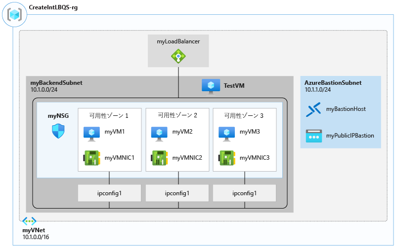
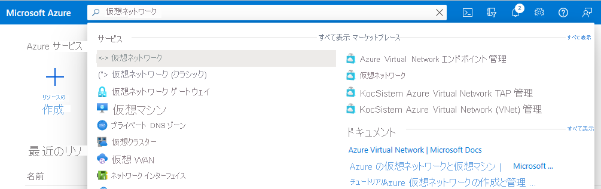
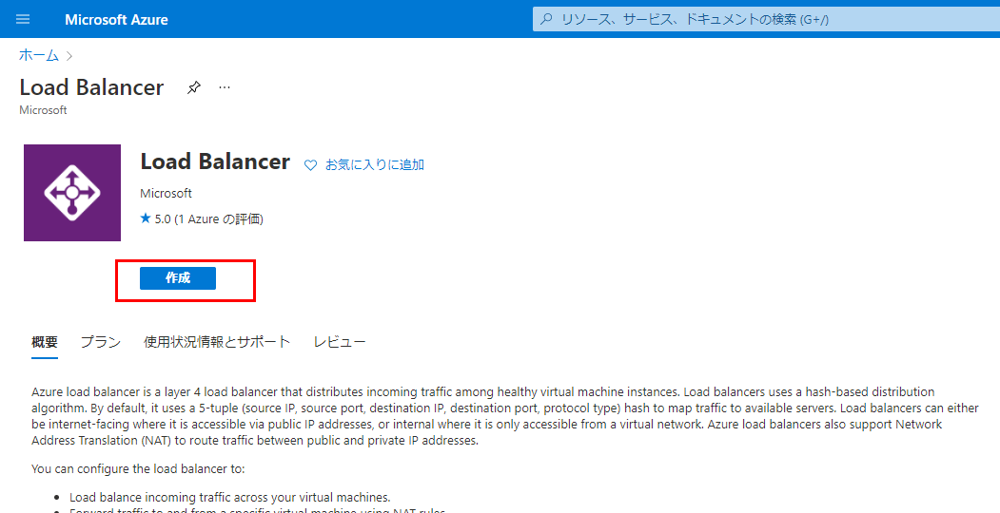
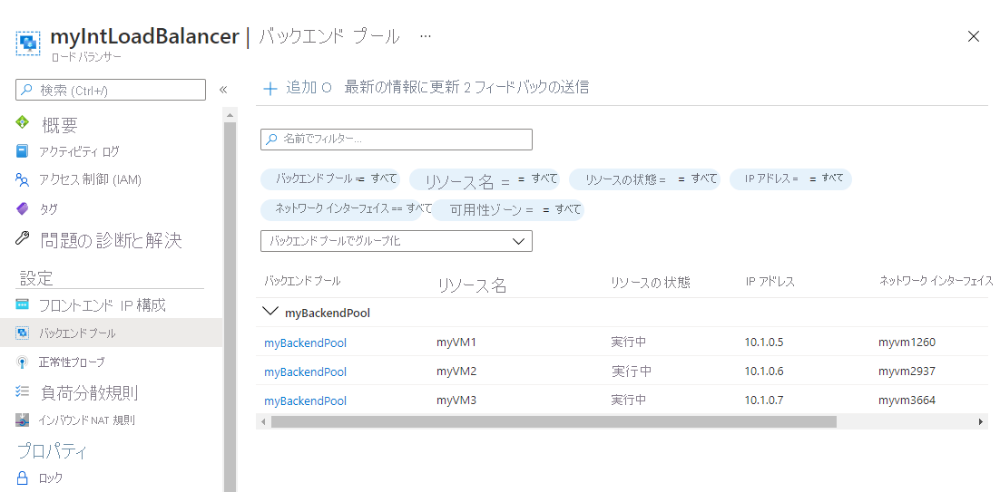
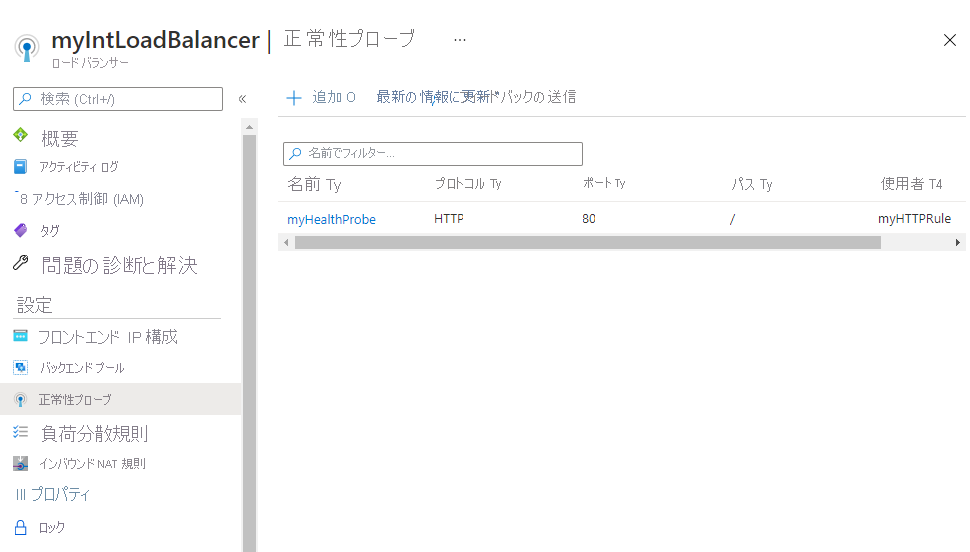
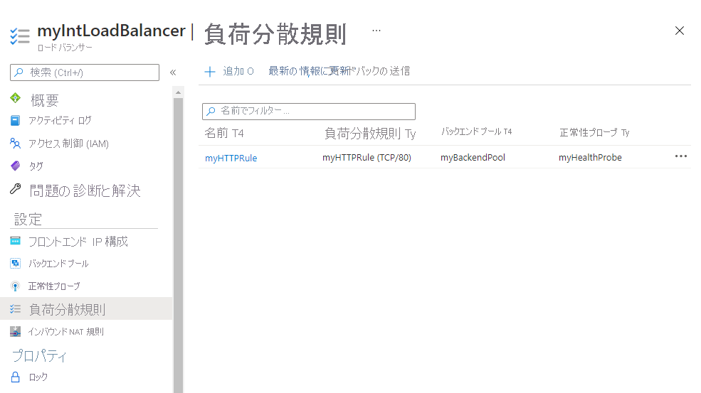
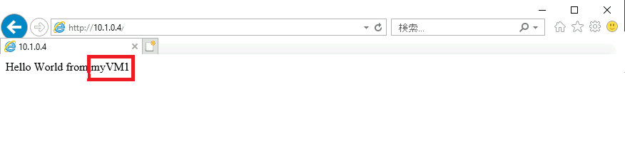
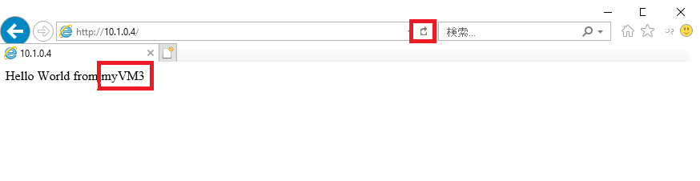

---
Exercise:
    title: 'M04-ユニット 4 Azure のロード バランサーを作成し、構成する'
    module: 'モジュール ? Azure での非 HTTP(S) トラフィックの負荷分散'
---


# M04-ユニット 4 Azure のロード バランサーを作成し、構成する

この演習では、架空の Contoso Ltd 組織の内部ロード バランサーを作成します。 

内部ロード バランサーを作成する手順は、パブリック ロード バランサーを作成するために、このモジュールですでに学習した手順と非常によく似ています。主な違いは、パブリック ロード バランサーを使用すると、フロントエンドにパブリック IP アドレスを介してアクセスし、仮想ネットワークの外部にあるホストからの接続をテストすることです。 一方、内部ロード バランサーでは、フロントエンドは仮想ネットワーク内のプライベート IP アドレスであり、同じネットワーク内のホストからの接続をテストします。

次の図は、この演習でデプロイする環境を示しています。



 
この演習では、次のことを行います。

+ タスク 1: 仮想ネットワークを作成する
+ タスク 2: バックエンド サーバーを作成する
+ タスク 3: ロード バランサーを作成する
+ タスク 4: ロード バランサー リソースを作成する
+ タスク 5: ロード バランサーをテストする

## タスク 1: 仮想ネットワークを作成する

このセクションでは、仮想ネットワークとサブネットを作成します。
   
1. Azure portal にログインします。

2. Azure portal の「ホーム」ページで、「グローバル検索」バーに移動して、「**Virtual Networks**」を検索し、サービスの下で、仮想ネットワークを選択します。  

3. 「Virtual Network」ページで、「**作成**」を選択します。  

4. **「基本」** タブで、次の表の情報を使用して仮想ネットワークを作成します。

   | **設定**    | **値**                                  |
   | -------------- | ------------------------------------------ |
   | サブスクリプション   | サブスクリプションを選択します                   |
   | リソース グループ | **「新しい名前の作成」** を選択する: **IntLB-RG** |
   | 名前           | **IntLB-VNet**                             |
   | リージョン         | **(米国) 米国東部**                           |


5. **「次へ: IP アドレス**」をクリックします。

6. **「IP アドレス」** タブの **「IPv4 アドレス空間」** ボックスで、既定値を削除し、**「10.1.0.0/16」** と入力します。

7. 「**IP アドレス**」タブで、「**+ サブネットの追加**」を選択します。

8. 「**サブネットの追加**」ペインで、**myBackendSubnet** のサブネット名と **10.1.0.0/24** のサブネット アドレス範囲を指定します。

9. 「**追加**」をクリックします。

10. **「サブネットの追加」** で、**「myFrontEndSubnet」** のサブネット名と **「10.1.2.0/24」** のサブネット アドレス範囲を指定します。**「追加」** をクリックします。

11. **「次へ: セキュリティ**」をクリックします。

12. **「BastionHost」** で、**「有効化」** を選択し、以下の表の情報を入力します。

    | **設定**                       | **値**                                     |
    | --------------------------------- | --------------------------------------------- |
    | Bastion 名                      | **myBastionHost**                             |
    | AzureBastionSubnet のアドレス空間 | **10.1.1.0/24**                               |
    | パブリック IP アドレス                 | **「新しい名前の作成」** を選択する: **myBastionIP** |


13. **「Review + create」** をクリックします。

14. **「作成」** をクリックします。

## タスク 2: バックエンド サーバーを作成する

このセクションでは、ロード バランサーのバックエンド プール用に同じ可用性セットに含まれる 3 つの VM を作成し、VM をバックエンド プールに追加してから、3 つの VM に IIS をインストールしてロード バランサーをテストします。

1. Azure portal の **「Cloud Shell」** ウィンドウで **「PowerShell」** セッションを開きます。

2. Cloud Shell ウィンドウのツールバーで、「ファイルのアップロード/ダウンロード」アイコンをクリックし、ドロップダウン メニューで「アップロード」をクリックして、azuredeploy.json、azuredeploy.parameters.vm1.json、azuredeploy.parameters.vm2.json、azuredeploy.parameters.vm3.json ファイルを Cloud Shell のホーム ディレクトリにアップロード配置します。

3. 次の ARM テンプレートをデプロイして、この演習に必要な仮想ネットワーク、サブネット、VM を作成します。

   ```powershell
   $RGName = "IntLB-RG"
   
   New-AzResourceGroupDeployment -ResourceGroupName $RGName -TemplateFile azuredeploy.json -TemplateParameterFile azuredeploy.parameters.vm1.json
   New-AzResourceGroupDeployment -ResourceGroupName $RGName -TemplateFile azuredeploy.json -TemplateParameterFile azuredeploy.parameters.vm2.json
   New-AzResourceGroupDeployment -ResourceGroupName $RGName -TemplateFile azuredeploy.json -TemplateParameterFile azuredeploy.parameters.vm3.json
   ```

## タスク 3: ロード バランサーを作成する

このセクションでは、内部 Standard SKU ロード バランサーを作成します。この演習で、Basic SKU ロード バランサーの代わりに Standard SKU ロード バランサーを作成する理由は、ロードバランサーの Standard SKU バージョンを必要とする後の演習のためです。

1. Azure portal のホーム ページで、**「リソースの作成」** をクリックします。

2. ページ上部の検索ボックスに、**「Load Balancer」** と入力し、**Enter** キーを押します (**注:** リストから 1 つを選択しないでください)。

3. 「結果」ページで、「**ロード バランサー**」 (名前の下に「Microsoft」と「Azure Service」と表示されているもの) を探して選択します。

4. **「作成」** をクリックします。
   

5. **「基本」** タブで、次の表の情報を使用してロード バランサーを作成します。

   | **設定**           | **値**                |
   | --------------------- | ------------------------ |
   | サブスクリプション          | サブスクリプションを選択します |
   | リソース グループ        | **IntLB-RG**             |
   | 名前                  | **myIntLoadBalancer**    |
   | リージョン                | **(米国) 米国東部**         |
   | 種類                  | **内部**             |
   | SKU                   | **Standard**             |


6. 「**次へ: フロントエンド IP 構成**」をクリックします。
7. 「フロントエンド IP の追加」をクリックします
8. **「フロントエンド IP アドレスの追加」** ブレードで、次の表の情報を入力します。
 
   | **設定**     | **値**                |
   | --------------- | ------------------------ |
   | 名前            | **LoadBalancerFrontEnd** |
   | 仮想ネットワーク | **IntLB-VNet**           |
   | サブネット          | **myFrontEndSubnet**     |
   | 割り当て      | **動的**              |

9. **「Review + create」** をクリックします。

10. **「作成」** をクリックします。

## タスク 4: ロード バランサー リソースを作成する

このセクションでは、バックエンド アドレス プールのロード バランサー設定を構成してから、正常性プローブとロード バランサー規則を作成します。

### バックエンド プールを作成し、VM をバックエンド プールに追加する

バックエンド アドレス プールには、ロード バランサーに接続された仮想 NIC の IP アドレスが含まれています。

1. Azure portal のホーム ページで、**「すべてのリソース」** をクリックしてから、リソース一覧から **「myIntLoadBalancer」** をクリックします。

2. **「設定」** で、**「バックエンド プール」** を選択してから、**「追加」** をクリックします。

3. **「バックエンド プールの追加」** ブレードで、次の表の情報を入力します。

   | **設定**     | **値**            |
   | --------------- | -------------------- |
   | 名前            | **myBackendPool**    |
   | 仮想ネットワーク | **IntLB-VNet**       |


4. **「仮想マシン」** で、**「追加」** をクリックします。

5. 3 つのVM (**myVM1**、**myVM2**、**myVM3**) すべてのチェックボックスを選択し、**「追加」** をクリックします。

6. **「追加」** をクリックします。
   
   

### 正常性プローブを作成する

ロード バランサーは、正常性プローブを使用してアプリの状態を監視します。正常性プローブは、正常性チェックへの応答に基づいて、ロード バランサーに含める VM を追加したり削除したりします。ここでは、VM の正常性を監視するための正常性プローブを作成します。

1. **「設定」** で **「正常性プローブ」** をクリックしてから、**「追加」** をクリックします。

2. **「正常性プローブの追加」** ブレードで、次の表の情報を入力します。

   | **設定**         | **値**         |
   | ------------------- | ----------------- |
   | 名前                | **myHealthProbe** |
   | プロトコル            | **HTTP**          |
   | ポート                | **80**            |
   | パス                | **/**             |
   | サイクル間隔            | **15**            |
   | 異常なしきい値 | **2**             |


3. **「追加」** をクリックします。
   

 

### ロード バランサー規則の作成

ロード バランサー規則の目的は、一連の VM に対するトラフィックの分散方法を定義することです。着信トラフィック用のフロントエンド IP 構成と、トラフィックを受信するためのバックエンド IP プールを定義します。送信元と送信先のポートは、この規則で定義します。ここでは、ロードバランサー規則を作成します。

1. ロード バランサーの **「バックエンド プール」** ページの **「設定」** で、**「負荷分散規則」** をクリックしてから、**「追加」** をクリックします。

2. **「負荷分散規則の追加」** ブレードで、次の表の情報を入力します。

   | **設定**            | **値**                |
   | ---------------------- | ------------------------ |
   | 名前                   | **myHTTPRule**           |
   | IP バージョン             | **IPv4**                 |
   | フロントエンド IP アドレス    | **LoadBalancerFrontEnd** |
   | プロトコル               | **TCP**                  |
   | ポート                   | **80**                   |
   | バックエンド ポート           | **80**                   |
   | バックエンド プール           | **myBackendPool**        |
   | 正常性プローブ           | **myHealthProbe**        |
   | セッション永続化    | **なし**                 |
   | アイドル タイムアウト (分) | **15**                   |
   | フローティング IP            | **無効**             |


3. **「追加」** をクリックします。
   

 


 

 

## タスク 5: ロード バランサーをテストする

このセクションでは、テスト VM を作成してから、ロード バランサーをテストします。

### テスト VM の作成

1. Azure portal のホーム ページで、**「リソースの作成」**、**「コンピューティング」** の順にクリックし、**「仮想マシン」** を選択します (このリソースの種類がページに表示されていない場合は、ページ上部の検索ボックスを使用して検索し、選択します)。

2. **「仮想マシンの作成」** ページの **「基本」** タブで、次の表の情報を使用して最初の VM を作成します。

   | **設定**          | **値**                                    |
   | -------------------- | -------------------------------------------- |
   | サブスクリプション         | サブスクリプションを選択します                     |
   | リソース グループ       | **IntLB-RG**                                 |
   | 仮想マシン名 | **myTestVM**                                 |
   | リージョン               | **(米国) 米国東部**                             |
   | 可用性オプション | **インフラストラクチャの冗長性は必要ありません**    |
   | イメージ                | **Windows Server 2019 Datacenter - Gen 1**   |
   | サイズ                 | **Standard_DS1_v2 - 1 vCpu、3.5 GiB メモリ** |
   | ユーザー名             | **TestUser**                                 |
   | パスワード             | **TestPa$$w0rd!**                            |
   | パスワードの確認     | **TestPa$$w0rd!**                            |


3. **「次へ: ディスク**」をクリックしてから、「**次へ: ネットワーク**」をクリックします。 

4. **「ネットワーク」** タブで、次のの表の情報を使用して、ネットワーク設定を構成します。

   | **設定**                                                  | **値**                     |
   | ------------------------------------------------------------ | ----------------------------- |
   | 仮想ネットワーク                                              | **IntLB-VNet**                |
   | サブネット                                                       | **myBackendSubnet**           |
   | パブリック IP                                                    | **「なし」** に変更する            |
   | NIC ネットワーク セキュリティ グループ                                   | **詳細**                  |
   | ネットワーク セキュリティ グループを構成する                             | 既存の **「myNSG」** を選択する |
   | この仮想マシンを既存の負荷分散ソリューションの背後に配置しますか?  | **オフ** (未チェック)           |


5. **「Review + create」** をクリックします。

6. **「作成」** をクリックします。

7. この最後の VM がデプロイされるのを待ってから、次のタスクに進みます。

### テスト VM に接続して、ロード バランサーをテストする

1. Azure portal のホーム ページで、**「すべてのリソース」** をクリックしてから、リソース一覧から **「myIntLoadBalancer」** をクリックします。

2. 「**概要**」ページで、**プライベート IP アドレス**をメモするか、クリップボードにコピーします。注: 「**プライベート IP アドレス**」フィールドを表示するために、「**もっと見る**」を選択することが必要となる場合があります。

3. **「ホーム」** をクリックし、Azure portal のホーム ページで、**「すべてのリソース」** をクリックしてから、作成した **myTestVM** 仮想マシンをクリックします。

4. **「概要」** ページで、**「接続」**、**「Bastion」** の順に選択します。

5. **「Bastion を使用」** をクリックします。

6. **「ユーザー名」** ボックスに **「TestUser」** と入力し、**「パスワード」** ボックスに **「TestPa$$w0rd!」** と入力して、**「接続」** をクリックします。

7. **myTestVM** ウィンドウが別のブラウザー タブで開きます。

8. **「ネットワーク」** ウィンドウが表示されたら、**「はい」** をクリックします。

9. タスクバーの **「Internet Explorer」** アイコンをクリックして、Web ブラウザーを開きます。

10. **「Internet Explorer 11 のセットアップ」** ダイアログ ボックスで **「OK」** をクリックします。

11. 前の手順の**プライベート IP アドレス** (例: 10.1.0.4) をブラウザーのアドレス バーに入力 (または貼り付け) して、Enter キーを押します。

12. IIS Web サーバーの既定の Web ホーム ページがブラウザー ウィンドウに表示されます。バックエンド プール内の 3 つの仮想マシンの 1 つが応答します。
    

13. ブラウザーの更新ボタンを数回クリックすると、内部ロード バランサーのバックエンド プール内のさまざまな VM からランダムに応答が返されることがわかります。
    

## リソースをクリーン アップする

   > **注**: 新しく作成した Azure リソースのうち、使用しないリソースは必ず削除してください。使用しないリソースを削除しないと、予期しないコストが発生する場合があります。

1. Azure portal の **「Cloud Shell」** ウィンドウで **「PowerShell」** セッションを開きます。

1. 次のコマンドを実行して、このモジュールのラボ全体で作成したすべてのリソース グループのリストを削除します。

   ```powershell
   Remove-AzResourceGroup -Name 'IntLB-RG' -Force -AsJob
   ```

    > **注**: コマンドは非同期で実行されるので (-AsJob パラメーターによって決定されます)、別の PowerShell コマンドを同一 PowerShell セッション内ですぐに実行できますが、リソース グループが実際に削除されるまでに数分かかります。
