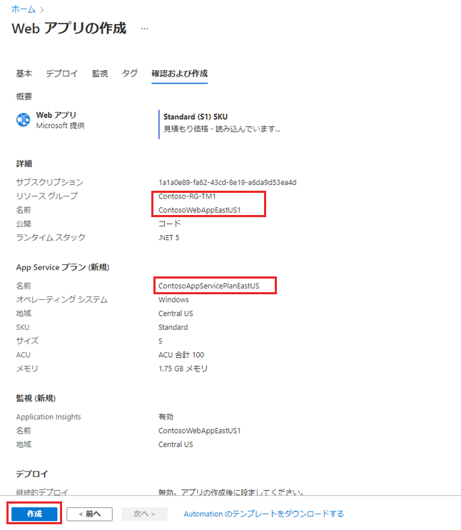
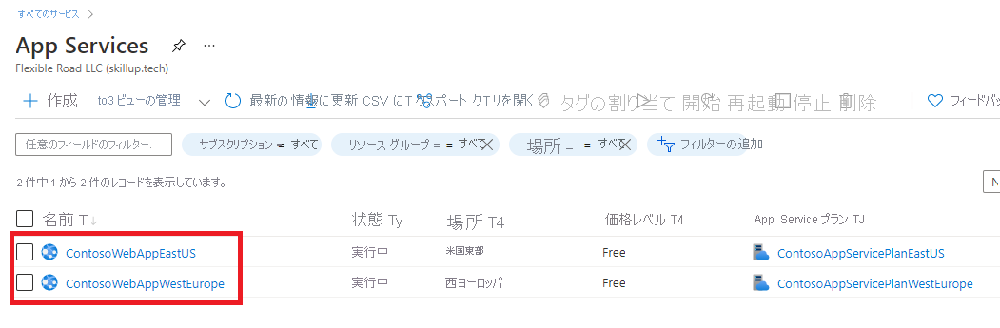
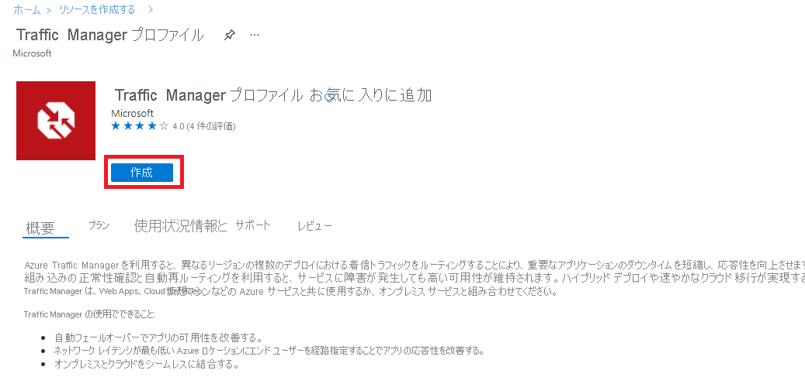
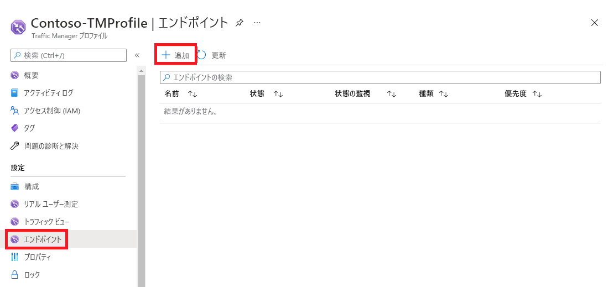
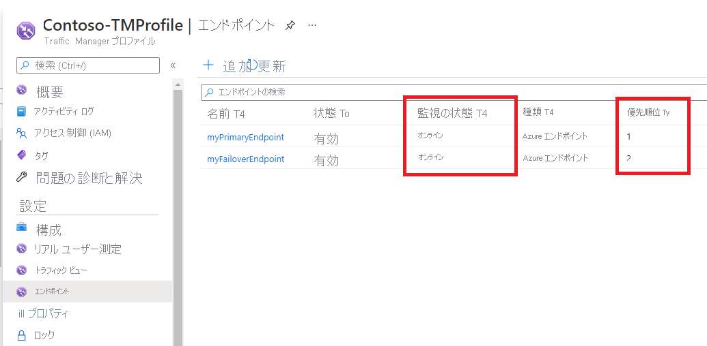
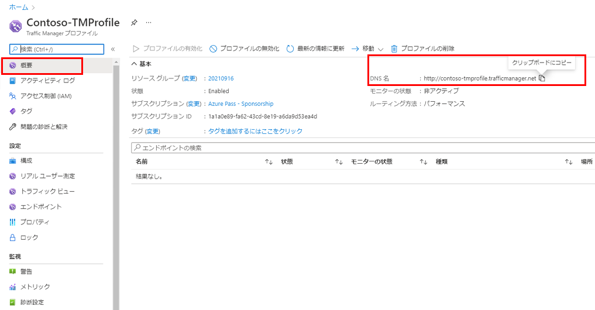
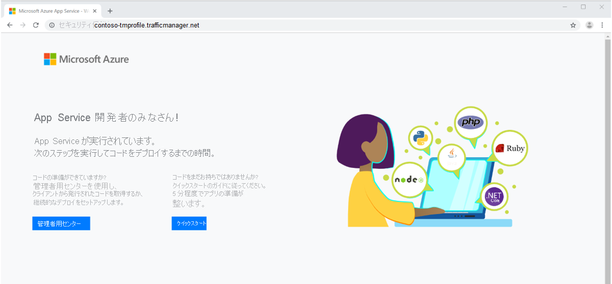
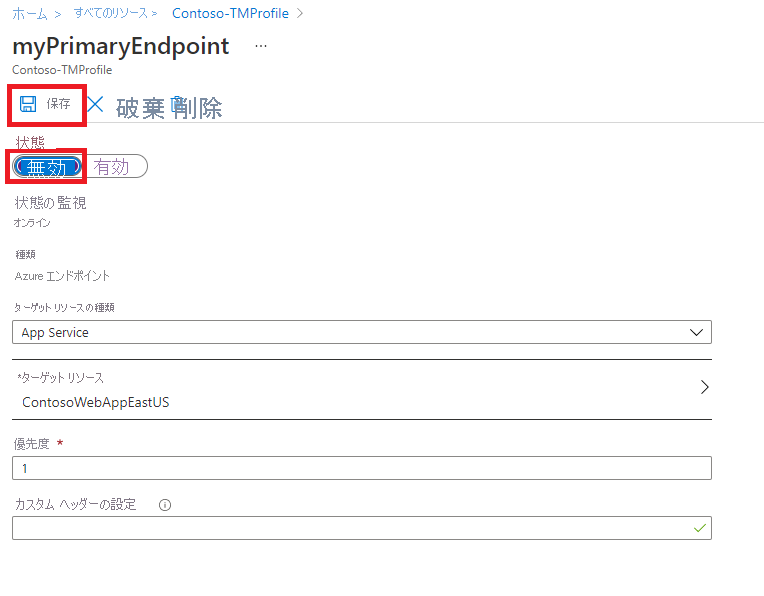

---
Exercise:
    title: 'M04-ユニット 6 Azure portal を使用して Traffic Manager プロファイルを作成する'
    module: 'モジュール - Azure で 非 HTTP(S) トラフィックの負荷を分散する'
---

# M04-ユニット 6 Azure portal を使用して Traffic Manager プロファイルを作成する

この演習では、Traffic Manager プロファイルを作成して、架空の Contoso Ltd 組織の Web アプリケーションに高可用性を提供します。 

2 つの異なるリージョン (米国東部と西ヨーロッパ) にデプロイされた Web アプリケーションの 2 つのインスタンスを作成します。米国東部リージョンは Traffic Manager のプライマリ エンドポイントとして機能し、西ヨーロッパ リージョンはフェイルオーバー エンドポイントとして機能します。

次に、エンドポイントの優先度に基づいて Traffic Manager プロファイルを作成します。このプロファイルにより、Web アプリケーションを実行しているプライマリ サイトにユーザー トラフィックを誘導します。Traffic Manager は Web アプリケーションを継続的に監視し、米国東部のプライマリ サイトが利用できない場合は、西ヨーロッパのバックアップ サイトへの自動フェイルオーバーを提供します。

次の図は、この演習でデプロイする環境を大まかに示しています。

​	

 この演習では、次のことを行います。

+ タスク 1: Web アプリの作成する
+ タスク 2: Traffic Manager プロファイルの作成
+ タスク 3: Traffic Manager エンドポイントの追加
+ タスク 4: Traffic Manager プロファイルのテスト
+ タスク 5: リソースをクリーン アップする


## タスク 1: Web アプリの作成する

このセクションでは、2 つの異なる Azure リージョンにデプロイされた Web アプリケーションの 2 つのインスタンスを作成します。

1. Azure portal のホーム ページで、「**リソースの作成**」をクリックし、「**Web アプリ**」を選択します (このリソースの種類がページに表示されていない場合は、ページ上部の検索ボックスを使用して検索し、選択します)。

2. 「**Web アプリの作成**」ページの「**基本**」タブで、次の表の情報を使用して、最初の Web アプリケーションを作成します。

   | **設定**      | **値**                                                    |
   | ---------------- | ------------------------------------------------------------ |
   | サブスクリプション     | サブスクリプションを選択します                                     |
   | リソース グループ   | 「**新しい名前の作成**」を選択します。**Contoso-RG-TM1**             |
   | 名前             | **ContosoWebAppEastUSxx** (xx は、名前を一意にするためのイニシャルです) |
   | 公開          | **コード**                                                     |
   | ランタイム スタック    | **ASP.NET V4.8**                                             |
   | オペレーティング システム | **Windows**                                                  |
   | リージョン           | **米国東部**                                                  |
   | Windows プラン     | 「**新しい名前の作成**」を選択します。 **ContosoAppServicePlanEastUS** |
   | SKU とサイズ     | **Standard S1 100 total ACU、1.75-GB メモリ**               |


3. 「**次へ : デプロイ (プレビュー)**」をクリックしてから、「**次へ : 監視**」をクリックします。

4. 「**監視**」タブで、「**アプリケーション インサイトを有効にする**」の「**いいえ**」オプションを選択します。

5. 「**Review + create**」をクリックします。

   

6. **作成**をクリックします。Web アプリが正常にデプロイされると、既定の Web サイトが作成されます。

7. 上記の手順 1 〜 6 を繰り返して、2 番目の Web アプリを作成します。以下の表の情報を除いて、以前と同じ設定を使用してください。 

   | **設定**    | **値**                                                    |
   | -------------- | ------------------------------------------------------------ |
   | リソース グループ | 「**新しい名前の作成**」を選択します。**Contoso-RG-TM2**             |
   | 名前           | **ContosoWebAppWestEuropexx** (xx は、名前を一意にするためのイニシャルです)  |
   | リージョン         | **西ヨーロッパ**                                              |
   | Windows プラン   | 「**新しい名前の作成**」を選択します。 **ContosoAppServicePlanWestEurope** |


8. Azure のホーム ページで「**すべてのサービス**」をクリックし、左側のナビゲーションメニューで「**Web**」を選択して、「**アプリ　サービス**」をクリックします。

9. 2 つの新しい Web アプリが一覧表示されます。

   

 

## タスク 2: Traffic Manager プロファイルの作成

次に、エンドポイントの優先度に基づいてユーザー トラフィックを転送する Traffic Manager プロファイルを作成します。

1. Azure portal のホーム ページで、「**リソースの作成**」をクリックします。

2. ページ上部の検索ボックスに「**Traffic Manager プロファイル**」と入力し、ポップアップ リストから選択します。

   

3. 「**作成**」をクリックします。

4. 「**Traffic Manager プロファイルの作成**」ページで、次の表の情報を使用して、トTraffic Manager プロファイルを作成します。

   | **設定**             | **値**                |
   | ----------------------- | ------------------------ |
   | 名前                    | **Contoso-TMProfilexx** (xx は、名前を一意にするためのイニシャルです) |
   | ルーティング方法          | **優先度**             |
   | サブスクリプション            | サブスクリプションを選択します |
   | リソース グループ          | **Contoso-RG-TM1**       |
   | リソース グループの場所 | **米国東部**              |


5. 「**作成**」をクリックします。

 

## タスク 3: Traffic Manager エンドポイントの追加

このセクションでは、すべてのユーザー トラフィックのルーティング先となるプライマリ エンドポイントとして、米国東部に Web サイトを追加します。次に、西ヨーロッパに、フェールオーバー エンドポイントとして Web サイトを追加します。プライマリ エンドポイントが使用できなくなった場合、トラフィックはフェイルオーバー エンドポイントに自動的にルーティングされます。

1. Azure portal のホーム ページで、「**すべてのリソース**」をクリックし、リソース一覧から **Contoso-TMProfile** をクリックします。

2. 「**設定**」で「**エンドポイント**」を選択し、「**追加**」をクリックします。

   

3. 「**エンドポイントの追加**」ページで、以下の表の情報を入力します。

   | **設定**          | **値**                         |
   | -------------------- | --------------------------------- |
   | 種類                 | **Azure エンドポイント**                |
   | 名前                 | **myPrimaryEndpoint**             |
   | ターゲット リソースの種類 | **App Service**                   |
   | ターゲット リソース      | **ContosoWebAppEastUS (米国東部)** |
   | 優先度             | **1**                             |


4. 「**追加**」をクリックします。

5. 上記の手順 2 〜 4 を繰り返して、フェールオーバー エンドポイントを作成します。以下の表の情報を除いて、以前と同じ設定を使用してください。 

   | **設定**     | **値**                                 |
   | --------------- | ----------------------------------------- |
   | 名前            | **myFailoverEndpoint**                    |
   | ターゲット リソース | **ContosoWebAppWestEurope (西ヨーロッパ)** |
   | 優先度        | **2**                                     |


6. 優先度を 2 に設定すると、設定されたプライマリ エンドポイントが異常になった場合にトラフィックがこのフェールオーバー エンドポイントにルーティングされます。

7. 2 つの新しいエンドポイントが Traffic Manager プロファイルに表示されます。数分後、「**監視状態**」が「**オンライン**」に変わることに注意してください。

   

 

## タスク 4: Traffic Manager プロファイルのテスト

このセクションでは、Traffic Manager プロファイルの DNS 名を確認してから、プライマリ エンドポイントが使用できないように構成します。次に、Web アプリがまだ利用可能であることを確認して、Traffic Manager プロファイルがフェイルオーバー エンドポイントにトラフィックを正常に送信していることをテストします。

1. 「**Contoso-TMProfile**」ページで、「**概要**」をクリックします。

2. 「**概要**」画面で、**DNS 名**エントリをクリップボードにコピーします (またはどこかにメモします)。

   

3. Web ブラウザータブを開き、**DNS 名**エントリ (contoso-tmprofile.trafficmanager.net) をアドレス バーに貼り付け (または入力し)、Enter キーを押します。

4. Web アプリの既定の　Web　サイトが表示されます。

   

5. 現在、「**優先度**」を **1** に設定すると、すべてのトラフィックがプライマリ エンドポイントに送信されます。

6. フェイルオーバー エンドポイントが正しく機能していることをテストするには、プライマリ サイトを無効にする必要があります。

7. 「**Contoso-TMProfile**」ページの概要画面で、「**myPrimaryEndpoint**」を選択します。

8. 「**myPrimaryEndpoint**」ページの「**状態**」で、「**無効**」をクリックし、「**保存**」をクリックします。

   

9. 「**myPrimaryEndpoint**」ページを閉じます (ページの右上隅にある「**X**」をクリックします)。

10. 「**Contoso-TMProfile**」ページで、「**myPrimaryEndpoint**」の「**監視状態**」が「**無効**」になっているはずです。

11. 新しい Web ブラウザータブを開き、**DNS 名**エントリ (contoso-tmprofile.trafficmanager.net) をアドレス バーに貼り付け (または入力し)、Enter キーを押します。

12. Web アプリがまだ応答していることを確認します。プライマリ エンドポイントが利用できなかったため、トラフィックは代わりにフェイルオーバー エンドポイントにルーティングされ、Web サイトが引き続き機能できるようになりました。

 
 ## タスク 5: リソースをクリーン アップする

   > **注**: 新しく作成した Azure リソースのうち、使用しないリソースは必ず削除してください。使用しないリソースを削除しないと、予期しないコストが発生する場合があります。

1. Azure portal の **「Cloud Shell」** ウィンドウで **「PowerShell」** セッションを開きます。

1. 次のコマンドを実行して、このモジュールのラボ全体で作成したすべてのリソース グループのリストを削除します。

   ```powershell

   Remove-AzResourceGroup -Name 'Contoso-RG-TM1' -Force -AsJob

   ```

    > **注**: コマンドは非同期で実行されるので (-AsJob パラメーターによって決定されます)、別の PowerShell コマンドを同一 PowerShell セッション内ですぐに実行できますが、リソース グループが実際に削除されるまでに数分かかります。
 

