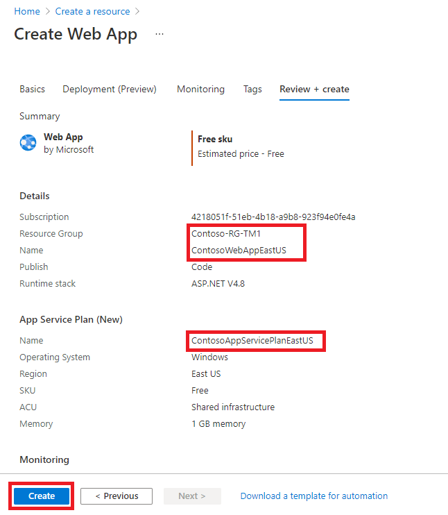

---
Exercise:
  title: M04-ユニット 6 Azure portal を使用して Traffic Manager プロファイルを作成する
  module: Module - Load balancing non-HTTP(S) traffic in Azure
ms.openlocfilehash: 1d04de9c9710cc452220b1f6c6cecc39ff130810
ms.sourcegitcommit: 15778a5942c3177246f4fb1077d4233ddeaf95a2
ms.translationtype: HT
ms.contentlocale: ja-JP
ms.lasthandoff: 03/19/2022
ms.locfileid: "140742006"
---
# <a name="m04-unit-6-create-a-traffic-manager-profile-using-the-azure-portal"></a>M04-ユニット 6 Azure portal を使用して Traffic Manager プロファイルを作成する

この演習では、架空の組織 Contoso Ltd の Web アプリケーションに高い可用性をもたらす Traffic Manager プロファイルを作成します。 

2 つの異なるリージョン (米国東部と西ヨーロッパ) にデプロイされた Web アプリケーションの 2 つのインスタンスを作成します。 米国東部リージョンは Traffic Manager のプライマリ エンドポイントとして、西ヨーロッパ リージョンはフェールオーバー エンドポイントとして機能します。

その後、エンドポイントの優先度に基づいて、Traffic Manager プロファイルを作成します。 このプロファイルにより、Web アプリケーションが実行されているプライマリ サイトにユーザー トラフィックが誘導されます。 Traffic Manager では Web アプリケーションを継続的に監視し、米国東部のプライマリ サイトが使用できない場合は、西ヨーロッパのバックアップ サイトに自動的にフェールオーバーします。

以下の概略図は、この演習でデプロイする環境を示しています。

    

 この演習では、以下のことを行います。

+ タスク 1: Web アプリを作成する
+ タスク 2: Traffic Manager プロファイルを作成する
+ タスク 3: Traffic Manager エンドポイントを追加する
+ タスク 4: Traffic Manager プロファイルをテストする
+ タスク 5: リソースをクリーンアップする


## <a name="task-1-create-the-web-apps"></a>タスク 1: Web アプリを作成する

このセクションでは、2 つの異なる Azure リージョンにデプロイされた Web アプリケーションの 2 つのインスタンスを作成します。

1. Azure portal のホーム ページで、**[リソースの作成]** をクリックし、**[Web アプリ]** を選択します (このリソースの種類がページに表示されていない場合は、ページの上部にある [検索] ボックスを使用してそれを検索し、選択します)。

2. **[Web アプリの作成]** ページの **[基本]** タブで、次の表の情報を使用して最初の Web アプリケーションを作成します。

   | **設定**      | **Value**                                                    |
   | ---------------- | ------------------------------------------------------------ |
   | サブスクリプション     | サブスクリプションを選択します。                                     |
   | Resource group   | **[新規作成]** を選択  名前: **Contoso-RG-TM1**             |
   | 名前             | **ContosoWebAppEastUSxx** (xx は、名前を一意にするための自分のイニシャルです) |
   | 発行          | **コード**                                                     |
   | ランタイム スタック    | **ASP.NET V4.8**                                             |
   | オペレーティング システム | **Windows**                                                  |
   | リージョン           | **米国東部**                                                  |
   | Windows プラン     | **[新規作成]** を選択  名前: **ContosoAppServicePlanEastUS** |
   | SKU とサイズ     | **[Standard S1 100 total ACU, 1.75-GB  memory]\(Standard S1 合計 100 ACU、1.75 GB メモリ\)**               |


3. ページの下部の **[次へ: デプロイ]** をクリックしたら、 **[次へ: モニタリング]** を選択します。

4. **[監視]** タブの **[Application Insights を有効にする]** で、**[いいえ]** のオプションを選択します。

5. **[Review + create]\(レビュー + 作成\)** をクリックします。

   

6. **[作成]** をクリックします。 Web アプリが正常にデプロイされると、既定の Web サイトが作成されます。

7. 前述の手順 1 から 6 を繰り返して、2 つ目の Web アプリを作成します。 以下の表の情報を除き、前と同じ設定を使用します。 

   | **設定**    | **Value**                                                    |
   | -------------- | ------------------------------------------------------------ |
   | Resource group | **[新規作成]** を選択  名前: **Contoso-RG-TM2**             |
   | 名前           | **ContosoWebAppWestEuropexx** (xx は、名前を一意にするための自分のイニシャルです)  |
   | リージョン         | "**西ヨーロッパ**"                                              |
   | Windows プラン   | **[新規作成]** を選択  名前: **ContosoAppServicePlanWestEurope** |


8. Azure ホーム ページで、**[すべてのサービス]** をクリックし、左側のナビゲーション メニューで **[Web]** を選択して、**[App Services]** をクリックします。

9. 2 つの新しい Web アプリが一覧に表示されます。

   

 

## <a name="task-2-create-a-traffic-manager-profile"></a>タスク 2: Traffic Manager プロファイルを作成する

次は、エンドポイントの優先度に基づいてユーザー トラフィックを誘導する Traffic Manager プロファイルを作成します。

1. Azure portal のホーム ページで、**[リソースの作成]** を選択します。

2. ページの上部にある検索ボックスに、「**Traffic Manager プロファイル**」と入力し、ポップアップ リストからそれを選択します。

   

3. **[作成]** をクリックします。

4. **[Traffic Manager プロファイルの作成]** ページで、以下の表の情報を使用して、Traffic Manager プロファイルを作成します。

   | **設定**             | **Value**                |
   | ----------------------- | ------------------------ |
   | 名前                    | **Contoso-TMProfilexx** (xx は、名前を一意にするための自分のイニシャルです) |
   | ルーティング方法          | **優先順位**             |
   | サブスクリプション            | サブスクリプションを選択します。 |
   | Resource group          | **Contoso-RG-TM1**       |
   | リソース グループの場所 | **米国東部**              |


5. **[作成]** をクリックします。

 

## <a name="task-3-add-traffic-manager-endpoints"></a>タスク 3: Traffic Manager エンドポイントを追加する

このセクションでは、すべてのユーザー トラフィックをルーティングするプライマリ エンドポイントとして、米国東部の Web サイトを追加します。 次に、フェールオーバー エンドポイントとして、西ヨーロッパの Web サイトを追加します。 プライマリ エンドポイントが使用できなくなった場合、トラフィックは自動的にフェールオーバー エンドポイントにルーティングされます。

1. Azure portal のホームページで、**[すべてのリソース]** をクリックし、リソースの一覧で **[Contoso-TMProfile]** をクリックします。

2. **[設定]** で、**[エンドポイント]** を選択し、**[追加]** をクリックします。

   

3. **[エンドポイントの追加]** ページで、以下の表の情報を入力します。

   | **設定**          | **Value**                         |
   | -------------------- | --------------------------------- |
   | Type                 | **Azure エンドポイント**                |
   | 名前                 | **myPrimaryEndpoint**             |
   | ターゲット リソースの種類 | **App Service**                   |
   | ターゲット リソース      | **ContosoWebAppEastUS (米国東部)** |
   | 優先度             | **1**                             |


4. **[追加]** をクリックします。

5. 前述の手順 2 から 4 を繰り返して、フェールオーバー エンドポイントを作成します。 以下の表の情報を除き、前と同じ設定を使用します。 

   | **設定**     | **Value**                                 |
   | --------------- | ----------------------------------------- |
   | 名前            | **myFailoverEndpoint**                    |
   | ターゲット リソース | **ContosoWebAppWestEurope (西ヨーロッパ)** |
   | 優先度        | **2**                                     |


6. 優先順位を 2 に設定すると、構成されたプライマリ エンドポイントで異常が発生した場合に、トラフィックがこのフェールオーバー エンドポイントにルーティングされます。

7. 2 つの新しいエンドポイントが Traffic Manager プロファイルに表示されます。 数分後に **[監視状態]** が **[オンライン]** に変更される点に注目してください。

   

 

## <a name="task-4-test-the-traffic-manager-profile"></a>タスク 4: Traffic Manager プロファイルをテストする

このセクションでは、Traffic Manager プロファイルの DNS 名を確認し、プライマリ エンドポイントが使用できなくなるように構成します。 次に、Traffic Manager プロファイルによってトラフィックがフェールオーバー エンドポイントに正常に送信されているかどうかをテストするために、Web アプリが引き続き使用可能であることを確認します。

1. **[Contoso-TMProfile]** ページで、**[概要]** をクリックします。

2. **[概要]** 画面で、**DNS 名** のエントリをクリップボードにコピーします (または、どこかに書き留めておきます)。

   

3. Web ブラウザーのタブを開き、**DNS 名** のエントリ (contoso-tmprofile.trafficmanager.net) をアドレス バーに貼り付け (または入力して)、Enter キーを押します。

4. その Web アプリの既定の Web サイトが表示されます。 " **404 Web サイトが見つかりません**" というメッセージが表示された場合は、**Contoso-TMProfilexx** Traffic Manager のプロファイルの概要ページから **プロファイルを無効化** し、**プロファイルを有効化** します。 その後、Web ページを更新します。

   

5. 現時点では、**[優先順位]** が **[1]** に設定されているため、すべてのトラフィックがプライマリ エンドポイントに送信されます。

6. フェールオーバー エンドポイントが正常に動作していることをテストするには、プライマリ サイトを無効にする必要があります。

7. **[Contoso-TMProfile]** ページの [概要] 画面で、**[myPrimaryEndpoint]** を選択します。

8. **[myPrimaryEndpoint]** ページの **[状態]** で、**[無効]** をクリックし、**[保存]** をクリックします。

   

9. **[myPrimaryEndpoint]** ページを閉じます (ページの右上隅にある **[X]** をクリックします)。

10. これで **[Contoso-TMProfile]** ページで、**myPrimaryEndpoint** の **[監視状態]** が **[無効]** になっているはずです。

11. Web ブラウザーの新しいセッションを開き、**DNS 名** のエントリ (contoso-tmprofile.trafficmanager.net) をアドレス バーに貼り付け (または入力して)、Enter キーを押します。

12. Web アプリからまだ応答があることを確認します。 プライマリ エンドポイントを使用できなかったため、Web サイトを引き続き利用できるように、トラフィックが代わりにフェールオーバー エンドポイントにルーティングされました。

 
 ## <a name="task-5-clean-up-resources"></a>タスク 5: リソースをクリーンアップする

   >**注**:新規に作成し、使用しなくなったすべての Azure リソースを削除することを忘れないでください。 使用していないリソースを削除することで、予期しない料金が発生しなくなります。

1. Azure portal で、**[Cloud Shell]** ペイン内に **PowerShell** セッションを開きます。

1. 次のコマンドを実行して、このモジュールのラボ全体を通して作成したすべてのリソース グループを削除します。

   ```powershell

   Remove-AzResourceGroup -Name 'Contoso-RG-TM1' -Force -AsJob
   Remove-AzResourceGroup -Name 'Contoso-RG-TM2' -Force -AsJob

   ```

    >**注**:このコマンドは非同期で実行されるため (-AsJob パラメーターによって決定されます)、同じ PowerShell セッション内で直後に別の PowerShell コマンドを実行できますが、リソース グループが実際に削除されるまでに数分かかります。
 

