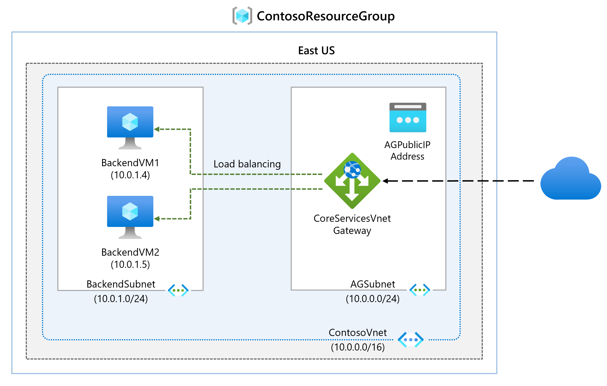

---
Exercise:
  title: M05 - ユニット 4 Azure Application Gateway をデプロイする
  module: Module 05 - Load balancing HTTP(S) traffic in Azure
---

# M05-ユニット 4 Azure Application Gateway をデプロイする

## 演習のシナリオ

この演習では、Azure portal を使用してアプリケーション ゲートウェイを作成します。 さらに、それをテストし、正しく動作することを確認します。



### 対話型ラボ シミュレーション

>**注**: 以前提供されていたラボ シミュレーションは廃止されました。

### 推定時間: 25 分

アプリケーション ゲートウェイは、アプリケーション Web トラフィックをバックエンド プール内の特定のリソースに転送します。 リスナーをポートに割り当て、ルールを作成し、リソースをバックエンド プールに追加します。 わかりやすくするために、この記事では、パブリック フロントエンド IP、アプリケーション ゲートウェイで単一サイトをホストするための基本リスナー、基本要求ルーティング規則、およびバックエンド プール内の 2 つの仮想マシンを使用する簡単な設定を使用します。

お客様が作成するリソースの間で Azure による通信が行われるには、仮想ネットワークが必要です。 新しい仮想ネットワークを作成することも、既存の仮想ネットワークを使用することもできます。 この例では、アプリケーション ゲートウェイの作成時に新しい仮想ネットワークを作成します。 Application Gateway インスタンスは、個別のサブネットに作成されます。 この例では 2 つのサブネットを作成します。1 つはアプリケーション ゲートウェイ用で、もう 1 つはバックエンド サーバー用です。

### 職務スキル

この演習では、次のことを行います。

+ タスク 1: アプリケーション ゲートウェイを作成する
+ タスク 2:仮想マシンを作成する
+ タスク 3: バックエンド プールにバックエンド サーバーを追加する
+ タスク 4: アプリケーション ゲートウェイをテストする

## タスク 1: アプリケーション ゲートウェイを作成する

1. Azure アカウントで [Azure Portal](https://portal.azure.com/) にサインインします。

1. Azure portal ページの「**リソース、サービス、ドキュメントの検索 (G+/)** 」で、アプリケーションゲートウェイと入力し、結果から「**アプリケーションゲートウェイ**」を選択します。
    

1. アプリケーション ゲートウェイのページで、**[+ 作成]** を選択します。

1. [アプリケーション ゲートウェイの作成] の **[基本]** タブで、次の情報を入力または選択します。

   | **設定**         | **Value**                                    |
   | ------------------- | -------------------------------------------- |
   | サブスクリプション        | サブスクリプションを選択します。                    |
   | Resource group      | [新規作成]、[ContosoResourceGroup] を選択します       |
   | Application Gateway | ContosoAppGateway                            |
   | リージョン              | **[米国東部]** を選択します。                           |
   | Virtual Network     | **[新規作成]** を選択します                        |

1. [仮想ネットワークの作成] で、次の情報を入力または選択します。

   | **設定**       | **Value**                          |
   | ----------------- | ---------------------------------- |
   | 名前              | ContosoVNet                        |
   | **アドレス空間** |                                    |
   | アドレス範囲     | 10.0.0.0/16                        |
   | **サブネット**       |                                    |
   | サブネット名       | **既定値**を **[AGSubnet]** に変更します |
   | アドレス範囲     | 10.0.0.0/24                        |


1. **[OK]** を選択して、[アプリケーション ゲートウェイの作成] の [基本] タブに戻ります。

1. 他の設定は既定値をそのまま使用し、 **[次へ:フロントエンド]** を選択します。

1. **[フロントエンド]** タブで、 **[フロントエンド IP アドレスの種類]** が **[パブリック]** に設定されていることを確認します。

1. **[パブリック IP アドレス]** で **[新規追加]** を選択し、パブリック IP アドレス名として「AGPublicIPAddress」を入力して **[OK]** を選択します。

1. **バックエンド** を選択します。

1. **[バックエンド]** タブで、 **[バックエンド プールの追加]** を選択します。

1. **[バックエンド プールの追加]** ウィンドウが開いたら、次の値を入力して、空のバックエンド プールを作成します。

    | **設定**                      | **Value**   |
    | -------------------------------- | ----------- |
    | 名前                             | BackendPool |
    | [Add backend pool without targets](ターゲットを持たないバックエンド プールを追加する) | はい         |

1. **[バックエンド プールの追加]** ウィンドウで、 **[追加]** を選択し、バックエンド プール構成を保存して、 **[バックエンド]** タブに戻ります。

1. **[バックエンド]** タブで、 **[次へ:構成]** を選択します。

1. **[構成]** タブで、ルーティング規則を使用して作成したフロントエンドとバックエンド プールを接続します。

1. **[ルーティング規則]** 列で **[ルーティング規則の追加]** を選択します。

1. **[規則名]** ボックスに「**RoutingRule**」と入力します。

1. **[優先度]** に「**100**」と入力します。 

1. **[リスナー]** タブで、次の情報を入力または選択します。

    | **設定**   | **Value**         |
    | ------------- | ----------------- |
    | リスナー名 | リスナー          |
    | フロントエンド IP   | **[パブリック IPv4]** を選択します。 |

1. **[リスナー]** タブの他の設定に対しては、既定値をそのまま使用します。

    

1. **[バックエンド ターゲット]** タブを選択して、残りのルーティング規則を構成します。

1. **[バックエンド ターゲット]** タブで、次の情報を入力または選択します。

    | **設定**      | **Value**      |
    | -------------    | -------------- |
    | 変換後の型      | バックエンド プール   |
    | バックエンド設定 | **[新規追加]** |

1. **[バックエンド設定の追加]** で、次の情報を入力または選択します。

    | **設定**          | **Value**   |
    | ------------------   | ----------- |
    | バックエンド設定の名前 | HTTPSetting |
    | バックエンド ポート         | 80          |

1. **[バックエンド設定の追加]** ウィンドウの他の設定に対しては既定値をそのまま使用し、 **[追加]** を選択して **[ルーティング規則の追加]** に戻ります。

1. **[追加]** を選択してルーティング規則を保存し、**[構成]** タブに戻ります。

1. **タグ**、**次へ:確認と作成** をクリックします。

1. **[確認および作成]** タブで設定を確認します。

1. **[作成]** を選択して、仮想ネットワーク、パブリック IP アドレス、アプリケーション ゲートウェイを作成します。

1. Azure によるアプリケーション ゲートウェイの作成には数分かかる場合があります。 デプロイが正常に終了するまで待ちます。

### バックエンド サーバーのサブネットを追加する

1. **ContosoVNet** を検索して選択します。 **AGSubnet** が作成されたことを確認します。 

1. **[設定]**、**[サブネット]** の順に選択して、**BackendSubnet** を作成します。 完了したら、必ず **[追加]** を選択してサブネットを追加します。
   
   | **設定**       | **Value**                          |
   | ----------------- | ---------------------------------- |
   | サブネット名       | BackendSubnet                      |
   | アドレス範囲     | 10.0.1.0/24                        |

## タスク 2:仮想マシンを作成する

1. Azure portal で、右上にある Cloud Shell アイコンを選択します。 必要に応じて、シェルを構成します。  
    + **[PowerShell]** を選択します。
    + **[ストレージ アカウントは必要ありません]** と **[サブスクリプション]** を選択してから、**[適用]** を選択します。
    + ターミナルが作成され、プロンプトが表示されるまで待ちます。
      
1. Cloud Shell 画面のツール バーで、**[ファイルの管理]**、**[アップロード]** の順に選択します。 **backend.json**、**backend.parameters.json**、**install-iis.ps1** の各ファイルをアップロードします。

    >**注:** 自分のサブスクリプションで作業している場合、[テンプレート ファイル](https://github.com/MicrosoftLearning/AZ-700-Designing-and-Implementing-Microsoft-Azure-Networking-Solutions/tree/master/Allfiles/Exercises)は GitHub ラボ リポジトリで入手できます。

1. 次の ARM テンプレートをデプロイして、この演習に必要な VM を作成します。

   >**注**: 管理者パスワードを入力するように求められます。 

   ```powershell
   $RGName = "ContosoResourceGroup"
   
   New-AzResourceGroupDeployment -ResourceGroupName $RGName -TemplateFile backend.json -TemplateParameterFile backend.parameters.json
   ```
   >**注**: 時間をかけて **backend.json** ファイルの内容を確認します。 2 つの仮想マシンがデプロイされます。 この処理には数分かかります。 

1. コマンドは正常に完了し、 **BackendVM1** と **BackendVM2** を一覧表示します。

### 各仮想マシンに IIS をインストールする

1. 各バックエンド サーバーには IIS がインストールされている必要があります。

1. PowerShell プロンプトで続行し、提供されたスクリプトを使用して、 **BackendVM1** に IIS をインストールします。

   ```powershell
   Invoke-AzVMRunCommand -ResourceGroupName 'ContosoResourceGroup' -Name 'BackendVM1' -CommandId 'RunPowerShellScript' -ScriptPath 'install-iis.ps1'
   ```

   >**注**: 待機中に PowerShell スクリプトを確認します。 IIS ホーム ページは、仮想マシン名を指定するようにカスタマイズされていることに注意してください。

1. **BackendVM2**のコマンドをもう一度実行します。

   ```powershell
   Invoke-AzVMRunCommand -ResourceGroupName 'ContosoResourceGroup' -Name 'BackendVM2' -CommandId 'RunPowerShellScript' -ScriptPath 'install-iis.ps1'
   ```
   >**注:** コマンドが完了するまでに数分かかります。

## タスク 3: バックエンド プールにバックエンド サーバーを追加する

1. Azure portal メニューで **[すべてのリソース]** を選択するか、または [すべてのリソース] を検索して選択します。 次に **[ContosoAppGateway]** を選択します。

1. **[設定]** で、 **[バックエンド プール]** を選択します。

1. **[BackendPool]** を選択します。

1. [バックエンド プールの編集] ページの **[バックエンド ターゲット]** にある **[ターゲットの種類]** で、**[仮想マシン]** を選択します。

1. **[ターゲット]** で **[BackendVM1-nic.]** を選択します。

1. **[ターゲットの種類]** で、 **[仮想マシン]** を選択します。

1. **[ターゲット]** で **[BackendVM2-nic.]** を選択します。

   

1. **[保存]** を選択して、ファイアウォール規則が追加されるまで待ちます。 

1. バックエンド サーバーが正常であることを確認します。 **[監視]** を選択し、次に **[バックエンドの正常性]** を選択します。 どちらのターゲットも正常である必要があります。 

   

## タスク 4: アプリケーション ゲートウェイをテストする

IIS はアプリケーション ゲートウェイを作成するのに必要ではありませんが、この演習では、Azure によってアプリケーション ゲートウェイが正常に作成されたかどうかを確認するためにインストールしました。

### IIS を使用してアプリケーション ゲートウェイをテストする

1. **[概要]** ページで、アプリケーション ゲートウェイのパブリック IP アドレスを見つけます。

   

1. パブリック IP アドレスをコピーし、お使いのブラウザーのアドレス バーに貼り付けて、その IP アドレスを開きます。

1. 応答を確認します。 有効な応答によって、アプリケーション ゲートウェイが正常に作成されたことが確認され、それによりバックエンドに正常に接続できます。

   

1. ブラウザーを何度か更新すると、BackendVM1 と BackendVM2 の両方への接続が表示されます。

## リソースをクリーンアップする

   >**注**:新規に作成し、使用しなくなったすべての Azure リソースを削除することを忘れないでください。 使用していないリソースを削除することで、予期しない料金が発生しなくなります。

1. Azure portal で、 **[Cloud Shell]** ペイン内に **PowerShell** セッションを開きます。

1. 次のコマンドを実行して、このモジュールのラボ全体を通して作成したすべてのリソース グループを削除します。

   ```powershell
   Remove-AzResourceGroup -Name 'IntLB-RG' -Force -AsJob
   ```

>**注**:このコマンドは非同期で実行されるため (-AsJob パラメーターによって決定されます)、同じ PowerShell セッション内で直後に別の PowerShell コマンドを実行できますが、リソース グループが実際に削除されるまでに数分かかります。

## Copilot を使用して学習を拡張する

Copilot は、Azure スクリプト ツールの使用方法を学習するのに役立ちます。 Copilot は、ラボでは対象外の、またはさらに詳しい情報が必要な領域でも役立ちます。 Edge ブラウザーを開き、Copilot (右上) を選択するか、*copilot.microsoft.com* に移動します。 次のプロンプトを試すには数分かかります。
+ Azure Application Gateway は要求をどのようにルーティングしますか?
+ Azure Application Gateway には、どのようなセキュリティ機能が備わっていますか?
+ Azure Application Gateway を Azure Load Balancer と比較してください。 各製品を使用する状況の例を示してください。


## 自習トレーニングでさらに学習する

+ [Azure Application Gateway の概要](https://learn.microsoft.com/training/modules/intro-to-azure-application-gateway/)。 このモジュールでは、Azure Application Gateway の機能とそのしくみ、また組織のニーズを満たすソリューションとして Application Gateway を使用することを選択すべきなのはどのような場合かについて説明します。
+ [Application Gateway で Web サービスのトラフィックを負荷分散する](https://learn.microsoft.com/training/modules/load-balancing-https-traffic-azure/)。 このモジュールでは、URL パスベースのルーティングを使用して Application Gateway を作成および構成する方法について説明します。
+ [Azure で HTTP(S) トラフィックを負荷分散する](https://learn.microsoft.com/training/modules/load-balancing-https-traffic-azure/)。 このモジュールでは、Azure Application Gateway の設計と実装の方法について説明します。

## 要点

以上でラボは完了です。 このラボの要点は次のとおりです。 
+ Azure Application Gateway は、Web アプリケーションに対するトラフィックを管理できる Web トラフィック (OSI レイヤー 7) ロード バランサーです。
+ Application Gateway では、URI パスやホスト ヘッダーなど、HTTP 要求の追加属性に基づいてルーティングを決定できます。
+ 単一のリージョンでホストされているアプリケーションに対して、および URL ベースのルーティングが必要な場合には、Application Gateway を使用します。 
