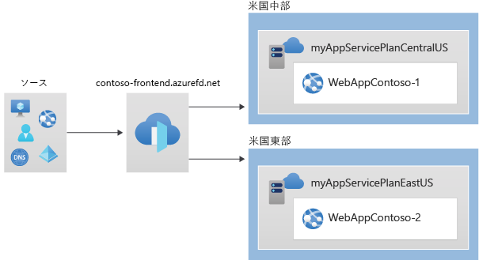
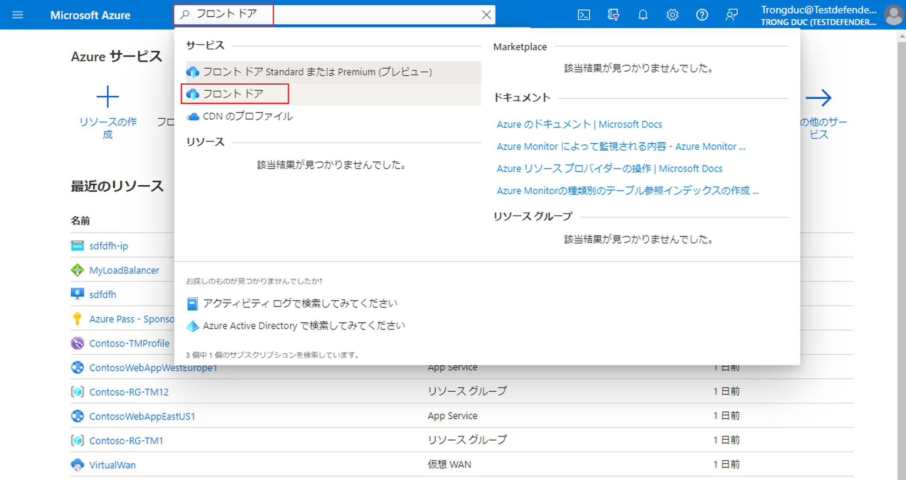
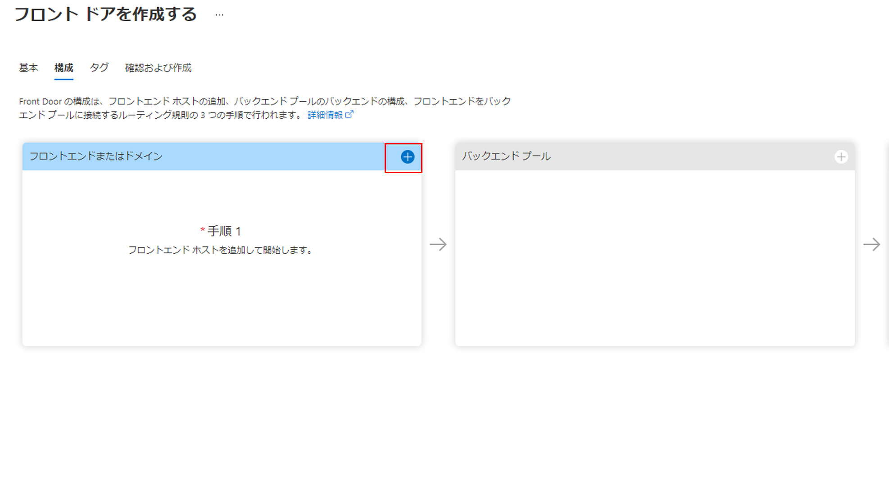
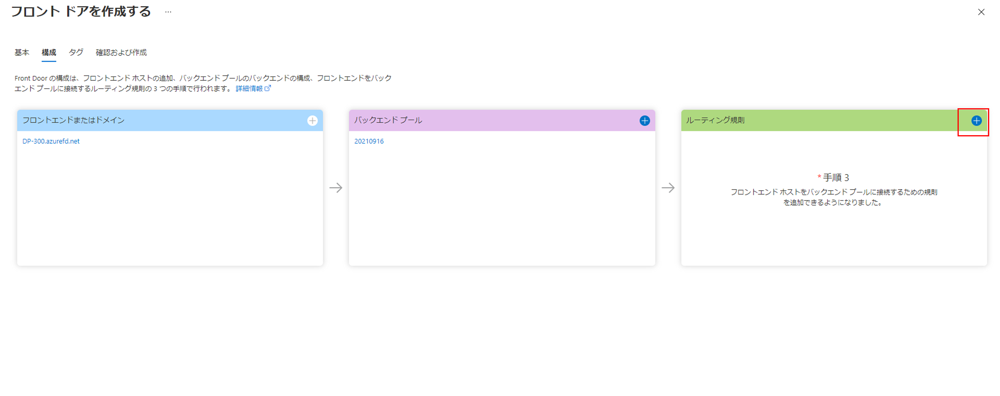
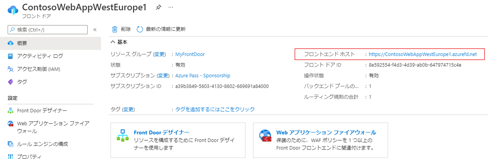
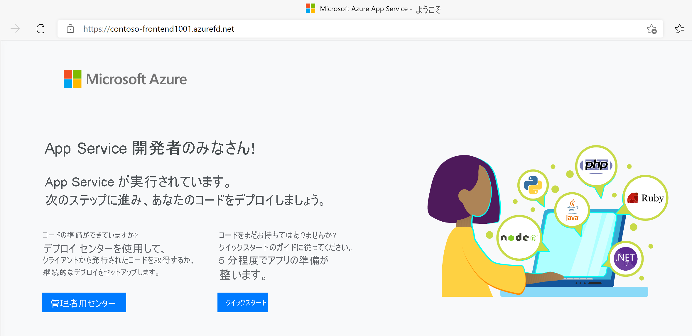
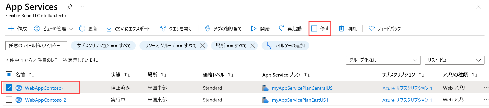
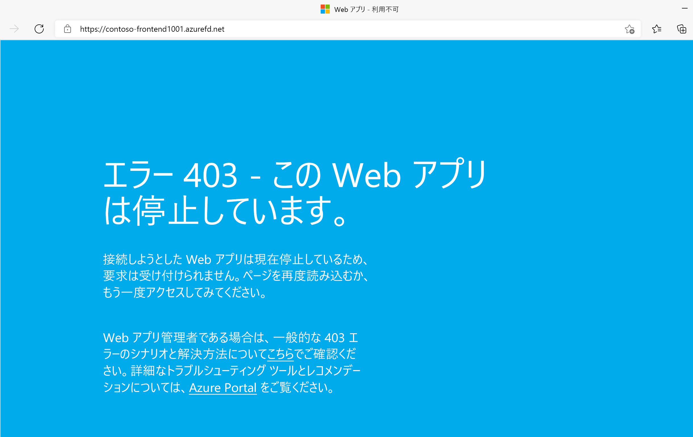

---
Exercise:
    title: 'M05-ユニット 6 Azure portal を使用して高可用性 Web アプリケーションのフロント ドアを作成する'
    module: 'モジュール - Azure で HTTP(S) トラフィックの負荷を分散する'
---


# M05-ユニット 6 Azure portal を使用して高可用性 Web アプリケーションのフロント ドアを作成する

 

この演習では、異なる Azure リージョンで実行される Web アプリケーションの 2 つのインスタンスをプールする Azure Front Door 構成をセットアップします。この構成では、アプリケーションが実行されている最も近いサイトにトラフィックが誘導されます。Web アプリケーションは、Azure Front Door によって絶えず監視されます。最も近いサイトが利用できない状態になると、サービスによって、使用可能な次のサイトへの自動フェールオーバーが行われることをデモします。ネットワーク構成を次の図に示します。



この演習では、次のことを行います。

+ タスク 1: Web アプリの 2 つのインスタンスを作成する
+ タスク 2: アプリケーション用の Front Door を作成する
+ タスク 3: Azure Front Door の動作を確認する
+ タスク 4: リソースをクリーン アップする


## タスク 1: Web アプリの 2 つのインスタンスを作成する

この演習には、別々の Azure リージョンで実行される、Web アプリケーションの 2 つのインスタンスが必要です。どちらの Web アプリケーション インスタンスもアクティブ/アクティブ モードで実行されるため、どちらでもトラフィックを受け入れることができます。この構成は、一方がフェールオーバーとして機能するアクティブ/スタンバイ構成とは異なります。

1. Azure portal [(https://portal.azure.com)](https://portal.azure.com/) にサインインします。

2. Azure portal の「ホーム」ページで、グローバル検索を使用して、「**WebApp**」と入力し、サービスの下で、「**App Services**」を選択します。

3. 「**+ 作成**」をクリックして、Web アプリを作成します。

4. 「Web アプリの作成」ページの「**基本**」タブで、次の情報を入力または選択します。

   | **設定**      | **値**                                                    |
   | ---------------- | ------------------------------------------------------------ |
   | サブスクリプション     | サブスクリプションを選択します。                                    |
   | リソース グループ   | リソース グループ ContosoResourceGroup を選択する               |
   | 名前             | Web アプリの一意の名前を入力します。この例では WebAppContoso-1 を使用します。 |
   | 公開          | 「**コード**」を選択します。                                             |
   | ランタイム スタック    | 「**NET Core 3.1 (LTS)**」を選択します。                              |
   | オペレーティング システム | 「**Windows**」を選択します。                                          |
   | リージョン           | 「**米国中部**」を選択します。                                       |
   | Windows プラン     | 「**新規作成**」を選択し、テキスト ボックスに「myAppServicePlanCentralUS」と入力します。 |
   | SKU とサイズ     | 「**Standard S1 100 total ACU、1.75 GB メモリ**を選択します。        |

5. 「**Review + create**」を選択し、「概要」を確認して、「**作成**」を選択します。   
   ‎デプロイが完了するまでに数分かかる場合があります。

6. 2 番目の Web アプリを作成します。Azure portal のホーム ページで、「**WebApp**」を検索します。

7. 「**+ 作成**」をクリックして、Web アプリを作成します。

8. 「Web アプリの作成」ページの「**基本**」タブで、次の情報を入力または選択します。

   | **設定**      | **値**                                                    |
   | ---------------- | ------------------------------------------------------------ |
   | サブスクリプション     | サブスクリプションを選択します。                                    |
   | リソース グループ   | リソース グループ ContosoResourceGroup を選択する               |
   | 名前             | Web アプリの一意の名前を入力します。この例では WebAppContoso-2 を使用します。 |
   | 公開          | 「**コード**」を選択します。                                             |
   | ランタイム スタック    | 「**NET Core 3.1 (LTS)**」を選択します。                              |
   | オペレーティング システム | 「**Windows**」を選択します。                                          |
   | リージョン           | 「**米国東部**」を選択します。                                          |
   | Windows プラン     | 「**新規作成**」を選択し、テキスト ボックスに「myAppServicePlanEastUS」と入力します。 |
   | SKU とサイズ     | 「**Standard S1 100 total ACU、1.75 GB メモリ**を選択します。        |

9. 「**Review + create**」を選択し、「概要」を確認して、「**作成**」を選択します。   
   ‎デプロイが完了するまでに数分かかる場合があります。

## タスク 2: アプリケーション用の Front Door を作成する

2 つの Web アプリ サーバーのうち待ち時間が短い方にユーザー トラフィックを誘導するように Azure Front Door を構成します。最初に、Azure Front Door のフロントエンド ホストを追加します。

1. Azure portal ページの「**リソース、サービス、ドキュメントの検索 (G+/)**」で、Front Doors と入力し、結果から「**Front Doors**」を選択します。

   

2. 「Front Door」ページで、「**+ 作成**」を選択します。

3. 「Front Door の作成」で、次の情報を入力または選択します。

   | **設定**             | **値**                                    |
   | ----------------------- | -------------------------------------------- |
   | サブスクリプション            | サブスクリプションを選択します。                    |
   | リソース グループ          | ContosoResourceGroup を選択する                  |
   | リソース グループの場所 | 既定の設定をそのまま使用します                       |

4. 「**次へ: 構成**」を選択します。

5. 「構成」タブの「**フロントエンド/ドメイン**」で、「**+**」を選択してフロントエンド ホストを追加します。

   

6. contoso-frontend などのグローバルに一意の**ホスト名**を入力し、「**追加**」を選択します。

7. 次に、2 つの Web アプリを含んだバックエンド プールを作成します。  
   ‎「Front Door の作成」の「**バックエンド**　プール」で、「+」を選択してバックエンド プールを追加します。

   

8. BackendPool　のように、グローバルに一意の**ホスト名**を入力します。

9. 「**バックエンド**」で、「**+ バックエンドの追加**」を選択します。

10. 「バックエンドの追加」で、次の情報を入力または選択します。

    | **設定**       | **値**                                                    |
    | ----------------- | ------------------------------------------------------------ |
    | バックエンド ホストの種類 | 「**App Service**」を選択します。                                      |
    | サブスクリプション      | サブスクリプションを選択します。                                    |
    | バックエンド ホスト名 | 最初に作成した Web アプリを選択します。この例では、**WebAppContoso-1** という Web アプリが該当します。 |

11. 他のすべてのフィールドは既定値のままにして、「**追加**」を選択します。

12. 「**+ バックエンドの追加**」を再度選択し、次の情報を入力または選択します。

    | **設定**       | **値**                                                    |
    | ----------------- | ------------------------------------------------------------ |
    | バックエンド ホストの種類 | 「App Service」を選択します。                                          |
    | サブスクリプション      | サブスクリプションを選択します。                                    |
    | バックエンド ホスト名 | 作成した 2 つ目の Web アプリを選択します。この例では、**WebAppContoso-2** という Web アプリが該当します。 |

13. 他のすべてのフィールドは既定値のままにして、「**追加**」を選択します。

14. 「**バックエンド プールの追加**」ブレードで「**追加**」を選択して、バックエンド プールの構成を完了します。

15. 最後に、ルーティング規則を追加します。フロントエンド ホストは、ルーティング規則によってバックエンド プールにマップされます。この規則は、contoso-frontend.azurefd.net の要求を myBackendPool に転送します。

16. 「Front Door を作成する」の「**ルーティング規則**」で「**+**」を選択し、ルーティング規則を構成します。

    

17. 「規則を追加する」の「**名前**」に「LocationRule」と入力します。 

18. すべて既定値のままにし、「**追加**」を選択してルーティング規則を追加します。

19. 「**Review + Create**」、「**作成**」の順に選択します。

**Front Door 内の各フロントエンド ホストに、既定のパス (\*) が関連付けられたルーティング規則があることを確認する必要があります。つまり、すべてのルーティング規則にわたり、既定の (\*) で定義されているフロントエンド ホストごとに少なくとも 1 つのルーティング規則が必要です。そうなっていないと、エンド ユーザーのトラフィックが正しくルーティングされない可能性があります**。

 

## タスク 3: Azure Front Door の動作を確認する

フロント ドアを作成した後、グローバルに構成がデプロイされるまでに数分かかります。完了したら、作成したフロントエンド ホストにアクセスします。 

1. Azure portal で、Front Door フロントエンドに移動します。「**リソースに移動**」を選択します。または、「リソース、サービス、ドキュメントの検索 (G+/)」で、**Front Doors** を入力し、結果から「**Front Doors**」を選択してから、Front Doors を選択します。

2. 「Front Door」ページで、**フロントエンド ホスト**の URL をメモします。この演習では contoso-frontend.azurefd.net を使用しますが、名前が一意になるように変更した可能性があります。

   

3. ブラウザーで、フロントエンド ホスト URL (contoso-frontend.azurefd.net) にアクセスします。要求は、バックエンド プール内の指定されたサーバーの中から、自分に最も近いサーバーに自動的にルーティングされます。

4. 次の情報ページが表示されます。

   

5. 即時グローバル フェールオーバーの動作をテストするために、次の手順を試してみましょう。

6. Azure portal に切り替え、「**App Services**」を検索して選択します。 

7. Web アプリの 1 つを選択し、「**停止**」を選択してから、「**はい**」を選択して確認します。

   

8. ブラウザーに戻り、「更新」を選択します。同じ情報ページが表示されるはずです。

**Web アプリの停止中に遅延が発生する場合があります。ブラウザーにエラーページが表示された場合は、ページを更新してください**。

1. Azure portal に戻り、他の Web アプリを見つけて、停止します。

2. ブラウザーに戻り、「更新」を選択します。今回はエラー メッセージが表示されます。

   

   お疲れさまでした! Azure Front Door を構成およびテストしました。
   
  
   
   ## タスク 4: リソースをクリーン アップする
   
   > **注**: 新しく作成した Azure リソースのうち、使用しないリソースは必ず削除してください。使用しないリソースを削除しないと、予期しないコストが発生する場合があります。

1. Azure portal の **「Cloud Shell」** ウィンドウで **「PowerShell」** セッションを開きます。

1. 次のコマンドを実行して、このモジュールのラボ全体で作成したすべてのリソース グループのリストを削除します。

   ```powershell

   Remove-AzResourceGroup -Name 'ContosoResourceGroup' -Force -AsJob

   ```

    > **注**: コマンドは非同期で実行されるので (-AsJob パラメーターによって決定されます)、別の PowerShell コマンドを同一 PowerShell セッション内ですぐに実行できますが、リソース グループが実際に削除されるまでに数分かかります。
