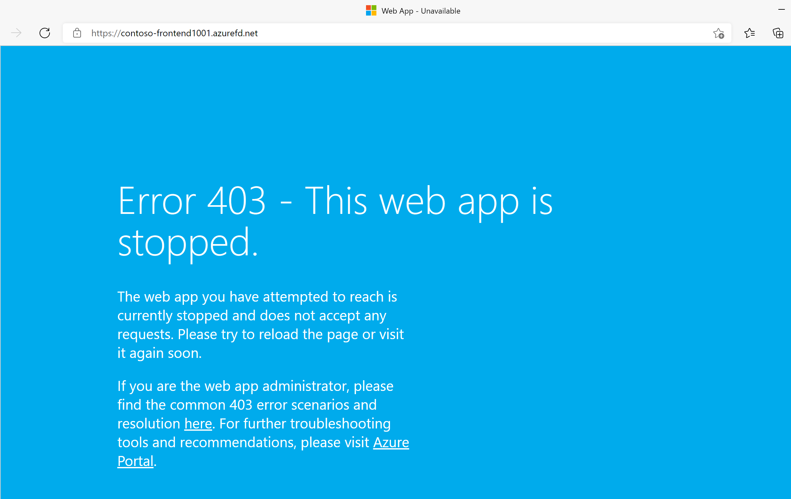

---
Exercise:
  title: M05 - ユニット 6 Azure portal を使用して高可用性 Web アプリケーションのフロント ドアを作成する
  module: Module 05 - Load balancing HTTP(S) traffic in Azure
---


# M05-ユニット 6 Azure portal を使用して高可用性 Web アプリケーションのフロント ドアを作成する

## 演習のシナリオ  

この演習では、別々の Azure リージョンで実行される、Web アプリケーションの 2 つのインスタンスをプールする Azure Front Door の構成を設定します。 この構成では、アプリケーションが実行されている最も近いサイトにトラフィックが誘導されます。 Web アプリケーションは、Azure Front Door によって絶えず監視されます。 最も近いサイトが利用できなくなったときに、使用可能な次のサイトに自動フェールオーバーする方法について説明します。 次の図に、ネットワーク構成を示します。


### 職務スキル

この演習では、次のことを行います。

+ タスク 1: Web アプリの 2 つのインスタンスを作成する
+ タスク 2: アプリケーション用のフロント ドアを作成する
+ タスク 3: Azure Front Door の動作を確認する

### 対話型ラボ シミュレーション

>**注**: 以前提供されていたラボ シミュレーションは廃止されました。

### 予想所要時間: 30 分

## タスク 1: Web アプリの 2 つのインスタンスを作成する

この演習には、別々の Azure リージョンで実行される、Web アプリケーションの 2 つのインスタンスが必要です。 どちらの Web アプリケーション インスタンスもアクティブ/アクティブ モードで実行されるため、どちらでもトラフィックを受け入れることができます。 この構成は、一方がフェールオーバーとして機能するアクティブ/スタンバイ構成とは異なります。

1. Azure Portal [https://portal.azure.com](https://portal.azure.com/) にサインインします。

1. Azure ホーム ページのグローバル検索で、「**WebApp**」と入力し、[サービス] の下の **[App Services]** を選択します。

1. **[+ 作成]** を選択して、Web アプリを作成します。

1. [Web アプリの作成] ページの **[基本]** タブで、次の情報を入力または選択します。

   | **設定**      | **Value**                                                    |
   | ---------------- | ------------------------------------------------------------ |
   | サブスクリプション     | サブスクリプションを選択します。                                    |
   | Resource group   | リソース グループ ContosoResourceGroup を選択する               |
   | Name             | Web アプリの一意の名前を入力します。 この例では WebAppContoso-1 を使用します。 |
   | 発行          | **[コード]** を選択します。                                             |
   | ランタイム スタック    | **[.NET 8 (LTS)]** を選びます。                                     |
   | オペレーティング システム | **[Windows]** を選択します。                                          |
   | リージョン           | **[米国中部]** を選択します。                                       |
   | Windows プラン     | **[新規作成]** を選択し、テキスト ボックスに「myAppServicePlanCentralUS」と入力します。 |
   | 料金プラン    | **[Standard S1 100 total ACU, 1.75 GB memory](Standard S1 合計 100 ACU、1.75 GB メモリ)** を選択します。        |

1. **[確認および作成]** を選択し、[概要] を確認して、**[作成]** を選択します。
   ‎デプロイが完了するまでに数分かかる場合があります。

1. 2つ目の Web アプリを作成します。 Azure portal のホーム ページで、**WebApp** を検索します。

1. **[+ 作成]** を選択して、Web アプリを作成します。

1. [Web アプリの作成] ページの **[基本]** タブで、次の情報を入力または選択します。

   | **設定**      | **Value**                                                    |
   | ---------------- | ------------------------------------------------------------ |
   | サブスクリプション     | サブスクリプションを選択します。                                    |
   | Resource group   | リソース グループ ContosoResourceGroup を選択する               |
   | Name             | Web アプリの一意の名前を入力します。 この例では WebAppContoso-2 を使用します。 |
   | 発行          | **[コード]** を選択します。                                             |
   | ランタイム スタック    | **[.NET 8 (LTS)]** を選びます。                                     |
   | オペレーティング システム | **[Windows]** を選択します。                                          |
   | リージョン           | **[East US（米国東部）]** を選択します。                                          |
   | Windows プラン     | **[新規作成]** を選択し、テキスト ボックスに「myAppServicePlanEastUS」と入力します。 |
   | 料金プラン     | **[Standard S1 100 total ACU, 1.75 GB memory](Standard S1 合計 100 ACU、1.75 GB メモリ)** を選択します。        |

1. **[確認および作成]** を選択し、[概要] を確認して、**[作成]** を選択します。
   ‎デプロイが完了するまでに数分かかる場合があります。

   >**注:** デプロイ エラーが発生した場合は、通知をよくお読みください。 クォータが原因でリージョンの可用性に関するエラーが発生した場合は、別のリージョンに変更してみてください。 

## タスク 2: アプリケーション用のフロント ドアを作成する

2 つの Web アプリ サーバーのうち待ち時間が短い方にユーザー トラフィックを誘導するように Azure Front Door を構成します。 最初に、Azure Front Door のフロントエンド ホストを追加します。

1. Azure Portal 上の任意のページで、 **[リソース、サービス、ドキュメントの検索 (G+/)]** 、[Search for Front Door and CDN profiles](Front Door と CDN プロファイルを検索) の順に選択し、**フロント ドアと CDN プロファイル**を選択します。

1. **[Create front door and CDN profiles](フロント ドアと CDN プロファイルの作成)** を選択します。 [Compare offerings](オファリングの比較) ページで、 **[簡易作成]** を選択します。 次に、 **[Continue to create a Front Door](フロント ドアの作成を続行する)** を選択します。

1. [基本] タブで、次の情報を入力または選択します。

   | **設定**             | **Value**                                    |
   | ----------------------- | -------------------------------------------- |
   | サブスクリプション            | サブスクリプションを選択します。                    |
   | Resource group          | [ContosoResourceGroup] を選択します                  |
   | リソース グループの場所 | 既定の設定を使用します                       |
   | 名前                    | このサブスクリプションで一意の名前を入力します (FrontDoor(イニシャル) など)。   |
   | レベル                    | Standard   |
   | エンドポイント名           | FDendpoint   |
   | 配信元の種類             | App Service|
   | 配信元のホスト名        | 以前にデプロイした １つ目のWeb アプリの名前 |

1. **[確認と作成]** を選択し、次に **[作成]** を選択します。

1. リソースのデプロイを待ってから、 **[リソースに移動]** を選択します。

1. [概要] ブレードの Front Door リソースで**配信元グループ**を見つけ、作成された配信元グループを選択します

1. 配信元グループを更新するには、一覧から名前 **default-origin-group** を選択します。 **[Add an origin](配信元の追加)** を選択し、2 つ目の Web アプリを追加します。 [追加] を選択し、[更新] を選択します。

## タスク 3: Azure Front Door の動作を確認する

フロント ドアを作成した後、グローバルに構成がデプロイされるまでに数分かかります。 完了したら、作成したフロントエンド ホストにアクセスします。

1. [概要] ブレードの Front Door リソースで、エンドポイント用に作成されたエンドポイント ホスト名を探します。 これは、fdendpoint の後にハイフンとランダムな文字列が続きます。 たとえば、**fdendpoint-fxa8c8hddhhgcrb9.z01.azurefd.net** などです。 この FQDN を**コピー**します。

1. 新しいブラウザー タブで、Front Door エンドポイントの FQDN に移動します。 既定の App Service ページが表示されます。
   

1. 即時グローバル フェールオーバーの動作をテストするために、次の手順を試してみましょう。

1. Azure portal に切り替えて、**App Services** を検索して選択します。

1. いずれかの Web アプリを選択し、**[停止]** を選択し、**[はい]** を選択して確認します。

   

1. ブラウザーに戻り、[最新の情報に更新] を選択します。 同じ情報ページが表示されるはずです。

**Web アプリが停止している間に遅延が発生する場合があります。ブラウザーにエラー ページが表示された場合は、ページを最新の情報に更新してください**。

1. Azure portal に戻り、他の １つ目のWeb アプリを見つけて、停止します。

1. ブラウザーに戻り、[最新の情報に更新] を選択します。 今回はエラー メッセージが表示されます。

   

   お疲れさまでした。 これで、Azure Front Door の構成とテストが完了しました。

## リソースをクリーンアップする

   >**注**:新規に作成し、使用しなくなったすべての Azure リソースを削除することを忘れないでください。 使用していないリソースを削除することで、予期しない料金が発生しなくなります。

1. Azure portal で、 **[Cloud Shell]** ペイン内に **PowerShell** セッションを開きます。

1. 次のコマンドを実行して、このモジュールのラボ全体を通して作成したすべてのリソース グループを削除します。

   ```powershell

   Remove-AzResourceGroup -Name 'ContosoResourceGroup' -Force -AsJob

   ```

   >**注**:このコマンドは非同期で実行されるため (-AsJob パラメーターによって決定されます)、同じ PowerShell セッション内で直後に別の PowerShell コマンドを実行できますが、リソース グループが実際に削除されるまでに数分かかります。

## Copilot を使用して学習を拡張する

Copilot は、Azure スクリプト ツールの使用方法を学習するのに役立ちます。 Copilot は、ラボでは対象外の、またはさらに詳しい情報が必要な領域でも役立ちます。 Edge ブラウザーを開き、Copilot (右上) を選択するか、*copilot.microsoft.com* に移動します。 次のプロンプトを試すには数分かかります。
+ Azure Application Gateway と Azure Front Door の違いは何ですか? 各製品を使用する状況の例を提供してください。
+ Azure Front Door を構成するときに行うことのチェックリストを提供してください。
+ Azure Front Door での配信元は何で、エンドポイントとの違いは何ですか?


## 自習トレーニングでさらに学習する

+ [Azure Front Door の概要](https://learn.microsoft.com/training/modules/intro-to-azure-front-door/)。 このモジュールでは、Azure Front Door でアプリケーションを保護する方法について説明します。
+ [Front Door を使用して Web サービスのトラフィックを負荷分散する](https://learn.microsoft.com/training/modules/create-first-azure-front-door/)。 このモジュールでは、Azure Front Door を作成して構成する方法について説明します。 

## 要点

以上でラボは完了です。 このラボの要点は次のとおりです。 
+ Azure Front Door は、世界中のどこでもアプリケーションを提供するクラウドベースのサービスです。 
+ Azure Front Door は、レイヤー 7 の負荷分散を使用して、複数のリージョンとエンドポイントにトラフィックを分散します。
+ Azure Front Door では、HTTP/HTTPS トラフィックの分散方法を決定するさまざまなトラフィック ルーティング方法がサポートされています。 ルーティング方法は、待機時間、優先度、重み付け、セッション アフィニティです。 
