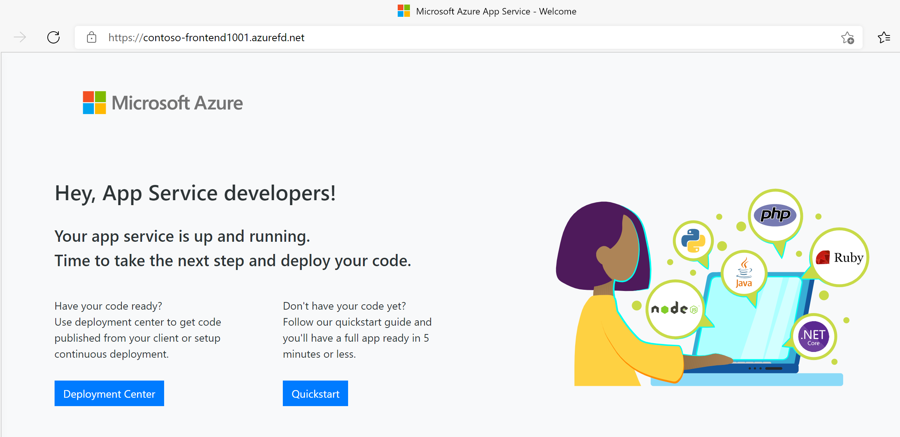

---
Exercise:
  title: M05-ユニット 6 Azure portal を使用して高可用性 Web アプリケーションのフロント ドアを作成する
  module: Module - Load balancing HTTP(S) traffic in Azure
ms.openlocfilehash: 78a6ba6417aa6c43e2e613af8c20c5d76c4749c0
ms.sourcegitcommit: 3aeb76a0ac28b33b6edc61365b303f5b0252a3c2
ms.translationtype: HT
ms.contentlocale: ja-JP
ms.lasthandoff: 01/30/2022
ms.locfileid: "137860535"
---
# <a name="m05-unit-6-create-a-front-door-for-a-highly-available-web-application-using-the-azure-portal"></a>M05-ユニット 6 Azure portal を使用して高可用性 Web アプリケーションのフロント ドアを作成する

 

この演習では、別々の Azure リージョンで実行される、Web アプリケーションの 2 つのインスタンスをプールする Azure Front Door の構成を設定します。 この構成では、アプリケーションが実行されている最も近いサイトにトラフィックが誘導されます。 Web アプリケーションは、Azure Front Door によって絶えず監視されます。 最も近いサイトが利用できなくなったときに、使用可能な次のサイトに自動フェールオーバーする方法について説明します。 次の図に、ネットワーク構成を示します。


この演習では、以下のことを行います。

+ タスク 1: Web アプリの 2 つのインスタンスを作成する
+ タスク 2: アプリケーション用のフロント ドアを作成する
+ タスク 3: Azure Front Door の動作を確認する
+ タスク 4: リソースをクリーンアップする


## <a name="task-1-create-two-instances-of-a-web-app"></a>タスク 1: Web アプリの 2 つのインスタンスを作成する

この演習には、別々の Azure リージョンで実行される、Web アプリケーションの 2 つのインスタンスが必要です。 どちらの Web アプリケーション インスタンスもアクティブ/アクティブ モードで実行されるため、どちらでもトラフィックを受け入れることができます。 この構成は、一方がフェールオーバーとして機能するアクティブ/スタンバイ構成とは異なります。

1. Azure Portal [https://portal.azure.com](https://portal.azure.com/) にサインインします。

2. Azure ホーム ページのグローバル検索で、「**WebApp**」と入力し、[サービス] の下の **[App Services]** を選択します。

3. **[+ 作成]** をクリックして、Web アプリを作成します。

4. [Web アプリの作成] ページの **[基本]** タブで、次の情報を入力または選択します。

   | **設定**      | **Value**                                                    |
   | ---------------- | ------------------------------------------------------------ |
   | サブスクリプション     | サブスクリプションを選択します。                                    |
   | Resource group   | リソース グループ ContosoResourceGroup を選択する               |
   | Name             | Web アプリの一意の名前を入力します。 この例では WebAppContoso-1 を使用します。 |
   | 公開         | **[コード]** を選択します。                                             |
   | ランタイム スタック    | **[.NET Core 3.1 (LTS)]** を選択します。                              |
   | オペレーティング システム | **[Windows]** を選択します。                                          |
   | リージョン           | **[Central US]** を選択します。                                       |
   | Windows プラン     | **[新規作成]** を選択し、テキスト ボックスに「myAppServicePlanCentralUS」と入力します。 |
   | SKU とサイズ     | **[Standard S1 100 total ACU, 1.75 GB memory]\(Standard S1 合計 100 ACU、1.75 GB メモリ\)** を選択します。        |

5. **[確認および作成]** を選択し、[概要] を確認して、**[作成]** を選択します。   
   デプロイが完了するまでに数分かかる場合があります。

6. 2つ目の Web アプリを作成します。 Azure portal のホーム ページで、**WebApp** を検索します。

7. **[+ 作成]** をクリックして、Web アプリを作成します。

8. [Web アプリの作成] ページの **[基本]** タブで、次の情報を入力または選択します。

   | **設定**      | **Value**                                                    |
   | ---------------- | ------------------------------------------------------------ |
   | サブスクリプション     | サブスクリプションを選択します。                                    |
   | Resource group   | リソース グループ ContosoResourceGroup を選択する               |
   | Name             | Web アプリの一意の名前を入力します。 この例では WebAppContoso-2 を使用します。 |
   | 公開          | **[コード]** を選択します。                                             |
   | ランタイム スタック    | **[.NET Core 3.1 (LTS)]** を選択します。                              |
   | オペレーティング システム | **[Windows]** を選択します。                                          |
   | リージョン           | **[East US]** を選択します。                                          |
   | Windows プラン     | **[新規作成]** を選択し、テキスト ボックスに「myAppServicePlanEastUS」と入力します。 |
   | SKU とサイズ     | **[Standard S1 100 total ACU, 1.75 GB memory]\(Standard S1 合計 100 ACU、1.75 GB メモリ\)** を選択します。        |

9. **[確認および作成]** を選択し、[概要] を確認して、**[作成]** を選択します。   
   ‎デプロイが完了するまでに数分かかる場合があります。

## <a name="task-2-create-a-front-door-for-your-application"></a>タスク 2: アプリケーション用のフロント ドアを作成する

2 つの Web アプリ サーバーのうち待ち時間が短い方にユーザー トラフィックを誘導するように Azure Front Door を構成します。 最初に、Azure Front Door のフロントエンド ホストを追加します。

1. Azure portal ページの「**リソース、サービス、ドキュメントの検索 (G+/)** 」で、Front Door と入力し、結果から「**Front Door と CDN プロファイル**」を選択します。

1. [Front Door と CDN プロファイル] ページで、**[+ 作成]** を選択します。

1. [オファリングの比較] ページで **[簡易作成]**が選択されていることを確認して **[reate front door and CDN profiles]** を選択します。

1. [フロント ドア プロファイルの作成] で、次の情報を入力または選択します。

   | **Setting**             | **Value**                                    |
   | ----------------------- | -------------------------------------------- |
   | サブスクリプション      | サブスクリプションを選択します。                  |
   | リソースグループ        | リソース グループ ContosoResourceGroup を選択する                  |
   | リソースグループの場所  | デフォルトの場所を受け入れます                   |
   | 名前                    | サブスクリプションの中で一意の名前を入力します。   |
   | レベル                    | Standard   |
   | エンドポイント名          | FDendpoint   |
   | 配信元の種類             | App Services| 
   | 配信元のホスト名       | 先の手順でデプロイした Web App の名前 |

1. **[確認及び作成]** を選択した後、 **[作成]**を選択します。

1. デプロイが完了したら、**[リソースに移動]** をクリックします。

1. [概要] ブレード内の **[配信元グループ]** を探して、作成された配信元グループをクリックします

1. [配信元グループ] の一覧から **[default-origin-group]** を選択して **[配信元の追加]** をクリックし、2つ目のWebAppを追加します。その後 **[更新]** を選択します


## <a name="task-3-view-azure-front-door-in-action"></a>タスク 3: Azure Front Door の動作を確認する

フロント ドアを作成した後、グローバルに構成がデプロイされるまでに数分かかります。 完了したら、作成したフロントエンド ホストにアクセスします。 

1. Azure portal で、Front Door リソースの[概要]ブレードで、Endpoint hostname の値を探します。これはFDendpoint のあとにランダムの文字列が追加された値です。例えば、**fdendpoint-fxa8c8hddhhgcrb9.z01.azurefd.net** です。このFQDNの値をコピーします

1. 新しいブラウザのタブを開き、Front Door endpoint の FQDN にアクセスします。 App Serviceのデフォルトページが表示されるはずです。
   

1. 即時グローバル フェールオーバーの動作をテストするために、次の手順を試してみましょう。

1. Azure portal に切り替えて、**App Service** を検索して選択します。 

1. いずれかの Web アプリを選択し、**[停止]** を選択し、**[はい]** を選択して確認します。

   

1. ブラウザーに戻り、[最新の情報に更新] を選択します。 同じ情報ページが表示されるはずです。

**Web アプリが停止している間に遅延が発生する場合があります。ブラウザーにエラー ページが表示された場合は、ページを最新の情報に更新してください**。

1. Azure portal に戻り、他の Web アプリを見つけて、停止します。

1. ブラウザーに戻り、[最新の情報に更新] を選択します。 今回はエラー メッセージが表示されます。

   

   お疲れさまでした。 これで、Azure Front Door の構成とテストが完了しました。
   
  
   
   ## <a name="task-4-clean-up-resources"></a>タスク 4: リソースをクリーンアップする
   
   >**注**:新規に作成し、使用しなくなったすべての Azure リソースを削除することを忘れないでください。 使用していないリソースを削除することで、予期しない料金が発生しなくなります。

1. Azure portal で、**[Cloud Shell]** ペイン内に **PowerShell** セッションを開きます。

1. 次のコマンドを実行して、このモジュールのラボ全体を通して作成したすべてのリソース グループを削除します。

   ```powershell

   Remove-AzResourceGroup -Name 'ContosoResourceGroup' -Force -AsJob

   ```

    >**注**:このコマンドは非同期で実行されるため (-AsJob パラメーターによって決定されます)、同じ PowerShell セッション内で直後に別の PowerShell コマンドを実行できますが、リソース グループが実際に削除されるまでに数分かかります。
