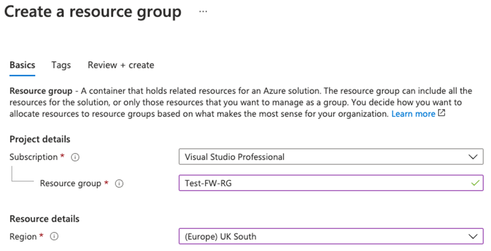
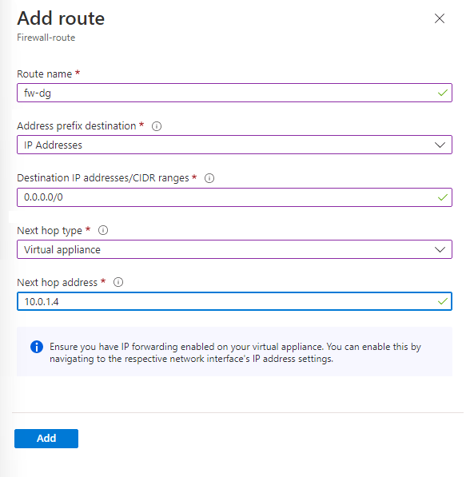

---
Exercise:
    title: 'M06-ユニット 7 Azure portal を使用して Azure Firewall をデプロイして構成する'
    module: 'モジュール - ネットワーク セキュリティの設計と実装'
---

# M06-ユニット 7 Azure portal を使用して Azure Firewall をデプロイして構成する

Contoso のネットワーク セキュリティ チームの一員である次のタスクは、特定の Web サイトへのアクセスを許可/拒否するファイアウォール規則を作成することです。次の手順では、環境準備タスクとして、リソース グループ、仮想ネットワークとサブネット、仮想マシンを作成する手順を説明します。次に、ファイアウォールとファイアウォール ポリシーをデプロイし、既定のルートとアプリケーション、ネットワークと DNAT ルールを構成し、最後にファイアウォールをテストします。

この演習では、次のことを行います。

+ タスク 1: リソース グループを作成する
+ タスク 2: 仮想ネットワークとサブネットを作成する
+ タスク 3: 仮想マシンを作成する
+ タスク 4: ファイアウォールとファイアウォール ポリシーを展開する
+ タスク 5: 既定のルートを作成する
+ タスク 6: アプリケーション ルールを構成する
+ タスク 7: ネットワーク ルールを構成する
+ タスク 8: 宛先 NAT (DNAT) 規則を構成する
+ タスク 9: サーバーのネットワーク インターフェイスのプライマリ DNS アドレスとセカンダリ DNS アドレスを変更します
+ タスク 10: ファイアウォールをテストする
+ タスク 11: リソースをクリーン アップする


## タスク 1: リソース グループを作成する

このタスクでは、新しいリソース グループを作成します。

1. Azure アカウントにログインします。

2. Azure portal のホーム ページで、「**リソース グループ**」を選択します。

3. 「**作成**」をクリックします。 

4. 「**基本**」タブの「**リソース グループ**」に、「**Test-FW-RG**」と入力します。

5. 「**リージョン**」で、一覧からリージョンを選択します。

   

6. 「**Review + create**」をクリックします。

7. 「**作成**」をクリックします。

 

## タスク 2: 仮想ネットワークとサブネットを作成する

このタスクでは、2 つのサブネットを持つ単一の仮想ネットワークを作成します。

1. Azure portal のホーム ページで、検索ボックスに「**仮想ネットワーク**」と入力して、表示されたら「**仮想ネットワーク**」を選択します。

2. 「**作成**」をクリックします。

3. 以前に作成した「**Test-FW-RG**」を選択します。

4. 「**名前**」ボックスに、「**Test-FW-VN**」名前を入力します。

   

5. 「**次へ: IP アドレス**」をクリックします。既定でまだ入力されていない場合は、IPv4 アドレス スペース 10.0.0.0/16 を入力します。 

6. 「**サブネット名**」で、「**既定**」という単語をクリックします。

7. 「**サブネットの編集**」ダイアログ ボックスで、名前を「**AzureFirewallSubnet**」に変更します。

8. 「**サブネット アドレス範囲**」を「**10.0.1.0/26**」に変更します。

9. 「**保存**」をクリックします。

10. 「**サブネットの追加**」をクリックして、まもなく作成するワークロード サーバーをホストする別のサブネットを作成します。


    
    
11. 「**サブネットの編集**」ダイアログ ボックスで、名前を「**Workload-SN**」に変更します。

12. 「**サブネット アドレス範囲**」を「**10.0.2.0/24**」に変更します。

13. 「**追加**」をクリックします。

14. 「**Review + create**」をクリックします。

15. 「**作成**」をクリックします。

 

## タスク 3: 仮想マシンを作成する

このタスクでは、ワークロード仮想マシンを作成し、前に作成した Workload-SN サブネットに配置します。

1. Azure portal のホーム ページで検索ボックスに「**仮想マシン**」と入力して、表示されたら「**仮想マシン**」を選択します。

2. 「**仮想マシン**」ページで、「**作成**」をクリックします。

3. 「**基本**」タブで、次の表の情報を使用して新しい VM を作成します。

   | **設定**          | **値**                                                    |
   | -------------------- | ------------------------------------------------------------ |
   | サブスクリプション         | サブスクリプションを選択します                                     |
   | リソース グループ       | **Test-FW-RG**                                               |
   | 仮想マシン名 | **Srv-Work**                                                 |
   | リージョン               | 自分のリージョン                                                  |
   | 可用性オプション | **インフラストラクチャの冗長性は必要ありません**                    |
   | イメージ                | **Windows Server 2022 Datacenter- Gen1**                     |
   | サイズ                 | **Standard_D2s_v3** - 2vcpus、8GiB メモリ                    |
   | ユーザー名             | **MyAdmin**                                                  |
   | パスワード             | **TestPa$$w0rd!**                                            |
   | パスワードの確認     | **TestPa$$w0rd!**                                            |
   | パブリック受信ポート | 「**なし**」を選択する                                              |


   

4. 「**次へ : ディスク**」をクリックします。

5. 「**次へ : ネットワーク**」をクリックします。

6. **Test-FW-VN** が仮想ネットワークで選択され、サブネットが **Workload-SN** になっていることを確認してください。

7. 「**パブリック IP**」で、「**なし**」を選択します。

8. 「**次へ : 管理**」をクリックします。

9. 「**監視**」で、「**ブート診断**」を「**無効**」に設定します。

10. 「**Review + create**」をクリックします。

11. 「**作成**」をクリックします。

12. VM のデプロイが完了したら、「**リソースに移動**」をクリックします。

13. **Srv-Work** の「**概要**」ページの「**ネットワーク**」の下のページの右側で、この VM の**プライベート IP アドレス**をメモします (例: **10.0.2.4**)。

 

## タスク 4: ファイアウォールとファイアウォール ポリシーを展開する

このタスクでは、ファイアウォール ポリシーを構成して、ファイアウォールを仮想ネットワークにデプロイします。

1. Azure portal のホーム ページで、「**リソースの作成**」を選択し、検索ボックスに「**firewall** 」と入力して、表示されたら「**ファイアウォール**」を選択します。

2. 「**ファイアウォール**」ページで、「**作成**」をクリックします。

3. 「**基本**」タブで、次の表の情報を使用してファイアウォールを作成します。

   | **設定**          | **値**                                                    |
   | -------------------- | ------------------------------------------------------------ |
   | サブスクリプション         | サブスクリプションを選択します                                     |
   | リソース グループ       | **Test-FW-RG**                                               |
   | 仮想マシン名 | **Test-FW01**                                                |
   | リージョン               | 自分のリージョン                                                  |
   | ファイアウォール層        | **Standard**                                                 |
   | ファイアウォール管理  | **ファイアウォール ポリシーを使用してこのファイアウォールを管理する**            |
   | ファイアウォール ポリシー      | **新規追加**を選択する<br />名前: **fw-test-pol**<br />リージョン: **自分のリージョン** |

   

   | 仮想ネットワークを選択する | **既存のものを使用**                         |
   | ------------------------ | ---------------------------------------- |
   | 仮想ネットワーク          | **Test-FW-VN**                           |
   | パブリック IP アドレス        | **新規追加**を選択する<br />名前: **fw-pip** |


   

4. すべての設定を確認して、以下のスクリーンショットと一致することを確認してください。

   

5. 「**Review + create**」をクリックします。

6. 「**作成**」をクリックして、ファイアウォールのデプロイが完了するまで待ちます。

7. ファイアウォールのデプロイが完了したら、「**リソースに移動**」をクリックします。

8. **Test-FW01** の「**概要**」ページの右側で、このファイアウォールの**ファイアウォール プライベート IP**をメモします (例: **10.0.1.4**)。

9. 左側のメニューの「**設定**」で、「**パブリック IP の構成**」をクリックします。

10. **fw-pip** パブリック IP 構成の **IP アドレス**の下にあるアドレスをメモします (例: **20.90.136.51**)。

 

## タスク 5: 既定のルートを作成する

このタスクでは Workload-SN サブネットで、ファイアウォールを通過する送信既定ルートを構成します。

1. Azure portal のホーム ページで、「**リソースの作成**」を選択し、検索ボックスに「**route**」と入力して、表示されたら「**ルート テーブル**」を選択します。

2. 「**ルート テーブル**」ページで、「**作成**」をクリックします。

3. 「**基本**」タブで、次の表の情報を使用して新しいルート テーブルを作成します。

   | **設定**              | **値**                |
   | ------------------------ | ------------------------ |
   | サブスクリプション             | サブスクリプションを選択します |
   | リソース グループ           | **Test-FW-RG**           |
   | リージョン                   | 自分のリージョン              |
   | 名前                     | **Firewall-route**       |
   | 伝達ゲートウェイのルート | **はい**                  |


4. 「**Review + create**」をクリックします。

5. 「**作成**」をクリックします。

   

6. デプロイが完了したら、「**リソースに移動**」を選択します。

7. 「**Firewall-route**」ページの「**設定**」で、「**サブネット**」をクリックし、「**関連付け**」をクリックします。

8. 「**仮想ネットワーク**」で、「**Test-FW-VN**」を選択します。

9. 「**サブネット**」で、「**Workload-SN**」を選択します。このルートに対して Workload-SN サブネットのみを選択してください。そうしないと、ファイアウォールが正しく機能しません。

10. 「**OK**」をクリックします。

11. 「**設定**」で「**ルート**」を選択し、「**追加**」をクリックします。

12. 「**ルート名**」で、「**fw-dg**」と入力します。

13. 「**アドレス プレフィックス**」で、「**0.0.0.0/0**」を入力します。

14. 「**次ホップの種類**」で、「**仮想アプライアンス**」を選択します。

15. 「**次ホップ アドレス**で、先ほどメモしたファイアウォールのプライベート IP アドレスを入力します (例: **10.0.1.4**)

16. 「**OK**」をクリックします。

    

 

## タスク 6: アプリケーション ルールを構成する

このタスクでは、 「www.google.com」 への送信アクセスを許可するアプリケーション ルールを追加します。

1. Azure portal のホーム ページで、「**すべてのリソース**」を選択します。

2. リソースの一覧で、ファイアウォール ポリシー「**fw-test-pol**」をクリックします。

3. 「**設定**」で、「**アプリケーション規則**」をクリックします。

4. 「**アプリケーション規則コレクション**」をクリックします。

5. 「**規則コレクションの追加**」ページで、次の表の情報を使用して新しいアプリケーション規則を作成します。

   | **設定**            | **値**                                 |
   | ---------------------- | ----------------------------------------- |
   | 名前                   | **App-Coll01**                            |
   | 規則コレクションの種類   | **アプリケーション**                           |
   | 優先度               | **200**                                   |
   | 規則コレクションのアクション | **許可**                                 |
   | 規則コレクション グループ  | **DefaultApplicationRuleCollectionGroup** |
   | **規則選択**      |                                           |
   | 名前                   | **Allow-Google**                          |
   | ソースの種類            | **IP アドレス**                            |
   | ソース                 | **10.0.2.0/24**                           |
   | プロトコル               | **http、https**                            |
   | 宛先タイプ       | **FQDN**                                  |
   | 宛先            | **www.google.com**                        |


   

6. 「**追加**」をクリックします。

 

## タスク 7: ネットワーク ルールを構成する

このタスクでは、ポート 53 (DNS) の 2 つの IP アドレスへの送信アクセスを許可するネットワーク規則を追加します。

1. 「**fw-test-pol**」ページ上の「**設定**」で、「**ネットワーク規則**」をクリックします。

2. 「**アプリケーション規則コレクション**」をクリックします。

3. 「**規則コレクションの追加**」ページで、次の表の情報を使用して新しいネットワーク規則を作成します。

   | **設定**            | **値**                                                    |
   | ---------------------- | ------------------------------------------------------------ |
   | 名前                   | **Net-Coll01**                                               |
   | 規則コレクションの種類   | **ネットワーク**                                                  |
   | 優先度               | **200**                                                      |
   | 規則コレクションのアクション | **許可**                                                    |
   | 規則コレクション グループ  | **DefaultNetworkRuleCollectionGroup**                        |
   | **規則選択**      |                                                              |
   | 名前                   | **Allow-DNS**                                                |
   | ソースの種類            | **IP アドレス**                                               |
   | ソース                 | **10.0.2.0/24**                                              |
   | プロトコル               | **UDP**                                                      |
   | 宛先ポート      | **53**                                                       |
   | 変換先の型       | **IP アドレス**                                               |
   | 宛先            | **209.244.0.3、209.244.0.4**<br />これらは CenturyLink が運営するパブリック DNS サーバーです |


   ​	

4. 「**追加**」をクリックします。

 

## タスク 8: 宛先 NAT (DNAT) 規則を構成する

このタスクでは、ファイアウォールを介してリモート デスクトップを Srv-Work 仮想マシンに接続できるようにする DNAT 規則を追加します。

1. 「**fw-test-pol**」ページ上の「**設定**」で、「**DNAT 規則**」をクリックします。

2. 「**アプリケーション規則コレクション**」をクリックします。

3. 「**規則コレクションの追加**」ページで、次の表の情報を使用して新しい DNAT 規則を作成します。

   | **設定**           | **値**                                                    |
   | --------------------- | ------------------------------------------------------------ |
   | 名前                  | **rdp**                                                      |
   | 規則コレクションの種類  | **DNAT**                                                     |
   | 優先度              | **200**                                                      |
   | 規則コレクション グループ | **DefaultDnatRuleCollectionGroup**                           |
   | **規則選択**     |                                                              |
   | 名前                  | **rdp-nat**                                                  |
   | ソースの種類           | **IP アドレス**                                               |
   | ソース                | *                                                         |
   | プロトコル              | **TCP**                                                      |
   | 宛先ポート     | **3389**                                                     |
   | 変換先の型      | **IP アドレス**                                               |
   | 宛先           | 前にメモした **fw-pip** からファイアウォールのパブリック IP アドレスを入力します。<br />**例 - 20.90.136.51** |
   | 変換されたアドレス    | 前にメモした **Srv-Work** からのプライベート IP アドレスを入力します。<br />**例- 10.0.2.4** |
   | 変換されたポート       | **3389**                                                     |


​	

4. 「**追加**」をクリックします。

 

## タスク 9: サーバーのネットワーク インターフェイスのプライマリ DNS アドレスとセカンダリ DNS アドレスを変更します

この演習では、テスト目的で、このタスクでは、Srv-Work サーバーのプライマリ DNS アドレスとセカンダリ DNS アドレスを構成します。ただし、これは、一般的な Azure Firewall 要件ではありません。

1. Azure portal のホーム ページで、「**リソース グループ**」を選択します。

2. リソース グループの一覧で、リソース グループ「**Test-FW-RG**」をクリックします。

3. このリソース グループのリソースの一覧で、**Srv-Work** 仮想マシンのネットワーク インターフェイスを選択します (例: **srv-work350**)。

   

4. 「**設定**」で、「**DNS サーバー**」を選択します。

5. 「**DNS サーバー**」で、「**カスタム**」を選択します。

6. 「**209.244.0.3**」を「**DNS サーバーを追加**」テキストボックスに入力し、次のテキストボックスに「**209.244.0.4**」と入力します。

7. 「**保存**」を選択します。

   

8. **Srv-Work** 仮想マシンを再起動します。

 

## タスク 10: ファイアウォールをテストする

この最後のタスクでは、ファイアウォールをテストして、規則が正しく構成され、期待どおりに機能していることを確認します。この構成により、ファイアウォールのパブリック IP アドレスを介して、ファイアウォールを介してリモート デスクトップ接続を Srv-Work 仮想マシンに接続できるようになります。

1. PC で**リモート デスクトップ接続**を開きます。

2. 「**コンピューター**」ボックスに、ファイアウォールのパブリック IP アドレス (例: **20.90.136.51**) に続けて **3389** (例: **20.90.136.51：3389**) を入力します。

3. 「**ユーザー名**」ボックスに、「**MyAdmin**」と入力します。

4. 「**接続**」をクリックします。

   

5. 「**資格情報の入力**」ダイアログ ボックスで、パスワード **TestPa$$w0rd!** を使用して、**Srv-Work** サーバー仮想マシンにログインします。

6. 「**OK**」をクリックします。

7. 証明書メッセージで「**はい**」をクリックします。

8. Internet Explorer を開き、**https://www.google.com** を参照します。

9. 「**セキュリティの警告**」ダイアログ ボックスで、「**OK**」をクリックします。

10. ポップアップする可能性のある Internet Explorer のセキュリティ アラートで「**閉じる**」をクリックします。

11. Google のホーム ページが表示されます。

    

12. **https://www.microsoft.com** を参照します。

13. ファイアウォールでブロックされるはずです。

    

 
## タスク 11: リソースをクリーン アップする 

> **注**: 新しく作成した Azure リソースのうち、使用しないリソースは必ず削除してください。使用しないリソースを削除しないと、予期しないコストが発生する場合があります。

1. Azure portal の **「Cloud Shell」** ウィンドウで **「PowerShell」** セッションを開きます。

1. 次のコマンドを実行して、このモジュールのラボ全体で作成したすべてのリソース グループのリストを削除します。

   ```powershell
   Remove-AzResourceGroup -Name 'Test-FW-RG' -Force -AsJob
   ```

    > **注**: コマンドは非同期で実行されるので (-AsJob パラメーターによって決定されます)、別の PowerShell コマンドを同一 PowerShell セッション内ですぐに実行できますが、リソース グループが実際に削除されるまでに数分かかります。
