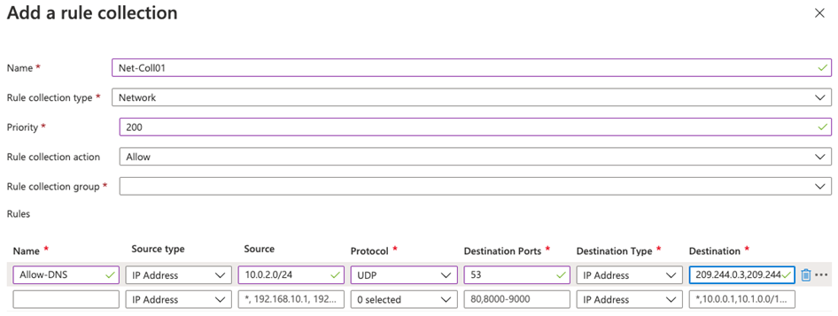

---
Exercise:
  title: M06 - ユニット 7 Azure portal を使用して Azure Firewall をデプロイして構成する
  module: 'Module 06 - Design and implement network security '
---

# M06-ユニット 7 Azure portal を使用して Azure Firewall をデプロイして構成する

## 演習のシナリオ

Contoso のネットワーク セキュリティ チームの一員であるあなたの次のタスクは、特定の Web サイトへのアクセスを許可または拒否するファイアウォール規則を作成することです。 以下の手順では、環境準備タスクとしてリソース グループ、仮想ネットワークとサブネット、仮想マシンを作成した後、ファイアウォールとファイアウォール ポリシーをデプロイし、既定のルートとアプリケーション、ネットワーク、DNAT 規則を構成して、最後にファイアウォールをテストします。


この演習では、次のことを行います。

+ タスク 1: リソース グループを作成する
+ タスク 2: 仮想ネットワークとサブネットを作成する
+ タスク 3: 仮想マシンを作成する
+ タスク 4: ファイアウォールとファイアウォール ポリシーをデプロイする
+ タスク 5: 既定のルートを作成する
+ タスク 6: アプリケーション規則を構成する
+ タスク 7: ネットワーク規則を構成する
+ タスク 8: 送信先 NAT (DNAT) 規則を構成する
+ タスク 9: サーバーのネットワーク インターフェイスのプライマリおよびセカンダリ DNS アドレスを変更する
+ タスク 10: ファイアウォールをテストする


   >**メモ:** このラボをご自分のペースでクリックして進めることができる、 **[ラボの対話型シミュレーション](https://mslabs.cloudguides.com/guides/AZ-700%20Lab%20Simulation%20-%20Deploy%20and%20configure%20Azure%20Firewall%20using%20the%20Azure%20portal)** が用意されています。 対話型シミュレーションとホストされたラボの間に若干の違いがある場合がありますが、示されている主要な概念とアイデアは同じです。

### 予想所要時間: 60 分

## タスク 1: リソース グループを作成する

このタスクでは、新しいリソース グループを作成します。

1. Azure アカウントにログインします。

1. Azure portal のホーム ページで、**[リソース グループ]** を選択します。

1. **［作成］** を選択します

1. **[基本]** タブで、**[リソース グループ]** に「**Test-FW-RG**」と入力します。

1. **[リージョン]** で、一覧から自分のリージョンを選択します。

   

1. **[Review + create](レビュー + 作成)** を選択します。

1. **［作成］** を選択します

## タスク 2: 仮想ネットワークとサブネットを作成する

このタスクでは、1 つの仮想ネットワークと 2 つのサブネットを作成します。

1. Azure portal のホーム ページで検索ボックスに「**仮想ネットワーク**」と入力し、表示されたら **[仮想ネットワーク]** を選択します。

1. **［作成］** を選択します

1. 前に作成した **Test-FW-RG** リソース グループを選択します。

1. **[名前]** ボックスに「**Test-FW-VN**」と入力します。

   ![仮想ネットワークの作成 - [基本] タブ](../media/create-vnet-basics-for-azure-firewall.png)

1. **次へ:[次へ: IP アドレス]** を選択します。 既定値として既に表示されていない場合は、IPv4 アドレス空間「10.0.0.0/16」を入力します。

1. **[サブネット名]** で、 **[default](既定)** という単語を選択します。

1. **[サブネットの編集]** ダイアログ ボックスで、名前を「**AzureFirewallSubnet**」に変更します。

1. **[サブネット アドレス範囲]** を「**10.0.1.0/26**」に変更します。

1. **[保存]** を選択します。

1. **[サブネットの追加]** を選択して、別のサブネットを作成します。この後で作成するワークロード サーバーを、そこでホストします。

    

1. **[サブネットの編集]** ダイアログ ボックスで、名前を「**Workload-SN**」に変更します。

1. **[サブネット アドレス範囲]** を「**10.0.2.0/24**」に変更します。

1. **[追加]** を選択します。

1. **[Review + create](レビュー + 作成)** を選択します。

1. **［作成］** を選択します

## タスク 3: 仮想マシンを作成する

このタスクでは、ワークロードの仮想マシンを作成し、前に作成した Workload-SN サブネットに配置します。

1. Azure portal で、右上の [Cloud Shell] アイコンを選択します。 必要に応じて、シェルを構成します。  
    + **[PowerShell]** を選択します。
    + **[ストレージ アカウントは必要ありません]** と **[サブスクリプション]** を選択してから、**[適用]** を選択します。
    + ターミナルが作成され、プロンプトが表示されるまで待ちます。 

1. Cloud Shell 画面のツールバーで、**[ファイルの管理]** アイコンを選択し、ドロップダウン メニューで **[アップロード]** を選択して、**firewall.json** と **firewall.parameters.json** というファイルを Cloud Shell のホーム ディレクトリにアップロードします。

    > **注:** 自分のサブスクリプションで作業している場合、[テンプレート ファイル](https://github.com/MicrosoftLearning/AZ-700-Designing-and-Implementing-Microsoft-Azure-Networking-Solutions/tree/master/Allfiles/Exercises)は GitHub ラボ リポジトリで入手できます。

1. 次の ARM テンプレートをデプロイして、この演習に必要な VM を作成します。

   >**注**: 管理者パスワードを入力するように求められます。

   ```powershell
   $RGName = "Test-FW-RG"
   
   New-AzResourceGroupDeployment -ResourceGroupName $RGName -TemplateFile firewall.json -TemplateParameterFile firewall.parameters.json
   ```
  
1. デプロイが完了したら、Azure portal のホーム ページに移動し、**[仮想マシン]** を選択します。

1. 仮想マシンが作成されていることを確認してください。

1. **Srv-Work** の **[概要]** ページの右側にある **[ネットワーク]** で、この VM の **[プライベート IP アドレス]** (例: **10.0.2.4**) を記録します。

## タスク 4: ファイアウォールとファイアウォール ポリシーをデプロイする

このタスクでは、ファイアウォール ポリシーを構成して仮想ネットワークにファイアウォールをデプロイします。

1. Azure portal のホーム ページで **[リソースの作成]** を選択し、検索ボックスに「**ファイアウォール**」と入力して、表示されたら **[ファイアウォール]** を選択します。

1. **[ファイアウォール]** ページで、**[作成]** を選択します。

1. **[基本]** タブで、次の表の情報を使用してファイアウォールを作成します。

   | **設定**          | **Value**                                                    |
   | -------------------- | ------------------------------------------------------------ |
   | サブスクリプション         | サブスクリプションを選択します。                                     |
   | Resource group       | **Test-FW-RG**                                               |
   | ファイアウォール名        | **Test-FW01**                                                |
   | リージョン               | 自分のリージョン                                                  |
   | ファイアウォール SKU        | **Standard**                                                 |
   | ファイアウォール管理  | **ファイアウォール ポリシーを使用してこのファイアウォールを管理する**            |
   | ファイアウォール ポリシー      | **[新規追加]** を選択します<br />名前: **fw-test-pol**<br />リージョン: **自分のリージョン** |

   

   | 仮想ネットワークの選択 | **[既存のものを使用]**                         |
   | ------------------------ | ---------------------------------------- |
   | 仮想ネットワーク          | **Test-FW-VN**                           |
   | パブリック IP アドレス        | **[新規追加]** を選択します<br />名前: **fw-pip** |

   

1. Firewall Manager を使用していないため、**有効なファイアウォール管理 NIC を有効にする**のチェック ボックスをオフにします。 

1. 設定を確認します。 

   

1. **[確認および作成]** に進んでから、**[作成]** を選択します。

1. ファイアウォールのデプロイが完了するまで待ちます。

1. ファイアウォールのデプロイが完了したら、**[リソースに移動]** を選択します。

1. **Test-FW01** の **[概要]** ページの右側で、このファイアウォールの **[ファイアウォールのプライベート IP]** (例: **10.0.1.4**) を記録します。

1. 左側のメニューで、**[設定]** の **[パブリック IP 構成]** を選択します。

1. **fw-pip** パブリック IP の構成で、**[IP アドレス]** のアドレスを記録します (例: **20.90.136.51**)。

## タスク 5: 既定のルートを作成する

このタスクでは、Workload-SN サブネットで、アウトバウンドの既定ルートがファイアウォールを通過するように構成します。

1. Azure portal のホーム ページで **[リソースの作成]** を選択し、検索ボックスに「**ルート**」と入力して、表示されたら **[ルート テーブル]** を選択します。

1. **[ルート テーブル]** ページで、**[作成]** を選択します。

1. **[基本]** タブで、次の表の情報を使用して新しいルート テーブルを作成します。

   | **設定**              | **Value**                |
   | ------------------------ | ------------------------ |
   | サブスクリプション             | サブスクリプションを選択します。 |
   | Resource group           | **Test-FW-RG**           |
   | リージョン                   | 自分のリージョン              |
   | 名前                     | **Firewall-route**       |
   | ゲートウェイのルートを伝達する | **あり**                  |

1. **[Review + create](レビュー + 作成)** を選択します。

1. **［作成］** を選択します

   

1. デプロイが完了したら、**[リソースに移動]** を選択します。

1. **Firewall-route** のページの **[設定]** で、**[サブネット]** を選択して、**[関連付け]** を選択します。

1. **[仮想ネットワーク]** で、**Test-FW-VN** を選択します。

1. **[サブネット]** で、**Workload-SN** を選択します。 必ずこのルートの Workload-SN サブネットのみを選択してください。それ以外の場合、ファイアウォールが正常に動作しません。

1. **[OK]** を選択します。

1. **[設定]** で **[ルート]** を選択してから、**[追加]** を選択します。

1. **[ルート名]** に「**fw-dg**」と入力します。

1. **[アドレス プレフィックス送信先]** に「**0.0.0.0/0**」と入力します。

1. **[ネクスト ホップの種類]** で、 **[仮想アプライアンス]** を選択します。

1. **[ネクスト ホップ アドレス]** に、前に記録したファイアウォールのプライベート IP アドレスを入力します (例: **10.0.1.4**)

1. **[追加]** を選択します。

    

## タスク 6: アプリケーション規則を構成する

このタスクでは、<www.google.com> へのアウトバウンド アクセスを許可するアプリケーション規則を追加します。

1. Azure portal のホーム ページで、**[すべてのリソース]** を選択します。

1. リソースの一覧で、自分のファイアウォール ポリシー **fw-test-pol** を選択します。

1. **[規則]** で **[アプリケーション規則]** を選択します。

1. **[規則コレクションの追加]** を選択します。

1. **[規則コレクションの追加]** ページで、次の表の情報を使用して新しいアプリケーション規則を作成します。

   | **設定**            | **Value**                                 |
   | ---------------------- | ----------------------------------------- |
   | 名前                   | **App-Coll01**                            |
   | 規則コレクションの種類   | **アプリケーション**                           |
   | 優先度               | **200**                                   |
   | 規則コレクション アクション | **許可**                                 |
   | 規則コレクション グループ  | **DefaultApplicationRuleCollectionGroup** |
   | **[規則] セクション**      |                                           |
   | 名前                   | **Allow-Google**                          |
   | 変換元の型            | **IP アドレス**                            |
   | source                 | **10.0.2.0/24**                           |
   | Protocol               | **http、https**                            |
   | 変換先の型       | **FQDN**                                  |
   | 宛先            | **<www.google.com>**                        |

   

1. **[追加]** を選択します。

## タスク 7: ネットワーク規則を構成する

このタスクでは、ポート 53 (DNS) で 2 つの IP アドレスへのアウトバウンド アクセスを許可するネットワーク規則を追加します。

1. **fw-test-pol** のページで、**[規則]** の **[ネットワーク規則]** を選択します。

1. **[規則コレクションの追加]** を選択します。

1. **[規則コレクションの追加]** ページで、次の表の情報を使用して新しいネットワーク規則を作成します。

   | **設定**            | **Value**                                                    |
   | ---------------------- | ------------------------------------------------------------ |
   | 名前                   | **Net-Coll01**                                               |
   | 規則コレクションの種類   | **Network**                                                  |
   | 優先度               | **200**                                                      |
   | 規則コレクション アクション | **許可**                                                    |
   | 規則コレクション グループ  | **DefaultNetworkRuleCollectionGroup**                        |
   | **[規則] セクション**      |                                                              |
   | 名前                   | **Allow-DNS**                                                |
   | 変換元の型            | **IP アドレス**                                               |
   | source                 | **10.0.2.0/24**                                              |
   | Protocol               | **UDP**                                                      |
   | ターゲット ポート      | **53**                                                       |
   | 変換先の型       | **IP アドレス**                                               |
   | 宛先            | **209.244.0.3、209.244.0.4**<br />これらは、Century Link によって運用されているパブリック DNS サーバーです |

    

1. **[追加]** を選択します。

## タスク 8: 送信先 NAT (DNAT) 規則を構成する

このタスクでは、ファイアウォール経由でリモート デスクトップを Srv-Work 仮想マシンに接続できるようにする DNAT 規則を追加します。

1. **fw-test-pol** のページで、**[規則]** の **[DNAT 規則]** を選択します。

1. **[規則コレクションの追加]** を選択します。

1. **[規則コレクションの追加]** ページで、次の表の情報を使用して新しい DNAT 規則を作成します。

   | **設定**           | **Value**                                                    |
   | --------------------- | ------------------------------------------------------------ |
   | 名前                  | **rdp**                                                      |
   | 規則コレクションの種類  | **DNAT**                                                     |
   | 優先度              | **200**                                                      |
   | 規則コレクション グループ | **DefaultDnatRuleCollectionGroup**                           |
   | **[規則] セクション**     |                                                              |
   | 名前                  | **rdp-nat**                                                  |
   | 変換元の型           | **IP アドレス**                                               |
   | source                | *                                                            |
   | Protocol              | **TCP**                                                      |
   | ターゲット ポート     | **3389**                                                     |
   | 変換先の型      | **IP アドレス**                                               |
   | 宛先           | 前に記録した **fw-pip** のファイアウォール パブリック IP アドレスを入力します。<br />**例 - 20.90.136.51** |
   | 変換されたアドレス    | 前に記録した **Srv-Work** のプライベート IP アドレスを入力します。<br />**例 - 10.0.2.4** |
   | 変換されたポート       | **3389**                                                     |

  

1. **[追加]** を選択します。

## タスク 9: サーバーのネットワーク インターフェイスのプライマリおよびセカンダリ DNS アドレスを変更する

この演習でのテストのため、このタスクでは、Srv-Work サーバーのプライマリおよびセカンダリ DNS アドレスを構成します。 ただし、これは Azure Firewall での一般的な要件ではありません。

1. Azure portal のホーム ページで、**[リソース グループ]** を選択します。

1. リソース グループの一覧で、自分のリソース グループ **Test-FW-RG** を選択します。

1. このリソース グループのリソースの一覧で、**Srv-Work** 仮想マシンのネットワーク インターフェイスを選択します (たとえば **srv-work350**)。

   

1. **[設定]** で、 **[DNS サーバー]** を選択します。

1. **[DNS サーバー]** で、 **[カスタム]** を選択します。

1. **[DNS サーバーの追加]** テキスト ボックスに「**209.244.0.3**」と入力し、次のテキスト ボックスに「**209.244.0.4**」と入力します。

1. **[保存]** を選択します。

   

1. **Srv-Work** 仮想マシンを再起動します。

## タスク 10: ファイアウォールをテストする

この最後のタスクでは、ファイアウォールをテストして、規則が正しく構成され、想定どおりに動作していることを確認します。 この構成により、ファイアウォールのパブリック IP アドレスを介して、ファイアウォール経由で Srv-Work 仮想マシンにリモート デスクトップ接続できます。

1. お使いの PC で **[リモート デスクトップ接続]** を開きます。

1. **[コンピューター]** ボックスに、ファイアウォールのパブリック IP アドレス (例: **20.90.136.51**) に続けて「 **:3389**」と入力します (例: **20.90.136.51:3389**)。

1. **[ユーザー名]** ボックスに「**TestUser**」と入力します。

1. **[接続]** を選択します。

   

1. **[資格情報を入力してください]** ダイアログ ボックスで、展開中に指定したパスワードを使用して、**Srv-Work** サーバーの仮想マシンにログインします。

1. **[OK]** を選択します。

1. 証明書メッセージで **[はい]** を選択します。

1. Internet Explorer を開き、**<https://www.google.com>** にアクセスします。

1. **[セキュリティ アラート]** ダイアログ ボックスで、 **[OK]** を選択します。

1. Internet Explorer でセキュリティ アラートのポップアップが表示される場合は、**[閉じる]** を選択します。

1. Google のホーム ページが表示されます。

    

1. **<https://www.microsoft.com>** にアクセスします。

1. ファイアウォールによってブロックされます。

    

## リソースをクリーンアップする

   >**注**:新規に作成し、使用しなくなったすべての Azure リソースを削除することを忘れないでください。 使用していないリソースを削除することで、予期しない料金が発生しなくなります。

1. Azure portal で、 **[Cloud Shell]** ペイン内に **PowerShell** セッションを開きます。

1. 次のコマンドを実行して、このモジュールのラボ全体を通して作成したすべてのリソース グループを削除します。

   ```powershell
   Remove-AzResourceGroup -Name 'Test-FW-RG' -Force -AsJob
   ```

   >**注**:このコマンドは非同期で実行されるため (-AsJob パラメーターによって決定されます)、同じ PowerShell セッション内で直後に別の PowerShell コマンドを実行できますが、リソース グループが実際に削除されるまでに数分かかります。

## Copilot を使用して学習を拡張する

Copilot は、Azure スクリプト ツールの使用方法を学習するのに役立ちます。 Copilot は、ラボでは対象外の、またはさらに詳しい情報が必要な領域でも役立ちます。 Edge ブラウザーを開き、Copilot (右上) を選択するか、*copilot.microsoft.com* に移動します。 次のプロンプトを試すには数分かかります。
+ ファイアウォールの 3 つの一般的な使用シナリオを提供してください。 
+ Azure Firewall SKU の機能を比較する表を提供してください。
+ Azure Firewall 用に作成できる 3 種類の規則について説明します。

## 自習トレーニングでさらに学習する

+ [Azure Firewall の概要](https://learn.microsoft.com/training/modules/introduction-azure-firewall/)。 このモジュールでは、Azure Firewall が機能、規則、デプロイ オプションを含む Azure 仮想ネットワーク リソースをどのように保護するかについて説明します。
+ [Azure Firewall Manager の概要](https://learn.microsoft.com/training/modules/intro-to-azure-firewall-manager/)。 このモジュールでは、Azure Firewall Manager がクラウドベースのセキュリティ境界に対して一元的なセキュリティ ポリシーとルート管理をどのように提供するかについて説明します。

## 要点

以上でラボは完了です。 このラボの要点は次のとおりです。 
+ "ファイアウォール" は、信頼できるネットワークと、インターネットなどの信頼されていないネットワークの間に置かれるネットワーク セキュリティ機能です。 ファイアウォールの仕事は、ネットワーク トラフィックを分析して許可または拒否することです。
+ Azure Firewall は、クラウドベースのファイアウォール サービスです。 Azure Firewall は、ほとんどの構成で、ハブ仮想ネットワーク内にプロビジョニングされます。 スポーク仮想ネットワークやオンプレミス ネットワークとの送受信トラフィックは、ファイアウォールに向かいます。
+ ファイアウォール規則によりネットワーク トラフィックが評価されます。 Azure Firewall には、アプリケーション、ネットワーク、NAT という 3 種類の規則があります。 
+ Azure Firewall は、Standard、Premium、および Basic の 3 つの SKU で提供されています。
