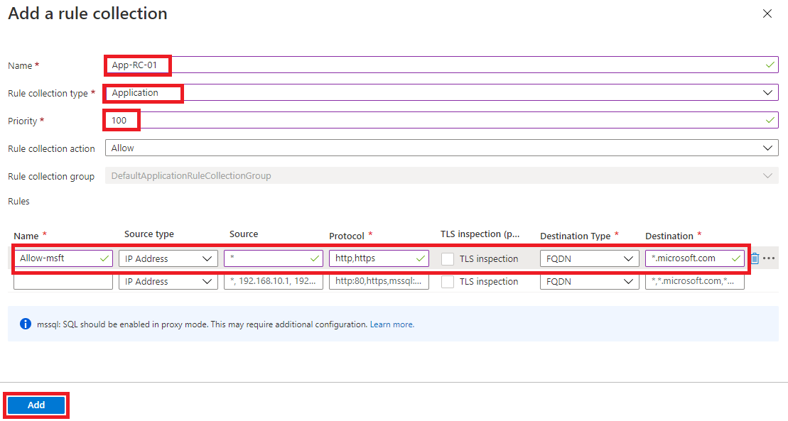
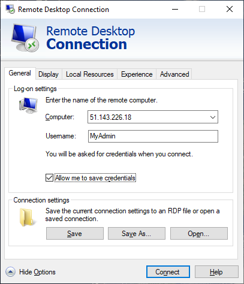
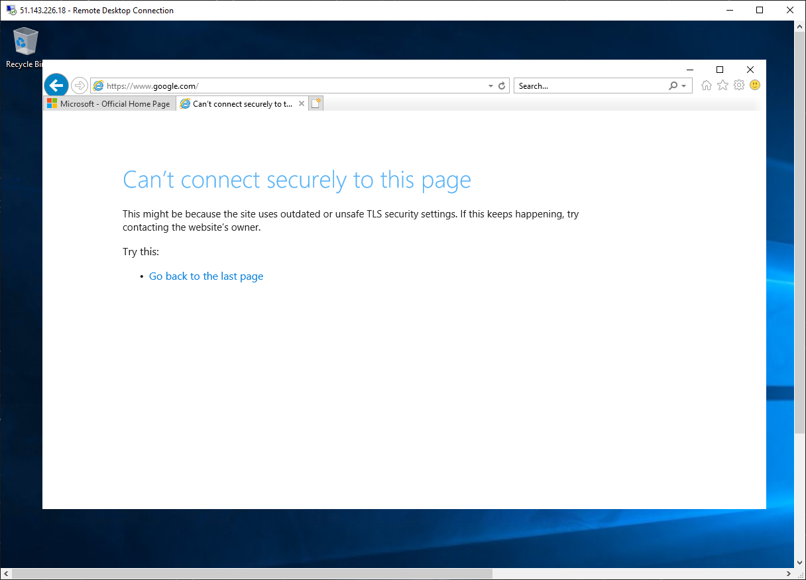

---
Exercise:
  title: M06 - ユニット 9 Azure Firewall Manager を使用して仮想ハブのセキュリティを保護する
  module: Module 06 - Design and implement network security
---


# <a name="m06-unit-9-secure-your-virtual-hub-using-azure-firewall-manager"></a>M06-ユニット 9 Azure Firewall Manager を使用して仮想ハブのセキュリティを保護する

この演習では、スポーク仮想ネットワークを作成し、セキュリティ保護付き仮想ハブを作成してから、ハブとスポークの仮想ネットワークを接続し、トラフィックをハブにルーティングします。 次に、ワークロード サーバーをデプロイしてから、ファイアウォール ポリシーを作成してハブをセキュリティ保護し、最後にファイアウォールをテストします。

## <a name="create-a-hub-and-spoke-architecture"></a>ハブとスポークのアーキテクチャを作成する

演習のこの部分では、ワークロード サーバーを配置するスポーク仮想ネットワークとサブネットを作成します。 次に、セキュリティ保護付き仮想ハブを作成し、ハブとスポークの仮想ネットワークを接続します。

この演習では、以下のことを行います。

+ タスク 1: 2 つのスポーク仮想ネットワークとサブネットを作成する
+ タスク 2: セキュリティ保護付き仮想ハブを作成する
+ タスク 3: ハブとスポークの仮想ネットワークを接続する
+ タスク 4: サーバーをデプロイする
+ タスク 5: ファイアウォール ポリシーを作成してハブをセキュリティ保護する
+ タスク 6: ファイアウォール ポリシーを関連付ける
+ タスク 7: トラフィックをハブにルーティングする
+ タスク 8: アプリケーション規則をテストする
+ タスク 9: ネットワーク規則をテストする
+ タスク 10: リソースをクリーンアップする

#### <a name="estimated-time-35-minutes"></a>推定時間: 35 分

## <a name="task-1-create-two-spoke-virtual-networks-and-subnets"></a>タスク 1: 2 つのスポーク仮想ネットワークとサブネットを作成する

このタスクでは、それぞれにワークロード サーバーをホストするサブネットが含まれる 2 つのスポーク仮想ネットワークを作成します。 

1. Azure portal のホーム ページで検索ボックスに「**仮想ネットワーク**」と入力し、表示されたら **[仮想ネットワーク]** を選択します。
2. **[作成]** をクリックします。
3. **[リソース グループ]** で **[新規作成]** を選択し、名前として「**fw-manager-rg**」と入力して、**[OK]** をクリックします。
4. **[名前]** に「**Spoke-01**」と入力します。
5. **[リージョン]** で、自分のリージョンを選択します。
6. **[次: IP アドレス]** をクリックします。
7. **[IPv4 アドレス空間]** に、「**10.0.0.0/16**」と入力します。 
8. ここに列記されている他のアドレス空間 (**10.1.0.0/16** など) をすべて**削除**します。
9. **[サブネット名]** で、**[default]** という単語をクリックします。
10. **[サブネットの編集]** ダイアログ ボックスで、名前を「**Workload-01-SN**」に変更します。
11. **[サブネット アドレス範囲]** を「**10.0.1.0/24**」に変更します。
12. **[保存]** をクリックします。
13. **[Review + create](レビュー + 作成)** をクリックします。
14. **Create** をクリックしてください。

上記のステップ 1 から 14 を繰り返して、同様の仮想ネットワークとサブネットを作成します。ただし、次の情報を使用します。

- リソース グループ: **fw-manager-rg** (既存のものを選択)
- 名前:**Spoke-02**
- アドレス空間: **10.1.0.0/16** - (一覧にある他のすべてのアドレス空間を削除します)
- サブネット名:**Workload-02-SN**
- サブネットのアドレス範囲: **10.1.1.0/24**

## <a name="task-2-create-the-secured-virtual-hub"></a>タスク 2: セキュリティ保護付き仮想ハブを作成する

このタスクでは、Firewall Manager を使用して、セキュリティ保護付き仮想ハブを作成します。

1. Azure portal のホーム ページで、**[すべてのサービス]** をクリックします。

2. 検索ボックスに「**Firewall Manager**」と入力し、表示されたら **[Firewall Manager]** を選択します。

3. **[Firewall Manager]** ページで、[概要] ページから **[View secured virtual hubs](セキュリティ保護付き仮想ハブの表示)** をクリックします。

4. **[仮想ハブ]** ページで、**[セキュリティで保護された仮想ハブの新規作成]** をクリックします。

5. **[リソース グループ]** で、 **[fw-manager-rg]** を選択します。

6. **[リージョン]** で、自分のリージョンを選択します。

7. 「**セキュリティで保護された仮想ハブ名**」には、「**Hub-01**」と入力します。

8. **[ハブ アドレス空間]** に、「**10.2.0.0/16**」と入力します。

9. **[新しい vWAN]** を選択します。

10. **[仮想 WAN 名]** に、「**Vwan-01**」と入力します。

11. **[次: Azure Firewall]** をクリックします。
    ![セキュリティ保護付き仮想ハブの新規作成 - [基本] タブ](../media/create-new-secured-virtual-hub-1.png)

12. **[次: セキュリティ パートナー プロバイダー]** をクリックします。

13. **[次: 確認および作成]** をクリックします。

14. **[作成]** をクリックします。

    > **[!NOTE]** 
    >
    > デプロイには最大 30 分かかることがあります。

    

    ![セキュリティ保護付き仮想ハブの新規作成 - [確認および作成] タブ](../media/create-new-secured-virtual-hub-2.png)

15. デプロイが完了したら、Azure portal のホーム ページで **[すべてのサービス]** をクリックします。

16. 検索ボックスに「**Firewall Manager**」と入力し、表示されたら **[Firewall Manager]** を選択します。

17. **[Firewall Manager]** ページで、**[仮想ハブ]** をクリックします。

18. **Hub-01** をクリックします。

19. **[パブリック IP 構成]** をクリックします。

20. 後で使用するので、パブリック IP アドレス (例: **51.143.226.18**) を記録しておきます。

## <a name="task-3-connect-the-hub-and-spoke-virtual-networks"></a>タスク 3: ハブとスポークの仮想ネットワークを接続する

このタスクでは、ハブとスポークの仮想ネットワークを接続します。 これは、一般にピアリングとして知られています。

1. Azure portal のホーム ページで、**[リソース グループ]** をクリックします。
2. **[fw-manager-rg]** リソース グループを選択してから、 **[Vwan-01]** 仮想 WAN を選択します。
3. **[接続]** で、**[仮想ネットワーク接続]** をクリックします。
4. **[接続の追加]** をクリックします。
5. **[接続名]** に「**hub-spoke-01**」と入力します。
6. **[ハブ]** で、 **[Hub-01]** を選択します。
7. **[リソース グループ]** で、 **[fw-manager-rg]** を選択します。
8. **[仮想ネットワーク]** で、 **[Spoke-01]** を選択します。
9. **[作成]** をクリックします。
   
10. 上記のステップ 4 から 9 を繰り返して、別の同様の接続を作成します。ただし、**Spoke-02** 仮想ネットワークの接続には **hub-spoke-02** という接続名を使用します。


 

## <a name="task-4-deploy-the-servers"></a>タスク 4: サーバーをデプロイする

1. Azure portal で、**[Cloud Shell]** ペイン内に **PowerShell** セッションを開きます。

2. [Cloud Shell] ペインのツール バーで、[ファイルのアップロード/ダウンロード] アイコンを選択し、ドロップダウン メニューで [アップロード] を選択して、**FirewallManager.json** と **FirewallManager.parameters.json** の各ファイルを、ソース フォルダー **F:\Allfiles\Exercises\M06** から Cloud Shell のホーム ディレクトリに 1 つずつアップロードします。

3. 次の ARM テンプレートをデプロイして、この演習に必要な VM を作成します。

   ```powershell
   $RGName = "fw-manager-rg"
   
   New-AzResourceGroupDeployment -ResourceGroupName $RGName -TemplateFile FirewallManager.json -TemplateParameterFile FirewallManager.parameters.json
   ```
  
4. デプロイが完了したら、Azure portal のホーム ページに移動し、**[仮想マシン]** を選択します。

5. **Srv-workload-01** の **[概要]** ページの右側のペインで、**[ネットワーク]** セクションの下にある **[プライベート IP アドレス]** (例: **10.0.1.4**) を記録しておきます。

6. **Srv-workload-02** の **[概要]** ページの右側のペインで、**[ネットワーク]** セクションの下にある **[プライベート IP アドレス]** (例: **10.1.1.4**) を記録しておきます。


## <a name="task-5-create-a-firewall-policy-and-secure-your-hub"></a>タスク 5: ファイアウォール ポリシーを作成してハブをセキュリティ保護する

このタスクでは、最初にファイアウォール ポリシーを作成した後、ハブをセキュリティで保護します。 このファイアウォール ポリシーでは、1 つまたは複数のセキュリティ保護付き仮想ハブでトラフィックを転送する規則のコレクションを定義します。

1. Azure portal のホーム ページで、**[Firewall Manager]** をクリックします。
   - ホーム ページに Firewall Manager アイコンが表示されない場合は、**[すべてのサービス]** をクリックします。 次に、検索ボックスに「**Firewall Manager**」と入力し、表示されたら **[Firewall Manager]** を選択します。

2. **[Firewall Manager]** ページで、[概要] ページから **[View Azure Firewall Policies](Azure Firewall ポリシーの表示)** をクリックします。

3. **[Azure ファイアウォール ポリシーの作成]** をクリックします。

4. **[リソース グループ]** で、**fw-manager-rg** を選択します。

5. **[ポリシーの詳細]** で、**[名前]** に「**Policy-01**」と入力します。

6. **[リージョン]** で、自分のリージョンを選択します。

7. **[Policy tier](ポリシー レベル)** で **[標準]** を選びます。

8. **[次: DNS 設定]** をクリックします。

8. **[Next: TLS Inspection (preview)](次: TLS 検査 (プレビュー))** をクリックします。

9. **[次: 規則]** をクリックします。

10. **[規則]** タブで、**[規則コレクションの追加]** をクリックします。

11. **[規則コレクションの追加]** ページの **[名前]** に「**App-RC-01**」と入力します。

12. **[規則コレクションの種類]** で、 **[アプリケーション]** を選択します。

13. **[優先度]** に「**100**」と入力します。

14. **[規則コレクション] アクション**が **[許可]** であることを確認します。

15. **[規則]** の **[名前]** に「**Allow-msft**」と入力します。

16. **[接続元の種類]** で、**[IP アドレス]** を選択します。

17. **[送信元]** に「*」と入力します。

18. **[プロトコル]** に「**http,https**」と入力します。

19. **[送信先の種類]** が **[FQDN]** であることを確認します。

20. **[送信先]** に「***.microsoft.com**」と入力します。

21. **[追加]** をクリックします。

    

22. リモート デスクトップを Srv-workload-01 VM に接続できるように DNAT 規則を追加するには、**[規則コレクションの追加]** をクリックします。

23. **[名前]** に「**dnat-rdp**」と入力します。

24. **[規則コレクションの種類]** で、 **[DNAT]** を選択します。

25. **[優先度]** に「**100**」と入力します。

26. **[規則]** の **[名前]** に「**Allow-rdp**」と入力します。

27. **[接続元の種類]** で、**[IP アドレス]** を選択します。

28. **[送信元]** に「*」と入力します。

29. **[プロトコル]** で **[TCP]** を選択します。

30. **[宛先ポート]** に「**3389**」と入力します。

31. **[送信先の種類]** で **[IP アドレス]** を選択します。

32. **[送信先]** に、前に記録しておいたファイアウォール仮想ハブのパブリック IP アドレス (例: **51.143.226.18**) を入力します。

33. **[変換されたアドレス]** に、前に記録しておいた **Srv-workload-01** のプライベート IP アドレス (例: **10.0.1.4**) を入力します。

34. **[変換されたポート]** に「**3389**」と入力します。

35. **[追加]** をクリックします。

36. Srv-workload-01 からのリモート デスクトップを Srv-workload-02 VM に接続できるようにネットワーク規則を追加するには、**[規則コレクションの追加]** をクリックします。

37. **[名前]** に「**vnet-rdp**」と入力します。

38. **[規則コレクションの種類]** で、 **[ネットワーク]** を選択します。

39. **[優先度]** に「**100**」と入力します。

40. **[規則コレクション アクション]** で **[許可]** を選択します。

41. **[規則]** の **[名前]** に「**Allow-vnet**」と入力します。

42. **[接続元の種類]** で、**[IP アドレス]** を選択します。

43. **[送信元]** に「*」と入力します。

44. **[プロトコル]** で **[TCP]** を選択します。

45. **[宛先ポート]** に「**3389**」と入力します。

46. **[送信先の種類]** で **[IP アドレス]** を選択します。

47. **[送信先]** に、前に記録しておいた **Srv-workload-02** のプライベート IP アドレス (例: **10.1.1.4**) を入力します。

48. **[追加]** をクリックします。

    

49. これで、3 つの規則コレクションが一覧に表示されるようになっているはずです。

50. **[Review + create](レビュー + 作成)** をクリックします。

51. **Create** をクリックしてください。

## <a name="task-6-associate-the-firewall-policy"></a>タスク 6: ファイアウォール ポリシーを関連付ける

このタスクでは、ファイアウォール ポリシーを仮想ハブと関連付けます。

1. Azure portal のホーム ページで、**[Firewall Manager]** をクリックします。
   - ホーム ページに Firewall Manager アイコンが表示されない場合は、**[すべてのサービス]** をクリックします。 次に、検索ボックスに「**Firewall Manager**」と入力し、表示されたら **[Firewall Manager]** を選択します。
2. **[Firewall Manager]** の **[セキュリティ]** で、**[Azure Firewall ポリシー]** をクリックします。
3. **Policy-01** のチェック ボックスをオンにします。
4. **[Manage associations](関連付けの管理) &gt; [ハブの関連付け]** を選択します。
5. **Hub-01** のチェック ボックスをオンにします。
6. **[追加]** をクリックします。
7. ポリシーがアタッチされている場合は、**[最新の情報に更新]** をクリックします。 関連付けが表示されるはずです。


 

## <a name="task-7-route-traffic-to-your-hub"></a>タスク 7: トラフィックをハブにルーティングする

このタスクでは、ネットワーク トラフィックがファイアウォール経由でルーティングされることを確認します。

1. **[Firewall Manager]** で **[仮想ハブ]** をクリックします。
2. **Hub-01** をクリックします。
3. **[設定]** で **[セキュリティの構成]** をクリックします。
4. **[インターネット トラフィック]** で、**[Azure Firewall]** を選択します。
5. **[プライベート トラフィック]** で、**[Send via Azure Firewall](Azure Firewall 経由で送信する)** を選択します。
6. **[保存]** をクリックします。 
7. これが完了するまでに数分かかります。
8. 構成が完了したら、**[インターネット トラフィック]** と **[プライベート トラフィック]** で、どちらのハブ スポーク接続にも **[Secured by Azure Firewall](Azure Firewall によって保護されています)** と表示されていることを確認します。


## <a name="task-8-test-the-application-rule"></a>タスク 8: アプリケーション規則をテストする

演習のこの部分では、リモート デスクトップをファイアウォールのパブリック IP アドレスに接続します。これは、Srv-Workload-01 にネットワーク アドレス変換されます。 その後、Web ブラウザーを使用してアプリケーション規則をテストし、リモート デスクトップを Srv-Workload-02 に接続してネットワーク規則をテストします。

このタスクでは、アプリケーション規則をテストして、期待したように動作することを確認します。

1. お使いの PC で **[リモート デスクトップ接続]** を開きます。

2. **[コンピューター]** ボックスに、**ファイアウォールのパブリック IP アドレス** (例: **51.143.226.18**) を入力します。

3. **[オプションの表示]** をクリックします。

4. **[ユーザー名]** ボックスに「**TestUser**」と入力します。

5. **[Connect]** をクリックします。

   

6. **[資格情報を入力してください]** ダイアログ ボックスで、**TestPa$$w0rd!** というパスワードを使用して、**Srv-workload-01** サーバーの仮想マシンにログインします。

7. **[OK]** をクリックします。

8. 証明書メッセージで **[はい]** をクリックします。

9. Internet Explorer を開き、**[Internet Explorer 11 の設定]** ダイアログ ボックスで **[OK]** をクリックします。

10. **https://** **www.microsoft.com** に移動します。

11. **[セキュリティ アラート]** ダイアログ ボックスで、**[OK]** をクリックします。

12. Internet Explorer でセキュリティ アラートのポップアップが表示される場合は、**[閉じる]** をクリックします。

13. Microsoft のホーム ページが表示されるはずです。

    

14. **https://** **www.google.com** に移動します。

15. ファイアウォールによってブロックされます。

    

16. そのため、許可されている 1 つの FQDN には接続できますが、他のすべてからはブロックされることを確認しました。

## <a name="task-9-test-the-network-rule"></a>タスク 9: ネットワーク規則をテストする

このタスクでは、ネットワーク規則をテストして、期待したように動作することを確認します。

1. **Srv-workload-01** RDP セッションにログインしている間に、このリモート コンピューターから**リモート デスクトップ接続**を開きます。

2. **[コンピューター]** ボックスに **Srv-workload-02** の**プライベート IP アドレス** (例: **10.1.1.4**) を入力します。

3. **[資格情報を入力してください]** ダイアログ ボックスで、ユーザー名 **TestUser** とパスワード **TestPa$$w0rd!** を使用して、**Srv-workload-02** サーバーにログインします。

4. **[OK]** をクリックします。

5. 証明書メッセージで **[はい]** をクリックします。

   

6. そのため、あるサーバーのリモート デスクトップを別の仮想ネットワークにある別のサーバーに接続して、ファイアウォール ネットワーク規則が機能していることを確認しました。

7. 両方の RDP セッションを閉じて切断します。


## <a name="task-10-clean-up-resources"></a>タスク 10: リソースをクリーンアップする 

>**注**:新規に作成し、使用しなくなったすべての Azure リソースを削除することを忘れないでください。 使用していないリソースを削除することで、予期しない料金が発生しなくなります。

1. Azure portal で、**[Cloud Shell]** ペイン内に **PowerShell** セッションを開きます。

1. 次のコマンドを実行して、このモジュールのラボ全体を通して作成したすべてのリソース グループを削除します。

   ```powershell
   Remove-AzResourceGroup -Name 'fw-manager-rg' -Force -AsJob
   ```

    >**注**:このコマンドは非同期で実行されるため (-AsJob パラメーターによって決定されます)、同じ PowerShell セッション内で直後に別の PowerShell コマンドを実行できますが、リソース グループが実際に削除されるまでに数分かかります。
