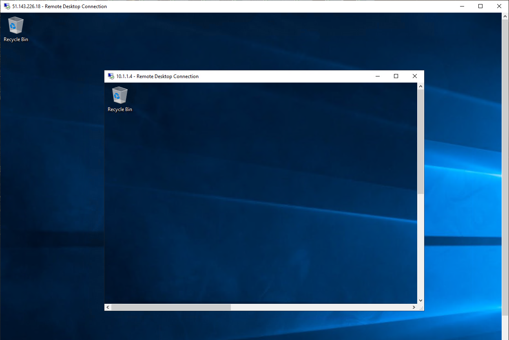

---
Exercise:
    title: 'M06-ユニット 9 Azure Firewall Manager を使用して仮想ハブのセキュリティを保護する'
    module: 'モジュール - ネットワーク セキュリティの設計と実装'
---


# M06-ユニット 9 Azure Firewall Manager を使用して仮想ハブのセキュリティを保護する

この演習では、スポーク仮想ネットワークを作成し、セキュリティで保護された仮想ハブを作成します。次に、ハブとスポーク仮想ネットワークを接続し、トラフィックをハブにルーティングします。次に、ワークロード サーバーを展開し、ファイアウォール ポリシーを作成してハブを保護し、最後にファイアウォールをテストします。

## ハブとスポークのアーキテクチャを作成する

演習のこの部分では、ワークロード サーバーを配置するスポーク仮想ネットワークとサブネットを作成します。次に、セキュリティで保護された仮想ハブを作成し、ハブとスポーク仮想ネットワークを接続します。

この演習では、次のことを行います。

+ タスク 1: 2 つのスポーク仮想ネットワークとサブネットを作成する
+ タスク 2: セキュリティ保護付き仮想ハブを作成する
+ タスク 3: ハブとスポークの仮想ネットワークを接続する
+ タスク 4: サーバーをデプロイする
+ タスク 5: ファイアウォール ポリシーを作成してハブをセキュリティで保護する
+ タスク 6: ファイアウォール ポリシーを関連付ける
+ タスク 7: ハブにトラフィックをルーティングする
+ タスク 8: アプリケーション規則をテストする
+ タスク 9: ネットワーク 規則をテストする
+ タスク 10: リソースをクリーン アップする

## タスク 1: 2 つのスポーク仮想ネットワークとサブネットを作成する

このタスクでは、ワークロード サーバーをホストするサブネットをそれぞれ含む 2 つのスポーク仮想ネットワークを作成します。 

1. Azure portal のホーム ページで、検索ボックスに「**仮想ネットワーク**」と入力して、表示されたら「**仮想ネットワーク**」を選択します。
2. 「**作成**」をクリックします。
3. 「**リソース グループ**」で、「**新規作成**」を選択し、名前として「**fw-manager-rg**」と入力して、「**OK**」をクリックします。
4. 「**名前**」で、「**Spoke-01**」と入力します。
5. 「**リージョン**」で、リージョンを選択します。
6. 「**次へ: IP アドレス**」をクリックします。
7. 「**IPv4 アドレス空間**」に、「**10.0.0.0/16**」と入力します。 
8. **10.1.0.0/16**など、ここにリストされている他のアドレス空間をすべて**削除**します。
9. 「**サブネット名**」で、「**既定**」という単語をクリックします。
10. 「**サブネットの編集**」ダイアログ ボックスで、名前を「**Workload-01-SN**」に変更します。
11. 「**サブネット アドレス範囲**」を「**10.0.1.0/24**」に変更します。
12. 「**保存**」をクリックします。
13. 「**Review + create**」をクリックします。
14. 「**作成**」をクリックします。

上記の手順 1 〜 14 を繰り返して、次の情報を使用して、別の同様の仮想ネットワークとサブネットを作成します。

- リソース グループ: **fw-manager-rg** (既存のものを選択)
- 名前: **Spoke-02**
- アドレス空間: **10.1.0.0/16** - (一覧表示されている他のアドレス空間を削除します)
- サブネット名: **Workload-02-SN**
- サブネット アドレス範囲: **10.1.1.0/24**

## タスク 2: セキュリティ保護付き仮想ハブを作成する

このタスクでは、ファイアウォール マネージャーを使用してセキュリティで保護された仮想ハブを作成します。

1. Azure portal のホーム ページから、「**すべてのサービス**」をクリックします。

2. 検索ボックスに「**firewall manager**」と入力し、「**Firewall Manager**」を選択します。

3. 「**Firewall Manager**」ページの「概要」ページで、「**セキュリティ保護付き仮想ハブの表示**」をクリックします。

4. 「**仮想ハブr**」ページで、「**セキュリティ保護付き仮想ハブの作成**」をクリックします。

5. 「**リソース グループ**」で、「**fw-manager-rg**」を選択します。

6. 「**リージョン**」で、リージョンを選択します。

7. 「**セキュリティで保護された仮想ハブ名**」には、「**Hub-01**」と入力します。

8. 「**ハブ アドレス空間**」に、「**10.2.0.0/16**」と入力します。

9. 「**新しい vWAN**」を選択します。

10. 「**仮想 WAN 名**」に「**Vwan-01**」と入力します。

11. 「**次へ: Azure Firewall**」をクリックします。
    

12. 「**次へ: セキュリティ パートナー プロバイダー**」をクリックします。

13. 「**次へ: Review + create」を選択します。**

14. 「**作成**」をクリックします。

    > **[!注]** 
    >
    > デプロイするまで最大 30 分かかることがあります。

    ​

    

15. デプロイが完了したら、Azure portal のホーム ページから、「**すべてのサービス**」をクリックします。

16. 検索ボックスに「**firewall manager**」と入力し、「**Firewall Manager**」を選択します。

17. 「**Firewall Manager**」ページで、「**仮想ハブ**」をクリックします。

18. 「**Hub-01**」をクリックします。

19. 「**パブリック IP 構成**」を選択します。

20. 後で使用するパブリック IP アドレス (例: **51.143.226.18**) を書き留めます。

## タスク 3: ハブとスポークの仮想ネットワークを接続する

このタスクでは、ハブとスポーク仮想ネットワークを接続します。これは一般にピアリングとして知られています。

1. Azure portal のホーム ページから、「**リソース グループ**」をクリックします。
2. 「**fw-manager-rg**」リソース グループを選択してから、「**Vwan-01**」仮想 WAN を選びます。
3. 「**接続**」で、「**仮想ネットワーク接続**」を選択します。
4. 「**接続の追加**」をクリックします。
5. 「**接続名**」に、「**hub-spoke-01**」と入力します。
6. 「**ハブ**」で、「**Hub-01**」を選択します。
7. 「**リソース グループ**」で、「**fw-manager-rg**」を選択します。
8. 「**仮想ネットワーク**」で、「**Spoke-01**」を選択します。
9. 「**作成**」をクリックします。
   
10. 上記の手順 4 〜 9 を繰り返して、別の同様の接続を作成しますが、**hub-spoke-02** の接続名を使用して **Spoke-02** 仮想ネットワークに接続します。


 

## タスク 4: サーバーをデプロイする

このタスクでは、2 つのワークロード サーバーをデプロイします。

1. Azure portal の「ホーム」ページで、グローバル検索を使用して、「**Virtual Networks**」と入力し、サービスの下で、仮想ネットワークを選択します。

2. 仮想マシンで、**「+ 作成」、「+ 仮想マシン」** を選択します。

3. 「**仮想マシンの作成**」ページの「**基本**」タブで、次の表の情報を使用して新しい VM を作成します。

   | **設定**          | **値**                |
   | -------------------- | ------------------------ |
   | サブスクリプション         | サブスクリプションを選択します |
   | リソース グループ       | **fw-manager-rg**        |
   | 仮想マシン名 | **Srv-workload-01**      |
   | リージョン               | 自分のリージョン              |
   | 可用性オプション | インフラストラクチャの冗長性は必要ありません|
   | イメージ                | Windows Server 2022 Datacenter- Gen2 |
   | Azure Spot インスタンス  | 非選択             |
   | ユーザー名             | **MyAdmin**              |
   | パスワード             | **TestPa$$w0rd!**        |
   | パスワードの確認     | **TestPa$$w0rd!**        |
   | パブリック受信ポート | **なし**                 |

4. 「**次へ : ディスク**」をクリックします。

5. 「**次へ : ネットワーク**」をクリックします。

6. 「**仮想ネットワーク**」で、「**Spoke-01**」が選択されていることを確認します。

7. 「**サブネット**」で、「**Workload-01-SN**」が選択されていることを確認します。 

8. 「**パブリック IP**」で、「**なし**」を選択します。

9. 「**次へ : 管理**」をクリックします。

10. 「**監視**」の「**ブート診断**」で、「**無効**」をクリックします。

11. 「**Review + create**」をクリックします。

12. 「**作成**」をクリックします。

13. このデプロイが完了したら、「**別の VM を作成**」をクリックします。

14. 上記の手順 **3 〜 12** を繰り返して、別の仮想マシンを作成しますが、次の情報を使用します。

    - 仮想マシン名: **Srv-workload-02**
    - 仮想ネットワーク: **Spoke-02**
    - サブネット: **Workload-02-SN**
    - パブリック IP: **なし**

15. 2 番目の VM のデプロイが完了したら、「**リソースに移動**」をクリックします。

16. **Srv-workload-02** の「**概要**」ページの右側のペインの「**ネットワーク**」セクションで、**プライベート IP アドレス** (例: **10.1.1.4**) を書き留めます。

17. 「**ホーム**」をクリックします。

18. Azure portal のホーム ページで、「**すべてのリソース**」をクリックします。

19. **Srv-workload-01** 仮想マシンをクリックします。

20. **Srv-workload-01** の「**概要**」ページの右側のペインの「**ネットワーク**」セクションで、**プライベート IP アドレス** (例: **10.0.1.4**) を書き留めます。


## タスク 5: ファイアウォール ポリシーを作成してハブをセキュリティで保護する

このタスクでは、最初にファイアウォール ポリシーを作成し、次にハブを保護します。ファイアウォール ポリシーでは、1 つまたは複数のセキュリティで保護された仮想ハブでトラフィックを転送する規則のコレクションを定義します。

1. Azure portal のホーム ページから、「**Firewall Manager**」をクリックします。
   - ホーム ページに Firewall Manager アイコンが表示されない場合は、「**すべてのサービス**」をクリックします。次に、検索ボックスに「**firewall manager**」と入力し、表示されたら「**Firewall Manager**」を選択します。

2. **Firewall Manager** の「概要」ページで、「**Azure Firewall ポリシーの表示**」をクリックします。

3. 「**Azure Firewall ポリシーの作成**」を選択します。

4. 「**リソース グループ**」で、「**fw-manager-rg**」を選択します。

5. 「**ポリシーの詳細**」で、「**名前**」に「**Policy-01**」と入力します。

6. 「**リージョン**」で、リージョンを選択します。

7. 「**次へ : DNS 設定**」をクリックします。

8. 「**次へ : TLS Inspection (プレビュー)**」をクリックします。

9. 「**次へ : 規則**」をクリックします。

10. 「**規則**」タブで、「**規則コレクションの追加**」をクリックします。

11. 「**規則コレクションの追加**」ページの「**名前**」に、「**App-RC-01**」と入力します。

12. 「**規則コレクションの種類**」で、「**アプリケーション**」を選択します。

13. 「**優先度**」には、「**100**」と入力します。

14. 「**規則コレクション アクション**」が「**許可**」であることを確認します。

15. 「**規則**」の「**名前**」に「**Allow-msft**」と入力します。

16. 「**ソースの種類**」で、「**IP アドレス**」を選択します。

17. 「**ソース**」で、「*****」を入力します。

18. 「**プロトコル**」に、「**http,https**」と入力します。

19. 「**ソースの種類**」が「**FQDN**」であることを確認します。

20. 「**宛先**：に、「***.microsoft.com**」と入力します。

21. 「**追加**」をクリックします。

    

22. リモート デスクトップを Srv-workload-01VM に接続できるように DNAT 規則を追加するには、「**規則コレクションの追加**」をクリックします。

23. 「**名前**」に「**dnat-rdp**」と入力します。

24. 「**規則コレクションの種類**」で、「**DNAT**」を選択します。

25. 「**優先度**」には、「**100**」と入力します。

26. 「**規則**」の「**名前**」に「**Allow-rdp**」と入力します。

27. 「**ソースの種類**」で、「**IP アドレス**」を選択します。

28. 「**ソース**」で、「*****」を入力します。

29. **プロトコル**で、**TCP**を選択します。

30. 「**宛先ポート**」については、「**3389**」と入力します。

31. 「**宛先の種類**」で「**IP アドレス**」を選択します。

32. 「**宛先**」に、前に書き留めたファイアウォール仮想ハブのパブリック IP アドレスを入力します (例: **51.143.226.18**)。

33. 「**変換れたアドレス**」に、前に書き留めた **Srv-workload-01** のプライベート IP アドレスを入力します (例: **10.0.1.4**)。

34. 「**変換されたポート**」については、「**3389**」と入力します。

35. 「**追加**」をクリックします。

36. Srv-workload-01 から Srv-workload-02VM にリモート デスクトップを接続できるようにネットワーク規則を追加するには、「**規則コレクションの追加**」をクリックします。

37. 「**名前**」に「**vnet-rdp**」と入力します。

38. 「**規則コレクションの種類**」で、「**ネットワーク**」を選択します。

39. 「**優先度**」には、「**100**」と入力します。

40. 「**規則コレクション アクション**」で「**許可**」を選択します。

41. 「**規則**」の「**名前**」に「**Allow-vnet**」と入力します。

42. 「**ソースの種類**」で、「**IP アドレス**」を選択します。

43. 「**ソース**」で、「*****」を入力します。

44. **プロトコル**で、**TCP**を選択します。

45. 「**宛先ポート**」については、「**3389**」と入力します。

46. 「**宛先の種類**」で「**IP アドレス**」を選択します。

47. 「**宛先**」に、前に書き留めた **Srv-workload-02** のプライベート IP アドレスを入力します (例: **10.1.1.4**)。

48. 「**追加**」をクリックします。

    

49. これで、3 つの規則コレクションが一覧表示されます。

50. 「**Review + create**」をクリックします。

51. 「**作成**」をクリックします。

## タスク 6: ファイアウォール ポリシーを関連付ける

このタスクでは、ファイアウォール ポリシーを仮想ハブに関連付けます。

1. Azure portal のホーム ページから、「**Firewall Manager**」をクリックします。
   - ホーム ページに Firewall Manager アイコンが表示されない場合は、「**すべてのサービス**」をクリックします。次に、検索ボックスに「**firewall manager**」と入力し、表示されたら「**Firewall Manager**」を選択します。
2. 「**Firewall Manager**」の「**セキュリティ**」で、「**Azure Firewall ポリシー**」をクリックします。
3. **Policy-01** のチェックボックスを選択します。
4. **「関連付けの管理」 &gt; 「ハブの関連付け」** を選択します。
5. **Hub-01** のチェックボックスを選択します。
6. 「**追加**」をクリックします。
7. ポリシーが添付されたら、「**更新**」をクリックします。関連付けが表示されます。


 

## タスク 7: ハブにトラフィックをルーティングする

このタスクでは、ネットワーク トラフィックがファイアウォールを通過するようにします。

1. 「**Firewall Manager**」で、「**仮想ハブ**」をクリックします。
2. 「**Hub-01**」をクリックします。
3. 「**設定**」で「**セキュリティの構成**」をクリックします。
4. 「**インターネット トラフィック**」で、「**Azure Firewall**」を選択します。
5. 「**プライベート トラフィック**」で、「**Azure Firewall 経由で送信**」を選択します。
6. 「**保存**」をクリックします。 
7. これが完了するまでに数分かかります。
8. 構成が完了したら、「**インターネット トラフィック**」と「**プライベート トラフィック**」で、両方のハブ スポーク接続に対して「**Azure Firewall によって保護されている**」と表示されていることを確認します。


## タスク 8: アプリケーション規則をテストする

演習のこの部分では、リモート デスクトップをファイアウォールのパブリック IP アドレスに接続します。これは、Srv-Workload-01 に NAT されています。次に、Web ブラウザーを使用してアプリケーション規則をテストし、リモート デスクトップを Srv-Workload-02 に接続してネットワーク規則をテストします。

このタスクでは、アプリケーション規則をテストして、期待どおりに機能することを確認します。

1. PC で**リモート デスクトップ接続**を開きます。

2. 「**コンピューター**」ボックスに、**ファイアウォールのパブリック IP アドレス** (例: **51.143.226.18**) を入力します。

3. 「**オプションの表示**」をクリックします。

4. 「**ユーザー名**」ボックスに、「**MyAdmin**」と入力します。

5. 「**接続**」をクリックします。

   

6. 「**資格情報の入力**」ダイアログ ボックスで、パスワード **TestPa$$w0rd!** を使用して、**Srv-workload-01** サーバー仮想マシンにログインします。

7. 「**OK**」をクリックします。

8. 証明書メッセージで「**はい**」をクリックします。

9. Internet Explorer を開き、「**Internet Explorer11 のセットアップ**」ダイアログボックスで「**OK**」をクリックします。

10. **https://** **www.microsoft.com** を参照します。

11. 「**セキュリティの警告**」ダイアログ ボックスで、「**OK**」をクリックします。

12. ポップアップする可能性のある Internet Explorer のセキュリティ アラートで「**閉じる**」をクリックします。

13. Microsoft のホーム ページが表示されるはずです。

    

14. **https://** **www.google.com** を参照します。

15. ファイアウォールでブロックされるはずです。

    

16. したがって、許可された 1 つの FQDN に接続できるが、他のすべての FQDN からブロックされていることを確認しました。

## タスク 9: ネットワーク 規則をテストする

このタスクでは、ネットワーク規則をテストして、期待どおりに機能することを確認します。

1. **Srv-workload-01** RDP セッションにログインしたまま、このリモート コンピューターから**リモート デスクトップ接続**を開きます。

2. 「**コンピューター**」ボックスに、**Srv-workload-02** の**プライベート IP アドレス**を入力します (例: **10.1.1.4**)。

3. 「**資格情報の入力**」ダイアログボックスで、ユーザー名 **MyAdmin** とパスワード **TestPa$$w0rd!** を使用して **Srv-workload-02** サーバーにログインします。

4. 「**OK**」をクリックします。

5. 証明書メッセージで「**はい**」をクリックします。

   

6. これで、あるサーバーから別の仮想ネットワークにある別のサーバーにリモート デスクトップを接続したため、ファイアウォール ネットワーク規則が機能していることを確認できました。

7. 両方の RDP セッションを閉じて、それらを切断します。


## タスク 10: リソースをクリーン アップする 

> **注**: 新しく作成した Azure リソースのうち、使用しないリソースは必ず削除してください。使用しないリソースを削除しないと、予期しないコストが発生する場合があります。

1. Azure portal の **「Cloud Shell」** ウィンドウで **「PowerShell」** セッションを開きます。

1. 次のコマンドを実行して、このモジュールのラボ全体で作成したすべてのリソース グループのリストを削除します。

   ```powershell
   Remove-AzResourceGroup -Name 'fw-manager-rg' -Force -AsJob
   ```

    > **注**: コマンドは非同期で実行されるので (-AsJob パラメーターによって決定されます)、別の PowerShell コマンドを同一 PowerShell セッション内ですぐに実行できますが、リソース グループが実際に削除されるまでに数分かかります。
