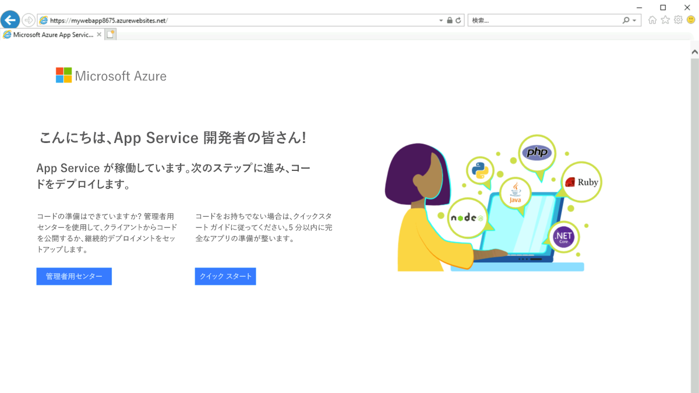

---
Exercise:
    title: 'M07-ユニット 3 Azure PowerShell を使用して Azure プライベート エンドポイントを作成する'
    module: 'モジュール - Azure サービスへのプライベート アクセスを設計および実装する'
---

# M07-ユニット 3 Azure PowerShell を使用して Azure プライベート エンドポイントを作成する

プライベート エンドポイントを使用して Azure Web アプリに安全に接続することにより、Azure Private Link の使用を開始します。ポータル、CLI、PowerShell などを含むエンドポイントを作成する方法はたくさんあります。 

Azure Web アプリのプライベート エンドポイントを作成し、仮想マシンをデプロイしてプライベート接続をテストします。

プライベート エンドポイントは、Azure SQL や Azure Storage などのさまざまな種類の Azure サービスに対して作成できます。

**前提条件**

- アクティブなサブスクリプションが含まれる Azure アカウント。無料でアカウントを作成できます。

- 対象の Azure サブスクリプションにデプロイされている PremiumV2 レベル以上のアプリ サービス プランを持つ Azure Web アプリ。

1. M07 フォルダーで parameters.json を見つけて開きます。メモ帳で開き、"value": "GEN-UNIQUE" という行を見つけます。プレースホルダーの GEN-UNIQUE 文字列を Web アプリ名の一意の値に置き換えます。変更内容を保存します｡

2. Azure portal の **「Cloud Shell」** ウィンドウで **「PowerShell」** セッションを開きます。

3. Cloud Shell ウィンドウのツールバーで、「ファイルのアップロード/ダウンロード」アイコンをクリックし、ドロップダウン メニューで「アップロード」をクリックして、次のファイル template.json および parameters.json を CloudShell ホーム ディレクトリにアップロードします。


PowerShell をインストールしてローカルで使用する場合、この例では Azure PowerShell モジュール バージョン 5.4.1 以降が必要になります。インストールされているバージョンを確認するには、```Get-Module -ListAvailable Az``` を実行します。アップグレードする必要がある場合は、[Azure PowerShell モジュールのインストール](https://docs.microsoft.com/ja-jp/azure/app-service/quickstart-dotnetcore)に関するページを参照してください。PowerShell をローカルで実行している場合、```Connect-AzAccount``` を実行して Azure との接続を作成することも必要です。

この演習では、次のことを行います。

+ タスク 1: リソース グループを作成する
+ タスク 2: 仮想ネットワークと bastion ホストの作成
+ タスク 3: テスト用の仮想マシンを作成する
+ タスク 4: プライベート エンドポイントを作成する
+ タスク 5: プライベート DNS ゾーンを構成する
+ タスク 6: プライベート エンドポイントへの接続をテストする
+ タスク 7: リソースをクリーン アップする

## タスク 1: リソース グループを作成し、前提条件である Web アプリをデプロイします。

Azure リソース グループとは、Azure リソースのデプロイと管理に使用する論理コンテナーです。

[New-AzResourceGroup](https://docs.microsoft.com/ja-jp/powershell/module/az.resources/new-azresourcegroup) を使用して、次のようにリソース グループを作成します。

```Azure PowerShell
New-AzResourceGroup -Name 'CreatePrivateEndpointQS-rg' -Location 'eastus'
```
次の ARM テンプレートをデプロイして、この演習に必要な PremiumV2 層の Azure Web アプリを作成します。

   ```powershell
   $RGName = "CreatePrivateEndpointQS-rg"
   
   New-AzResourceGroupDeployment -ResourceGroupName $RGName -TemplateFile template.json -TemplateParameterFile parameters.json
   ```

## タスク 2: 仮想ネットワークと bastion ホストの作成

仮想ネットワーク、サブネット、bastion ホストを作成します。

bastion ホストは、プライベート エンドポイントをテストする目的で、仮想マシンに安全に接続するために使用されます。

次を使用して仮想ネットワークと bastion ホストを作成します。

- New-AzVirtualNetwork

- New-AzPublicIpAddress

- New-AzBastion

 

```Azure PowerShell
## Create backend subnet config. ##

$subnetConfig = New-AzVirtualNetworkSubnetConfig -Name myBackendSubnet -AddressPrefix 10.0.0.0/24```

## Create Azure Bastion subnet. ##

$bastsubnetConfig = New-AzVirtualNetworkSubnetConfig -Name AzureBastionSubnet -AddressPrefix 10.0.1.0/24

## Create the virtual network. ##

$parameters1 = @{

 Name = 'MyVNet'

 ResourceGroupName = 'CreatePrivateEndpointQS-rg'

 Location = 'eastus'

 AddressPrefix = '10.0.0.0/16'

 Subnet = $subnetConfig, $bastsubnetConfig

}

$vnet = New-AzVirtualNetwork @parameters1

## Create public IP address for bastion host. ##

$parameters2 = @{

 Name = 'myBastionIP'

 ResourceGroupName = 'CreatePrivateEndpointQS-rg'

 Location = 'eastus'

 Sku = 'Standard'

 AllocationMethod = 'Static'

}

$publicip = New-AzPublicIpAddress @parameters2

## Create bastion host ##

$parameters3 = @{

 ResourceGroupName = 'CreatePrivateEndpointQS-rg'

 Name = 'myBastion'

 PublicIpAddress = $publicip

 VirtualNetwork = $vnet

}

New-AzBastion @parameters3
```


## タスク 3: テスト用の仮想マシンを作成する

このセクションでは、プライベート エンドポイントのテストに使用する仮想マシンを作成します。

- 次のコマンドを使用して、仮想マシンを作成します。

- Get-Credential (注: プロンプトが表示されたら、VM のローカル管理者アカウントの資格情報 (つまり、Student および Pa55w.rd1234) を入力します)。

- New-AzNetworkInterface

- New-AzVM

- New-AzVMConfig

- Set-AzVMOperatingSystem

- Set-AzVMSourceImage

- Add-AzVMNetworkInterface

``` Azure PowerShell
## Set credentials for server admin and password. ##

$cred = Get-Credential

## Command to get virtual network configuration. ##

$vnet = Get-AzVirtualNetwork -Name myVNet -ResourceGroupName CreatePrivateEndpointQS-rg

## Command to create network interface for VM ##

$parameters1 = @{

 Name = 'myNicVM'

 ResourceGroupName = 'CreatePrivateEndpointQS-rg'

 Location = 'eastus'

 Subnet = $vnet.Subnets[0]

}

$nicVM = New-AzNetworkInterface @parameters1

## Create a virtual machine configuration.##

$parameters2 = @{

 VMName = 'myVM'

 VMSize = 'Standard_DS1_v2'

}

$parameters3 = @{

 ComputerName = 'myVM'

 Credential = $cred

}

$parameters4 = @{

 PublisherName = 'MicrosoftWindowsServer'

 Offer = 'WindowsServer'

 Skus = '2019-Datacenter'

 Version = 'latest'

}

$vmConfig = New-AzVMConfig @parameters2 | Set-AzVMOperatingSystem -Windows @parameters3 | Set-AzVMSourceImage @parameters4 | Add-AzVMNetworkInterface -Id $nicVM.Id

## Create the virtual machine ##

New-AzVM -ResourceGroupName 'CreatePrivateEndpointQS-rg' -Location 'eastus' -VM $vmConfig 


```


Azure は、パブリック IP アドレスが割り当てられていない、または内部の Basic Azure LoadBalancer のバックエンド プールにある Azure 仮想マシンに エフェメラル IP を提供します。エフェメラル IP メカニズムは、構成できないアウトバウンド IP アドレスを提供します。

パブリック IP アドレスが仮想マシンに割り当てられている場合、または仮想マシンがアウトバウンド規則の有無にかかわらず Standard Load Balancer のバックエンド プールに配置されている場合、エフェメラル IP は無効になります。Azure 仮想ネットワーク NAT ゲートウェイ リソースが仮想マシンのサブネットに割り当てられている場合、エフェメラル IP は無効になります。

Azure でのアウトバウンド接続の詳細については、アウトバウンド接続でのソース ネットワーク アドレス変換 (SNAT) の使用を参照してください。

## タスク 4: プライベート エンドポイントを作成する

このセクションでは、次を使用してプライベート エンドポイントと接続を作成します。

- New-AzPrivateLinkServiceConnection

- New-AzPrivateEndpoint

 

```Azure PowerShell
## Place web app into variable. Replace <webapp-resource-group-name> with the resource group of your webapp. ##

## Replace <your-webapp-name> with your webapp name ##

$webapp = Get-AzWebApp -ResourceGroupName <webapp-resource-group-name> -Name <your-webapp-name>

## Create Private Endpoint connection. ##

$parameters1 = @{

 Name = 'myConnection'

 PrivateLinkServiceId = $webapp.ID

 GroupID = 'sites'

}

$privateEndpointConnection = New-AzPrivateLinkServiceConnection @parameters1

## Place virtual network into variable. ##

$vnet = Get-AzVirtualNetwork -ResourceGroupName 'CreatePrivateEndpointQS-rg' -Name 'myVNet'

## Disable private endpoint network policy ##

$vnet.Subnets[0].PrivateEndpointNetworkPolicies = "Disabled"

$vnet | Set-AzVirtualNetwork

## Create private endpoint

$parameters2 = @{

 ResourceGroupName = 'CreatePrivateEndpointQS-rg'

 Name = 'myPrivateEndpoint'

 Location = 'eastus'

 Subnet = $vnet.Subnets[0]

 PrivateLinkServiceConnection = $privateEndpointConnection

}

New-AzPrivateEndpoint @parameters2 
```


## タスク 5: プライベート DNS ゾーンを構成する

このセクションでは、次を使用してプライベート DNS ゾーンを作成し、構成します。

- New-AzPrivateDnsZone

- New-AzPrivateDnsVirtualNetworkLink

- New-AzPrivateDnsZoneConfig

- New-AzPrivateDnsZoneGroup

```Azure PowerShell
## Place virtual network into variable. ##

$vnet = Get-AzVirtualNetwork -ResourceGroupName 'CreatePrivateEndpointQS-rg' -Name 'myVNet'

## Create private dns zone. ##

$parameters1 = @{

 ResourceGroupName = 'CreatePrivateEndpointQS-rg'

 Name = 'privatelink.azurewebsites.net'

}

$zone = New-AzPrivateDnsZone @parameters1

## Create dns network link. ##

$parameters2 = @{

 ResourceGroupName = 'CreatePrivateEndpointQS-rg'

 ZoneName = 'privatelink.azurewebsites.net'

 Name = 'myLink'

 VirtualNetworkId = $vnet.Id

}

$link = New-AzPrivateDnsVirtualNetworkLink @parameters2

## Create DNS configuration ##

$parameters3 = @{

 Name = 'privatelink.azurewebsites.net'

 PrivateDnsZoneId = $zone.ResourceId

}

$config = New-AzPrivateDnsZoneConfig @parameters3

## Create DNS zone group. ##

$parameters4 = @{

 ResourceGroupName = 'CreatePrivateEndpointQS-rg'

 PrivateEndpointName = 'myPrivateEndpoint'

 Name = 'myZoneGroup'

 PrivateDnsZoneConfig = $config

}

New-AzPrivateDnsZoneGroup @parameters4 
```


## タスク 6: プライベート エンドポイントへの接続をテストする

このセクションでは、前の手順で作成した仮想マシンを使用し、プライベート エンドポイントを通じて SQL サーバーに接続します。

- [Azure portal](https://portal.azure.com/) にサインインします

- 左側のナビゲーション ペインで「**リソース グループ**」を選択します。

- 「**CreatePrivateEndpointQS-rg**」を選択します。

- 「**myVM**」を選択します。

- 「**myVM**」の「概要」ページで「**接続**」、「**Bastion**」の順に選択します。

- 青色の「**Bastion を使用する**」ボタンを選択します。

- 仮想マシンの作成時に入力したユーザー名とパスワードを入力します。

- 接続後にサーバーで Windows PowerShell を開きます。

- nslookup &lt;your- webapp-name&gt;.azurewebsites.net と入力します。&lt;your-webapp-name&gt; を、前の手順で作成した Web アプリの名前に置き換えます。以下に表示されるようなメッセージが返されます。

  ```
  Server: UnKnown
  
  Address: 168.63.129.16
  
  Non-authoritative answer:
  
  Name: mywebapp8675.privatelink.azurewebsites.net
  
  Address: 10.0.0.5
  
  Aliases: mywebapp8675.azurewebsites.net 
  ```  


Web アプリ名に対応する **10.0.0.5** というプライベート IP アドレスが返されます。このアドレスは、先ほど作成した仮想ネットワークのサブネット内に存在します。

- **myVM** への bastion 接続で、Internet Explorer を開きます。
- Web アプリの URL (**https://&lt;your-webapp-name&gt;.azurewebsites.net**) を入力します。
- アプリケーションがデプロイされていない場合は、既定の Web アプリ ページが表示されます。
  
- **myVM** への接続を閉じます。

## タスク 7: リソースをクリーン アップする

プライベート エンドポイントと VM を使いおわったら、[Remove-AzResourceGroup](https://docs.microsoft.com/ja-jp/powershell/module/az.resources/remove-azresourcegroup) を使用して、リソース グループとそのすべてのリソースを削除します。

```Azure PowerShell
Remove-AzResourceGroup -Name CreatePrivateEndpointQS-rg -Force -AsJob
```


