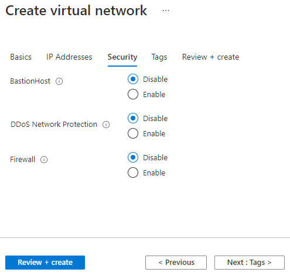
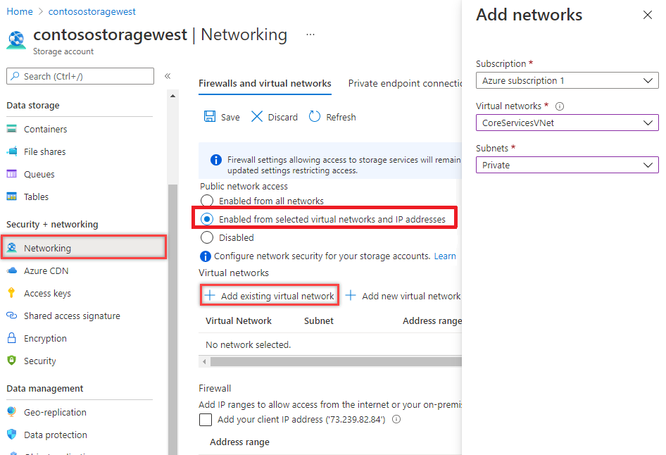

---
Exercise:
    title: 'M07-ユニット 5 仮想ネットワーク サービス エンドポイントを使用して、PaaS リソースへのネットワーク アクセスを制限する'
    module: 'モジュール - Azure サービスへのプライベート アクセスを設計および実装する'
---

# M07-ユニット 5 仮想ネットワーク サービス エンドポイントを使用して、PaaS リソースへのネットワーク アクセスを制限する


仮想ネットワーク サービス エンドポイントを使うと、一部の Azure サービス リソースへのネットワーク アクセスを、仮想ネットワーク サブネットに制限できます。また、リソースに対するインターネット アクセスを排除することもできます。サービス エンドポイントにより、使用している仮想ネットワークからサポートされている Azure サービスへの直接接続が提供されるため、ご自身の仮想ネットワークのプライベート アドレス スペースを使用して、Azure サービスにアクセスできるようになります。サービス エンドポイントを介して Azure リソースに送信されるトラフィックは、常に Microsoft Azure のバックボーン ネットワーク上に留まります。

この演習では、次のことを行います。

+ タスク 1: 仮想ネットワークを作成する
+ タスク 2: サービス エンドポイントを有効にする
+ タスク 3: サブネットのネットワーク アクセスを制限する
+ タスク 4: 送信規則を追加する 
+ タスク 5: RDP 接続へのアクセスを許可する
+ タスク 6: リソースへのネットワーク アクセスを制限する
+ タスク 7: ストレージ アカウントにファイル共有を作成する
+ タスク 8: サブネットへのネットワーク アクセスを制限する
+ タスク 9: 仮想マシンを作成する
+ タスク 10: ストレージ アカウントへのアクセスを確認する
+ タスク 11: リソースをクリーン アップする

## タスク 1: 仮想ネットワークを作成する

1. Azure portal にログインします。

2. Azure portal の「ホーム」ページで、仮想ネットワークを検索し、結果から「**仮想ネットワーク**」を選択します。

3. 「**+** **作成**」を選択します。

4. 次の情報を入力または選択します。
   

   | **設定**    | **値**                                     |
   | -------------- | --------------------------------------------- |
   | サブスクリプション   | サブスクリプションを選択します                      |
   | リソース グループ | (新しい) myResourceGroup                         |
   | 名前           | CoreServicesVNet                              |
   | 場所       | 「**米国東部**」を選択する                            |

5. 「**IP アドレス**」タブを選択し、次の値を入力します (サブネット名を変更するには**既定**を選択します)。
   

   | **設定**          | **値**   |
   | -------------------- | ----------- |
   | アドレス空間        | 10.0.0.0/16 |
   | サブネット名          | パブリック      |
   | サブネットのアドレス範囲 | 10.0.0.0/24 |

6. 「**セキュリティ**」タブを選択し、次の値を入力します。
   

   | **設定**     | **値** |
   | --------------- | --------- |
   | BastionHost     | 無効  |
   | DDoS 保護 | 無効  |
   | ファイアウォール        | 無効  |

7. 「**Review + create**」をクリックします。リソースが検証されたら、「**作成**」を選択します。 

## タスク 2: サービス エンドポイントを有効にする

サービス エンドポイントは、サービスごと、サブネットごとに有効になります。サブネットを作成し、そのサブネットに対してサービス エンドポイントを有効にします。

1. ポータルの最上部にある「**リソース、サービス、ドキュメントを検索する**」ボックスに、CoreServicesVNet を入力します。検索結果に CoreServicesVNet が表示されたら、それを選択します。

2. 仮想ネットワークにサブネットを追加します。「**設定**」で、「**サブネット**」を選択してから、次の図で示すように「**+ サブネット**」を選択します。 
   

3. 「**サブネットの追加**」で、次の情報を選択または入力します。

   | **設定**                 | **値**                    |
   | --------------------------- | ---------------------------- |
   | 名前                        | プライベート                      |
   | アドレス範囲               | 10.0.1.0/24                  |
   | サービス エンドポイント: サービス | 「**Microsoft.Storage**」を選択する |

4. 「**保存**」を選択します。

これで、2 つのサブネットが構成されているはずです。


 

## タスク 3: サブネットのネットワーク アクセスを制限する

既定では、サブネット内のすべての VM はすべてのリソースと通信できます。ネットワーク セキュリティ グループを作成し、サブネットに関連付けることにより、サブネット内のすべてのリソースとの通信を制限できます。

1. ポータルの最上部にある「**リソース、サービス、ドキュメントを検索する**」ボックスに、「**セキュリティ グループ**」を入力します。検索結果に「**ネットワーク セキュリティ グループ**」が表示されたら、それを選びます。

2. 「ネットワーク セキュリティ」グループで、「**+ 作成**」を選択します。 

3. 次の情報を入力または選択します。 
   

   | **設定**    | **値**                                                    |
   | -------------- | ------------------------------------------------------------ |
   | サブスクリプション   | サブスクリプションを選択します                                     |
   | リソース グループ | myResourceGroup                                              |
   | 名前           | ContosoPrivateNSG                                            |
   | 場所       | 「**米国東部**」を選択する                                           |

4. **「Review + create」** をクリックしてから、**「作成」** をクリックします。

5. ContosoPrivateNSG ネットワーク セキュリティ グループが作成されたら、「**リソースに移動**」を選択します。
   

6. 「**設定**」で「**送信セキュリティ規則**」を選びます。

7. 「**+ 追加**」を選択します。

8. Azure Storage サービスへの送信方向の通信を許可するルールを作成します。次の情報を入力または選択します。
   

   | **設定**             | **値**                 |
   | ----------------------- | ------------------------- |
   | ソース                  | **VirtualNetwork** を選びます |
   | ソース ポート範囲      | *                         |
   | 宛先             | 「**サービス タグ**」を選びます    |
   | 宛先サービス タグ | 「**ストレージ**」を選びます        |
   | Service                 | カスタム                    |
   | 宛先ポート範囲 | *                         |
   | プロトコル                | 任意                       |
   | アクション                  | 許可                     |
   | 優先度                | 100                       |
   | 名前                    | Allow-Storage-All         |

9. **「追加」** を選択します。


## タスク 4: 送信規則を追加する 

インターネットへの通信を拒否する別の送信セキュリティ ルールを作成します。この規則は、送信インターネット通信を許可するすべてのネットワーク セキュリティ グループの既定の規則を上書きします。 

1. 「**送信セキュリティ規則**」で「**+ 追加**」を選択します。

2. 次の情報を入力または選択します。
   

   | **設定**             | **値**                 |
   | ----------------------- | ------------------------- |
   | ソース                  | **VirtualNetwork** を選びます |
   | ソース ポート範囲      | *                         |
   | 宛先             | 「**サービス タグ**」を選びます    |
   | 宛先サービス タグ | 「**インターネット**」を選びます       |
   | Service                 | カスタム                    |
   | 宛先ポート範囲 | *                         |
   | プロトコル                | 任意                       |
   | アクション                  | Deny                      |
   | 優先度                | 110                       |
   | 名前                    | Deny-Internet-All         |

3. **「追加」** を選択します。

## タスク 5: RDP 接続へのアクセスを許可する

任意の場所からサブネットへのリモート デスクトップ プロトコル (RDP) トラフィックを許可する受信セキュリティ規則を作成します。この規則は、インターネットからのすべての受信トラフィックを拒否するデフォルトのセキュリティ規則をオーバーライドします。後のステップで接続をテストできるように、サブネットへのリモート デスクトップ接続を許可します。

1. On ContosoPrivateNSG | 「送信セキュリティ規則」の「**設定**」で、「**受信セキュリティ規則**」を選択します。

2. 「**+ 追加**」を選択します。

3. 「受信セキュリティ規則の追加」で、次の値を入力します。
   

   | **設定**             | **値**                 |
   | ----------------------- | ------------------------- |
   | ソース                  | 任意                       |
   | ソース ポート範囲      | *                         |
   | 宛先             | **VirtualNetwork** を選びます |
   | Service                 | カスタム                    |
   | 宛先ポート範囲 | 3389                      |
   | プロトコル                | 任意                       |
   | アクション                  | 許可                     |
   | 優先度                | 120                       |
   | 名前                    | Allow-RDP-All             |

4. 次に、「**追加**」を選択します。

> **警告**: RDP ポート 3389 がインターネットに公開されます。このオプションは、テスト用にのみ使用することをお勧めします。運用環境では、VPN またはプライベート接続を使用することをお勧めします。

5. 「**設定**」で「**サブネット**」を選択します。

6. 「**+ 関連付け**」を選択します。

7. 「**サブネットを関連付ける**」で、「**仮想ネットワーク**」を選択してから、「**仮想ネットワークを選択する**」で「**CoreServicesVNet**」を選択します。

8. 「**サブネットの選択**」で「**Private**」を選び、「**OK**」を選びます。

## タスク 6: リソースへのネットワーク アクセスを制限する

サービス エンドポイントを有効にした Azure サービスを介して作成されたリソースへのネットワーク アクセスを制限するために必要な手順は、サービスによって異なります。各サービスの具体的な手順については、それぞれのサービスのドキュメントをご覧ください。この演習の残りの部分には、例として、Azure ストレージアカウントのネットワークアクセスを制限する手順が含まれています。

1. Azure portal で「ストレージ アカウント」を選択します。

2. 「+ 作成」を選択します。

3. 次の情報を入力するか選択し、それ以外の設定では既定値をそのまま受入ます。
   

   | **設定**    | **値**                                                    |
   | -------------- | ------------------------------------------------------------ |
   | サブスクリプション   | サブスクリプションを選択します                                     |
   | リソース グループ | myResourceGroup                                              |
   | 名前           | contosostoragewestxx を入力する (xx は、名前を一意にするためのイニシャルです) |
   | パフォーマンス    | Standard StorageV2 (汎用 v2)                      |
   | 場所       | 「米国東部」を選択する                                               |
   | レプリケーション    | ローカル冗長ストレージ (LRS)                              |

4. **「Review + create」** をクリックしてから、**「作成」** をクリックします。

## タスク 7: ストレージ アカウントにファイル共有を作成する

1. ストレージ アカウントを作成した後、ポータルの上部にある「**リソース、サービス、ドキュメントの検索**」ボックスにストレージ アカウントの名前を入力します。指定したストレージ アカウントの名前が検索結果に表示されたら、それを選びます。
2. 次の図に示すように、**ファイル共有** を選択します。 
   
3. 「**+ ファイル共有**」を選択します。
4. 「**名前**」の下に「marketing」と入力し、「**作成**」を選択します。

## タスク 8: サブネットへのネットワーク アクセスを制限する

既定では、ストレージ アカウントは、インターネットを含む任意のネットワーク上のクライアントからのネットワーク接続を受け入れます。インターネット、およびすべての仮想ネットワーク内の他のすべてのサブネットからのネットワークアクセスを拒否します。ただし、CoreServicesVNet 仮想ネットワークの プライベート サブネットは除きます。

1. ストレージ アカウントの「**セキュリティ + ネットワーク**」で、「**ネットワーク**」を選択します。

2. 「**選択されたネットワーク**」を選択します。

3. 「**+ 既存の仮想ネットワークを追加**」を選択します。

4. 「**サブネットの追加**」で、次の情報を入力します。
   

   | **設定**      | **値**                    |
   | ---------------- | ---------------------------- |
   | サブスクリプション     | サブスクリプションを選択します。    |
   | 仮想ネットワーク | 「**CoreServicesVNet**」を選択します。 |
   | サブネット          | 「**プライベート**」を選択します。          |

5. **「追加」** を選択します。

6. 「**保存**」を選択します。

7. ストレージ アカウントの「**セキュリティ + ネットワーク**」で、「**アクセス キー**」を選択します。

8. 「**キーの表示**」を選択します。「**キー**」の値をメモします。後の手順でファイル共有を VM のドライブ文字にマップするときに、この値を手入力する必要があります。

## タスク 9: 仮想マシンを作成する

ストレージ アカウントへのネットワーク アクセスをテストするには、各サブネットに VM を展開します。

1. Azure portal ホーム画面で、「仮想マシン」、「選択」、「**+ 作成**」、「**+ 仮想マシン**」の順に選択します。

2. 「基本」タブで、次の情報を入力または選択します。 
   

   | **設定**           | **値**                                                    |
   | --------------------- | ------------------------------------------------------------ |
   | プロジェクトの詳細       |                                                              |
   | サブスクリプション          | サブスクリプションを選択します。                                    |
   | リソース グループ        | myResourceGroup                                              |
   | インスタンスの詳細      |                                                              |
   | 仮想マシン名  | ContosoWestPublic                                            |
   | リージョン                | (米国) 米国東部                                                 |
   | 可用性オプション  | インフラストラクチャの冗長性は必要ありません                        |
   | イメージ                 | 「**Windows Server 2019 Datacenter**」を選択します。                   |
   | サイズ                  | Standard_D2s                                                 |
   | 「管理者アカウント」 |                                                              |
   | ユーザー名              | 任意のユーザー名を入力します。                          |
   | パスワード              | 任意のパスワードを入力します。                           |
   | パスワードの確認      | パスワードを再入力します。                                       |
   | 受信ポートの規則    |                                                              |
   | パブリック受信ポート  | 選択したポートを許可する                                         |
   | 受信ポートの選択  | RDP (3389)                                                   |

3. その後、「**ネットワーク**」タブを選択します。次の情報を入力または選択します。
   

   | **設定**                | **値**                  |
   | -------------------------- | -------------------------- |
   | 仮想ネットワーク            | CoreServicesVNet           |
   | サブネット                     | パブリック (10.0.0.0/24)       |
   | パブリック IP                  | (新しい) ContosoWestPublic-ip |
   | NIC ネットワーク セキュリティ グループ | Basic                      |
   | パブリック受信ポート       | 選択したポートを許可する       |
   | 受信ポートの選択       | RDP (3389)                 |

4. 「**Review + create**」をクリックします。

5. 「**作成**」を選択して、仮想マシンのデプロイを開始します。VM の展開には数分かかりますが、VM の作成中に次の手順に進むことができます。

6. 別の仮想マシンを作成する手順 2 〜 5 を再度実行しますが、仮想マシンに ContosoWestPrivate という名前を付けて、**プライベート** サブネットを選択します。

VM のデプロイには数分かかります。作成が完了して設定がポータルに表示されるまで、次の手順を続行しないでください。

 

## タスク 10: ストレージ アカウントへのアクセスを確認する

1. ContosoWestPrivate VM の作成が完了したら、「リソースに移動」を選択して VM のブレードを開きます。「接続」ボタンを選択してから、「RDP」を選択します。
   
2. 「接続」ボタンと RDP を選択した後、「RDP ファイルのダウンロード」ボタンを選択します。リモート デスクトップ プロトコル (.rdp) ファイルが作成され、お使いのコンピューターにダウンロードされます。
3. ダウンロードされた rdp ファイルを開きます。メッセージが表示されたら、「接続」 を選択します。VM の作成時に指定したユーザー名とパスワードを入力します。VM 作成時に入力した資格情報を指定するには、その他を選択してから、別のアカウントを使用する を選択する必要があります。
4. 「**OK**」を選択します。
5. サインイン プロセス中に証明書の警告が表示されることがあります。警告が表示されたら、「はい」または「続行」を選択して接続処理を続行します。
6. ContosoWestPrivate VM で、PowerShell を使って、Azure ファイル共有を Z ドライブにマップします。以下のコマンドを実行する前に、<storage-account-key>、<storage-account-name> (例: contosostoragewestxx)、my-file-share (例: marketing) を、ストレージ アカウントを作成する タスクで指定および取得した値に置き換えてください。

```Azure CLI
$acctKey = ConvertTo-SecureString -String "<storage-account-key>" -AsPlainText -Force

$credential = New-Object System.Management.Automation.PSCredential -ArgumentList "Azure\<storage-account-name>", $acctKey

New-PSDrive -Name Z -PSProvider FileSystem -Root "\\<storage-account-name>.file.core.windows.net\my-file-share" -Credential $credential
```

Azure ファイル共有は Z ドライブに正常にマップされました。

7. VM にコマンド プロンプトからインターネットへの送信接続がないことを確認します。

 ping bing.com

プライベート サブネットに関連付けられているネットワーク セキュリティ グループは、インターネットへの送信アクセスを許可しないため、返信を受け取ることはありません。

8. ContosoWestPrivate VM へのリモート デスクトップ セッションを閉じます。

### ストレージ アカウントへのアクセスが拒否されたことを確認する

1. ポータルの最上部にある「**リソース、サービス、ドキュメントを検索する**」ボックスに、ContosoWestPublic を入力します。

2. 検索結果に **ContosoWestPublic** が表示されたら、それを選択します。

3. 「ContosoWestPublic VM のストレージ アカウント タスクへのアクセスを確認する」 で手順 1 〜 6 を完了します。  
     
   ‎少し待ってから、「New-PSDrive：アクセスが拒否されました」というエラーを受け取ります。ContosoWestPublic VM が パブリック サブネットにデプロイされているため、アクセスが拒否されています。パブリック サブネットには、Azure Storage に対応したサービス エンドポイントがありません。ストレージ アカウントは、パブリック サブネットではなく プライベート サブネットからのネットワーク アクセスのみ許可します。

4. パブリック VM にコマンドプロンプトからインターネットへの送信接続がないことを確認します。

 ping bing.com    
    
5. ContosoWestPublic VM へのリモート デスクトップ セッションを閉じます。

6. コンピューターから、Azure portal を参照します。

7. 「**リソース、サービス、ドキュメントの検索**」ボックスに、作成したストレージ アカウントの名前を入力します。指定したストレージ アカウントの名前が検索結果に表示されたら、それを選びます。

8. 「**ファイル共有**」を選択し、**marketing** ファイル共有を選択します。

9. 次のスクリーンショットに表示されているエラーを受け取ります。

    

 お使いのコンピューターが CoreServicesVNet 仮想ネットワークの プライベート サブネットにないため、アクセスが拒否されています。

> **警告**: 続行する前に、このラボで使用したすべてのリソースを削除する必要があります。Azure Portal でこれを行うには、リソース グループ をクリックします。作成したリソース グループを選択します。リソース グループ ブレードで、「リソース グループの削除」をクリックし、リソース グループ名を入力して、「削除」をクリックします。作成した可能性のある追加のリソース グループに対してプロセスを繰り返します。これを行わないと、他のラボで問題が発生する可能性があります。

結果: これで、このラボを完了しました。

## タスク 11: リソースをクリーン アップする

   > **注**: 新しく作成した Azure リソースのうち、使用しないリソースは必ず削除してください。使用しないリソースを削除しないと、予期しないコストが発生する場合があります。

1. Azure portal の **「Cloud Shell」** ウィンドウで **「PowerShell」** セッションを開きます。

1. 次のコマンドを実行して、このモジュールのラボ全体で作成したすべてのリソース グループのリストを削除します。

   ```powershell
   Remove-AzResourceGroup -Name 'myResourceGroup' -Force -AsJob
   ```

    > **注**: コマンドは非同期で実行されるので (-AsJob パラメーターによって決定されます)、別の PowerShell コマンドを同一 PowerShell セッション内ですぐに実行できますが、リソース グループが実際に削除されるまでに数分かかります。
