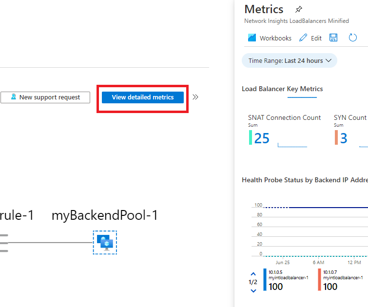

---
Exercise:
    title: 'M08 - ユニット 3 Azure Monitor を使用してロード バランサー リソースを監視する'
    module: 'モジュール - ネットワーク セキュリティの設計と実装'
---

# M08 - ユニット 3 Azure Monitor を使用してロード バランサー リソースを監視する


この演習では、架空の Contoso Ltd 組織の内部ロード バランサーを作成します。次に、Log Analytics ワークスペースを作成し、Azure Monitor Insights を使用して内部ロード バランサーに関する情報を表示します。関数従属性ビューを表示してから、ロード バランサー リソースの詳細なメトリックを表示し、ロード バランサーのリソース正常性情報を表示します。最後に、ロード バランサーの診断設定を構成して、作成した Log Analytics ワークスペースにメトリックを送信します。 

次の図は、この演習でデプロイする環境を示しています。


 この演習では、次のことを行います。

+ タスク 1: 仮想ネットワークの作成
+ タスク 2: ロード バランサーを作成する
+ タスク 3: バックエンド プールの作成
+ タスク 4: 正常性プローブの作成
+ タスク 5: ロード バランサー規則の作成
+ タスク 6: バックエンド サーバーを作成する
+ タスク 7: バックエンド プールに VM を追加する
+ タスク 8: VM に IIS をインストールする
+ タスク 9: ロード バランサーをテストする
+ タスク 10: Log Analytics ワークスペースを作成する
+ タスク 11: 機能依存関係ビューを使用する
+ タスク 12: 詳細なメトリックを表示する
+ タスク 13: リソースの正常性を表示する
+ タスク 14: 診断設定を構成する
+ タスク 15: リソースをクリーン アップする


## タスク 1: 仮想ネットワークの作成

このセクションでは、仮想ネットワークとサブネットを作成します。

1. Azure portal にログインします。

2. Azure portal の「ホーム」ページで、「**仮想ネットワーク**」を検索し、結果から仮想ネットワークを選択します。

3. **「+ 作成」** をクリックします。

   

4. 「**基本**」タブで、次の表の情報を使用して仮想ネットワークを作成します。

   | **設定**    | **値**                                           |
   | -------------- | --------------------------------------------------- |
   | サブスクリプション   | サブスクリプションを選択します                            |
   | リソース グループ | **新規作成** を選択する<br /><br />名前: **IntLB-RG** |
   | 名前           | **IntLB-VNet**                                      |
   | リージョン         | **(US) 米国西部**                                    |

5. 「**次へ : IP アドレス**」をクリックします。

6. 「**IP アドレス**」タブの「**IPv4 アドレス空間**」ボックスで、「**10.1.0.0/16**」と入力します。

7. 「**サブネット名**」の上で、「**+ サブネットの追加**」を選択します。

8. 「**サブネットの追加**」ペインで、**myBackendSubnet** のサブネット名と **10.1.0.0/24** のサブネット アドレス範囲を指定します。

9. 「**追加**」をクリックします。

10. 「**次へ : セキュリティ**」をクリックします。

11. **BastionHost** で「**有効にする**」を選択し、以下の表の情報を入力します。

    | **設定**                       | **値**                                              |
    | --------------------------------- | ------------------------------------------------------ |
    | Bastion 名                      | **myBastionHost**                                      |
    | AzureBastionSubnet のアドレス空間  | **10.1.1.0/24**                                        |
    | パブリック IP アドレス                 | **新規作成** を選択する<br /><br />名前: **myBastionIP** |

12. 「**Review + create**」をクリックします。

13. 「**作成**」をクリックします。

## タスク 2: ロード バランサーを作成する

このセクションでは、内部 Standard SKU ロード バランサーを作成します。この演習で、Basic SKU ロード バランサーの代わりに Standard SKUロードバランサーを作成する理由は、ロード バランサーの Standard SKU バージョンを必要とする後の演習のためです。

1. Azure portal の「ホーム」ページ上部の検索ボックスに「**ロード バランサー**」と入力し、サービスの下で、ロード バランサーを選択します。

2. **「作成」** をクリックします。

   

3. 「**基本**」タブで、次の表の情報を使用して、ロードバランサーを作成します。

   | **設定**           | **値**                |
   | --------------------- | ------------------------ |
   | 基本タブ            |                          | 
   | サブスクリプション          | サブスクリプションを選択します |
   | リソース グループ        | **IntLB-RG**             |
   | 名前                  | **myIntLoadBalancer**    |
   | リージョン                | **(US) 米国西部**         |
   | SKU                   | **Standard**             |
   | 種類                  | **内部**             |
   | フロントエンド IP の構成タブ | + フロントエンド IP 構成の追加 |
   | 仮想ネットワーク       | **IntLB-VNet**           |
   | サブネット                | **myBackendSubnet**      |
   | IP アドレスの割り当て | **動的**              |


4. 「**確認および作成**」をクリックします。


5. **「作成」** をクリックします。


## タスク 3: バックエンド プールの作成

バックエンド アドレス プールには、ロード バランサーに接続された仮想 NIC の IP アドレスが含まれています。

1. Azure portal のホーム ページで、「**すべてのリソース**」をクリックし、リソース一覧から **myIntLoadBalancer** をクリックします。

2. 「**設定**」で「**バックエンド プール**」を選択し、「**追加**」をクリックします。

3. 「**バックエンド プールの追加**」ページで、以下の表の情報を入力します。

   | **設定**     | **値**            |
   | --------------- | -------------------- |
   | 名前            | **myBackendPool**    |
   | 仮想ネットワーク | **IntLB-VNet**       |
   | 関連付け先   | **仮想マシン** |

4. 「**追加**」をクリックします。

   

   

## タスク 4: 正常性プローブの作成

ロード バランサーは、正常性プローブを使用してアプリの状態を監視します。正常性プローブは、正常性チェックへの応答に基づいて、ロード バランサーに含める VM を追加したり削除したりします。ここでは、VM の正常性を監視するための正常性プローブを作成します。

1. ロード バランサーの「**バックエンド プール**」ページの「**設定**」で、「**正常性プローブ**」をクリックし、「**追加**」をクリックします。

2. 「**正常性プローブの追加**」ページで、以下の表の情報を入力します。

   | **設定**         | **値**         |
   | ------------------- | ----------------- |
   | 名前                | **myHealthProbe** |
   | プロトコル            | **HTTP**          |
   | ポート                | **80**            |
   | パス                | **/**             |
   | サイクル間隔            | **15**            |
   | 異常なしきい値 | **2**             |

3. 「**追加**」をクリックします。

   


## タスク 5: ロード バランサー規則の作成

ロード バランサー規則の目的は、一連の VM に対するトラフィックの分散方法を定義することです。着信トラフィック用のフロントエンド IP 構成と、トラフィックを受信するためのバックエンド IP プールを定義します。送信元と送信先のポートは、この規則で定義します。ここでは、ロード バランサー規則を作成します。

1. ロード バランサーの「**バックエンド プール**」ページの「**設定**」で、「**負荷分散規則**」をクリックし、「**追加**」をクリックします。

2. 「**負荷分散規則の追加**」ページで、以下の表の情報を入力します。

   | **設定**            | **値**                |
   | ---------------------- | ------------------------ |
   | 名前                   | **myHTTPRule**           |
   | IP バージョン             | **IPv4**                 |
   | フロントエンド IP アドレス    | **LoadBalancerFrontEnd** |
   | プロトコル               | **TCP**                  |
   | ポート                   | **80**                   |
   | バックエンド ポート           | **80**                   |
   | バックエンド プール           | **myBackendPool**        |
   | 正常性プローブ           | **myHealthProbe**        |
   | セッション永続化    | **なし**                 |
   | アイドル タイムアウト (分) | **15**                   |
   | フローティング IP            | **無効**             |

3. 「**追加**」をクリックします。

   

## タスク 6: バックエンド サーバーを作成する


このセクションでは、ロード バランサーのバックエンド プール用に同じ可用性セットに含まれる 3 つのVMを作成し、VM をバックエンド プールに追加してから、3 つの VM に IIS をインストールしてロード バランサーをテストします。

1. Azure portal の **「Cloud Shell」** ウィンドウで **「PowerShell」** セッションを開きます。

2. Cloud Shell ウィンドウのツールバーで、「ファイルのアップロード/ダウンロード」アイコンをクリックし、ドロップダウン メニューで「アップロード」をクリックして、次の **azuredeploy.json**、**azuredeploy.parameters.vm1.json**、**azuredeploy.parameters.vm2.json**、 **azuredeploy.parameters.vm3.json** ファイルを CloudShell ホーム ディレクトリにソース フォルダ－ **F:\Allfiles\Exercises\M08** からアップロードします。

3. 次の ARM テンプレートをデプロイして、この演習に必要な仮想ネットワーク、サブネット、VM を作成します。

   ```powershell
   $RGName = "IntLB-RG"
   
   New-AzResourceGroupDeployment -ResourceGroupName $RGName -TemplateFile azuredeploy.json -TemplateParameterFile azuredeploy.parameters.vm1.json
   New-AzResourceGroupDeployment -ResourceGroupName $RGName -TemplateFile azuredeploy.json -TemplateParameterFile azuredeploy.parameters.vm2.json
   New-AzResourceGroupDeployment -ResourceGroupName $RGName -TemplateFile azuredeploy.json -TemplateParameterFile azuredeploy.parameters.vm3.json
   ```
  
    > **注:** デプロイには数分かかる場合があります。 

## タスク 7: バックエンド プールに VM を追加する

1. Azure portal のホーム ページで、「**すべてのリソース**」をクリックし、リソース一覧から **myIntLoadBalancer** をクリックします。

2. 「**設定**」で「**バックエンド プール**」を選択し、「**myBackendPool**」を選択します。

3. 「**関連付け先**」ボックスで、「**仮想マシン**」を選択します。

4. 「**仮想マシン**」で、「**追加**」をクリックします。

5. 3 つの VM すべて (**myVM1**、**myVM2**、**myVM3**) のチェックボックスを選択し、「**追加**」をクリックします。

6. **myBackendPool** ページで、「**保存**」をクリックします。

   

 

## タスク 8: VM に IIS をインストールする

1. Azure portal のホーム ページで、「**すべてのリソース**」をクリックし、リソース一覧から **myVM1** をクリックします。
2. 「**概要**」ページで、「**接続**」、「**Bastion**」の順に選択します。
3. 「**Bastion を使用**」をクリックします。
4. 「**ユーザー名**」ボックスに「**TestUser**」と入力し、「**パスワード**」ボックスに「**TestPa$$w0rd!**」と入力して、「**接続**」をクリックします。
5. **myVM1** ウィンドウが別のブラウザー タブで開きます。
6. 「**ネットワーク**」ペインが表示されたら、「**はい**」をクリックします。
7. ウィンドウの左下隅にある「**Windows スタート**」アイコンをクリックしてから、「**Windows PowerShell**」タイルをクリックします。
8. IIS インストールするには、PowerShell で次のコマンドを実行します。Install-WindowsFeature -name Web-Server -IncludeManagementTools
9. 既存の既定の Web ホームページを削除するには、Power Shell で次のコマンドを実行します。 Remove-Item C:\inetpub\wwwroot\iisstart.htm
10. 新しい既定の Web ホーム ページを追加してコンテンツを追加するには、PowerShell で次のコマンドを実行します。Add-Content -Path "C:\inetpub\wwwroot\iisstart.htm" -Value $("Hello World from " + $env:computername)
11. ブラウザー タブを閉じて、**myVM1** への Bastion セッションを閉じます。
12. 上記の手順 1 ~ 11 をさらに 2 回繰り返して、IIS と更新された既定のホーム ページを **myVM2** および **myVM3** 仮想マシンにインストールします。

 

## タスク 9: ロード バランサーをテストする

このセクションでは、テスト VM を作成してから、ロード バランサーをテストします。

### テスト VM を作成する

1. Azure portal の「ホーム」ページで、グローバル検索を使用して、「**Virtual Networks**」と入力し、サービスの下で、仮想ネットワークを選択します。 

2. **「+ 作成」、「+ 仮想マシン」** を選択し、「**基本**」タブで、次の表の情報を使用して、最初の VM を作成します。

   | **設定**          | **値**                                    |
   | -------------------- | -------------------------------------------- |
   | サブスクリプション         | サブスクリプションを選択します                     |
   | リソース グループ       | **IntLB-RG**                                 |
   | 仮想マシン名 | **myTestVM**                                 |
   | リージョン               | **(US) 米国西部**                             |
   | 可用性オプション | **インフラストラクチャの冗長性は必要ありません**    |
   | イメージ                | **Windows Server 2019 Datacenter - Gen 1**   |
   | サイズ                 | **Standard_DS1_v2 - 1 vcpu、3.5 GiB メモリ** |
   | ユーザー名             | **TestUser**                                 |
   | パスワード             | **TestPa$$w0rd!**                            |
   | パスワードの確認     | **TestPa$$w0rd!**                            |

3. 「**次へ : ディスク**」をクリックしてから、「**次へ : ネットワーク**」をクリックします。 

4. 「**ネットワーク**」タブで、次の表の情報を使用して、ネットワーク設定を構成します。

   | **設定**                                                  | **値**                     |
   | ------------------------------------------------------------ | ----------------------------- |
   | 仮想ネットワーク                                              | **IntLB-VNet**                |
   | サブネット                                                       | **myBackendSubnet**           |
   | パブリック IP                                                    | 「**なし**」に変更する            |
   | NIC ネットワーク セキュリティ グループ                                   | **詳細**                  |
   | ネットワーク セキュリティ グループを構成する                             | 既存の「**myNSG**」を選択する |
   | この仮想マシンを既存の負荷分散ソリューションの背後に配置しますか？ | **オフ** (未チェック)           |

5. 「**Review + create**」をクリックします。

6. 「**作成**」をクリックします。

7. この最後の VM がデプロイされるのを待ってから、次のタスクに進みます。

### テスト VM に接続して、ロード バランサーをテストする

1. Azure portal のホーム ページで、「**すべてのリソース**」をクリックし、リソース一覧から **myIntLoadBalancer** をクリックします。

2. 「**概要**」ページで、**プライベート IP アドレス**をメモするか、クリップボードにコピーします。注: 「**プライベート IP アドレス**」を表示するために、「**もっと見る**」を選択することが必要となる場合があります。

3. 「**ホーム**」をクリックし、Azure portal のホーム ページで「**すべてのリソース**」をクリックしてから、作成した **myTestVM** 仮想マシンをクリックします。

4. 「**概要**」ページで、「**接続**」、「**Bastion**」の順に選択します。

5. 「**Bastion を使用**」をクリックします。

6. 「**ユーザー名**」ボックスに「**TestUser**」と入力し、「**パスワード**」ボックスに「**TestPa$$w0rd!**」と入力して、「**接続**」をクリックします。

7. **myTestVM** ウィンドウが別のブラウザー タブで開きます。

8. 「**ネットワーク**」ペインが表示されたら、「**はい**」をクリックします。

9. タスク バーの **Internet Explorer** アイコンをクリックして、Web ブラウザーを開きます。

10. 「**Internet Explorer 11 のセットアップ**」ダイアログ ボックスで「**OK**」をクリックします。

11. 前の手順の**プライベート IP アドレス** (例: 10.1.0.4) をブラウザーのアドレス バーに入力 (または貼り付け) して、Enter キーを押します。

12. IIS Web サーバーの既定の Web ホーム ページがブラウザー ウィンドウに表示されます。バックエンドプ ール内の 3 つの仮想マシンの 1 つが応答します。
    

13. ブラウザーの更新ボタンを数回クリックすると、内部ロード バランサーのバックエンド プール内のさまざまな VM からランダムに応答が返されることがわかります。

    

## タスク 10: Log Analytics ワークスペースを作成する

1. Azure portal のホーム ページで「**すべてのサービス**」をクリックし、ページ上部の検索ボックスに「**Log Analytics**」と入力して、フィルター処理された一覧から「**Log Analytics ワークスペース**」を選択します。

   

2. 「**作成**」をクリックします。 

3. 「**Log Analytics ワークスペースの作成**」ページの「**基本**」タブで、次の表の情報を使用して、ワークスペースを作成します。

   | **設定**    | **値**                |
   | -------------- | ------------------------ |
   | サブスクリプション   | サブスクリプションを選択します |
   | リソース グループ | **IntLB-RG**             |
   | 名前           | **myLAworkspace**        |
   | リージョン         | **米国西部**              |

4. **「Review + create」** をクリックしてから、**「作成」** をクリックします。

   


## タスク 11: 機能依存関係ビューを使用する

1. Azure portal のホーム ページで「**すべてのリソース**」をクリックし、「リソース」一覧で「**myIntLoadBalancer**」を選択します。

   

2. 「**監視**」で「**分析情報**」を選択します。

3. ページの右上隅にある「**X** 」をクリックして、「**メトリック**」ペインを閉じます。すぐにまた開きます。

4. このページ ビューは関数従属性ビューと呼ばれ、このビューでは、選択したネットワーク リソース (この場合はロード バランサー) のトポロジを示す便利なインタラクティブな図が表示されます。Standard Load Balancer の場合、バックエンド プールのリソースは正常性プローブの状態で色分けされ、トラフィックを処理するためのバックエンド プールの現在の可用性が示されます。

5. ページの右下隅にある**ズームイン (+)** ボタンと**ズームアウト (-)** ボタンを使用して、トポロジ図をズームインおよびズームアウトします (または、マウス ホイールがある場合はそれを使用できます)。トポロジ図をページの周りにドラッグして移動することもできます。

6. 図の **LoadBalancerFrontEnd** コンポーネントにカーソルを合わせてから、**myBackendPool** コンポーネントにカーソルを合わせます。 

7. これらのポップアップ ウィンドウのリンクを使用して、ロード バランサー コンポーネントに関する情報を表示し、それぞれの Azure portal ブレードを開くことができることに注意してください。

8. **myVM3** 仮想マシン コンポーネントにカーソルを合わせます。仮想マシンのリソース ブレードを開いたり、**VM Insights** ページを開いたり、Network Watcher から**接続トラブルシューティング** ツールを実行したりできます。これらはすべてトポロジ図のこの部分から実行できます。
   

9. トポロジ図の SVG ファイル コピーをダウンロードするには、「**トポロジのダウンロード**」をクリックし、ファイルを**ダウンロード** フォルダーに保存します。 

10. 右上隅にある「**メトリックの表示**」をクリックして、画面の右側にあるメトリック ペインを再度開きます。
    

11. 「メトリック」ペインには、このロード バランサー リソースのいくつかの主要なメトリックが棒グラフと折れ線グラフの形式ですばやく表示されます。

    

 

## タスク 12: 詳細なメトリックを表示する

1. このネットワーク リソースのより包括的なメトリックを表示するには、「**詳細なメトリックの表示**」をクリックします。 
   

2. これにより、Azure Network Insights プラットフォームで大きな完全な**メトリック** ページが開きます。最初に表示されるタブは「**概要**」タブです。このタブには、ロード バランサーの可用性の状態と、ロード バランサーに接続されている各フロントエンド IP の全体的なデータス ループットとフロントエンドおよびバックエンドの可用性が表示されます。これらのメトリックにより、フロントエンド IP が応答可能かどうか、およびバックエンド プール内のコンピューティング インスタンスが着信接続に対して個別に応答可能かどうかが示されます。
   

3. 「**フロントエンドとバックエンドの可用性**」タブをクリックし、ページを下にスクロールして、正常性プローブ状態グラフを表示します。これらの項目の**値が 100 未満**の場合は、それらのリソースで何らかの停止が発生していることを示しています。
   

4. 「**データ スループット**」タブをクリックし、ページを下にスクロールして、他のデータ スループット グラフを参照します。

5. グラフの一部のデータ ポイントにカーソルを合わせると、値が変化してその時点の正確な値が表示されます。
   

6. 「**フロー ディストリビューション**」タブをクリックし、ページを下にスクロールして、「**VM フローの作成とネットワーク トラフィック**」セクションの下のグラフを表示します。 

   

 

## タスク 13: リソースの正常性を表示する

1. ロード バランサー リソースの状態を表示するには、Azure portal のホーム ページで「**すべてのサービス**」をクリックし、「**監視**」を選択します。 

2. **「監視」 &gt; 「概要」** ページの左側のメニューで、「**サービス正常性**」をクリックします。 

3. **「サービス正常性」 &gt; 「サービスの問題」** ページの左側のメニューで、「**リソース正常性**」をクリックします。

4. **「サービス正常性」 &gt; 「リソース正常性」** ページの「**リソースの種類**」ドロップダウン リストで、下にスクロールして、「**ロード バランサー**」を選択します。

   

5. 次に、一覧からロードバランサーの名前を選択します。

6. 「**リソース正常性**」ページでは、ロード バランサーリソースに関する主要な可用性の問題を特定できます。「**正常性履歴**」セクションにイベントがある場合は、正常性イベントを展開して、イベントの詳細を表示できます。イベントの詳細を PDF ファイルとして保存して、後で確認したり報告したりすることもできます。

   

 

## タスク 14: 診断設定を構成する

1. Azure portal のホーム ページで「**リソース グループ**」をクリックし、リストから **IntLB-RG** リソース グループを選択します。 

2. 「**IntLB-RG**」ページで、リソースの一覧から **myIntLoadBalancer** ロード バランサー リソースの名前をクリックします。

3. 「**監視**」で、「**診断設定**」を選択し、「**診断設定を追加する**」をクリックします。

   

4. 「**診断設定**」ページの名前ボックスに、「**myLBDiagnostics**」と入力します。

5. 「**AllMetrics**」チェックボックスで、「**Log Analytics ワークスペースに送信する**」チェック ボックスをオンにします。

6. 一覧からサブスクリプションを選択し、ワークスペースのドロップダウン リストから **myLAworkspace (westus)** を選択します。

7. 「**保存**」をクリックします。

   

 

 

## タスク 15: リソースをクリーン アップする

   > **注**: 新しく作成した Azure リソースのうち、使用しないリソースは必ず削除してください。使用しないリソースを削除しないと、予期しないコストが発生する場合があります。

1. Azure portal の **「Cloud Shell」** ウィンドウで **「PowerShell」** セッションを開きます。

1. 次のコマンドを実行して、このモジュールのラボ全体で作成したすべてのリソース グループのリストを削除します。

   ```powershell
   Remove-AzResourceGroup -Name 'IntLB-RG' -Force -AsJob
   ```

    > **注**: コマンドは非同期で実行されるので (-AsJob パラメーターによって決定されます)、別の PowerShell コマンドを同一 PowerShell セッション内ですぐに実行できますが、リソース グループが実際に削除されるまでに数分かかります。
