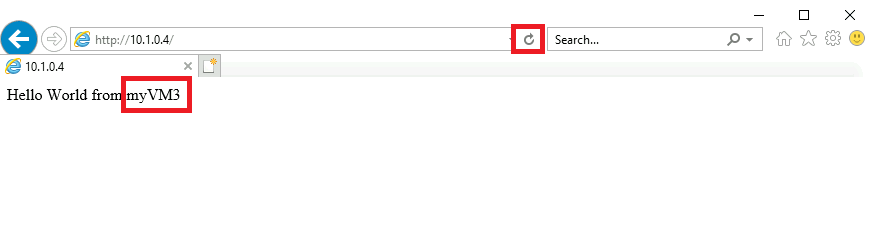

---
Exercise:
  title: M08 - ユニット 3 Azure Monitor を使用してロード バランサー リソースを監視する
  module: Module 08 - Design and implement network monitoring
---

# M08 - ユニット 3 Azure Monitor を使用してロード バランサー リソースを監視する


この演習では、架空の組織 Contoso Ltd. 用の内部ロード バランサーを作成します。 次に、Log Analytics ワークスペースを作成し、Azure Monitor Insights を使用して内部ロード バランサーに関する情報を表示します。 [機能依存] ビューを表示してから、ロード バランサー リソースの詳細なメトリックを表示し、ロード バランサー リソースの正常性情報を表示します。 最後に、作成した Log Analytics ワークスペースにメトリックを送信するようにロード バランサーの診断設定を構成します。 

次の図は、この演習でデプロイする環境を示しています。


 この演習では、以下のことを行います。

+ タスク 1: 仮想ネットワークを作成する
+ タスク 2: ロード バランサーを作成する
+ タスク 3: バックエンド プールを作成する
+ タスク 4: 正常性プローブを作成する
+ タスク 5: ロード バランサーの規則を作成する
+ タスク 6: バックエンド サーバーを作成する
+ タスク 7: バックエンド プールに VM を追加する
+ タスク 8: VM に IIS をインストールする
+ タスク 9: ロード バランサーをテストする
+ タスク 10: Log Analytics ワークスペースを作成する
+ タスク 11: [機能依存] ビューを使用する
+ タスク 12: 詳細なメトリックを表示する
+ タスク 13: リソース正常性を表示する
+ タスク 14: 診断設定を構成する
+ タスク 15: リソースをクリーンアップする

                **メモ:** このラボをご自分のペースでクリックして進めることができる、 **[ラボの対話型シミュレーション](https://mslabs.cloudguides.com/guides/AZ-700%20Lab%20Simulation%20-%20Monitor%20a%20load%20balancer%20resource%20using%20Azure%20Monitor)** が用意されています。 対話型シミュレーションとホストされたラボの間に若干の違いがある場合がありますが、示されている主要な概念とアイデアは同じです。


> [!Note]  
> 命令と Azure portal インターフェイスには若干の違いが生じる場合がありますが、コア概念は同じです。 

#### 推定時間: 55 分

## タスク 1: 仮想ネットワークを作成する

このセクションでは、仮想ネットワークとサブネットを作成します。

1. Azure ポータルにログインします。

1. Azure portal のホーム ページで、「**仮想ネットワーク**」を検索して、[サービス] で仮想ネットワークを選択します。

1. **[+ 作成]** を選択します。

   

1. **[基本]** タブで、次の表の情報を使用して仮想ネットワークを作成します。

   | **設定**    | **Value**                                           |
   | -------------- | --------------------------------------------------- |
   | サブスクリプション   | サブスクリプションを選択します。                            |
   | Resource group | **[新規作成]** を選択します<br /><br />名前: **IntLB-RG** |
   | 名前           | **IntLB-VNet**                                      |
   | リージョン         | **(米国) 米国西部**                                    |

1. **[次へ :IP アドレス]** を選択します。

1. **[IP アドレス]** タブの **[IPv4 アドレス空間]** ボックスに、「**10.1.0.0/16**」と入力します。

1. **[サブネット名]** で、 **[+ サブネットの追加]** を選択します。

1. **[サブネットの追加]** ペインで、サブネット名を **myBackendSubnet** に、サブネット アドレス範囲を **10.1.0.0/24** に設定します。

1. **[追加]** を選択します。

1. **[次へ:セキュリティ]** を選択します。

1. **[BastionHost]** で、**[有効化]** を選択し、以下の表の情報を入力します。

    | **設定**                       | **Value**                                              |
    | --------------------------------- | ------------------------------------------------------ |
    | 要塞名                      | **myBastionHost**                                      |
    | AzureBastionSubnet のアドレス空間  | **10.1.1.0/24**                                        |
    | パブリック IP アドレス                 | **[新規作成]** を選択します<br /><br />名前: **myBastionIP** |

1. **[Review + create](レビュー + 作成)** を選択します。

1. **［作成］** を選択します

## タスク 2: ロード バランサーを作成する

このセクションでは、Standard SKU の内部ロード バランサーを作成します。 この演習で、Basic SKU のロード バランサーではなく、Standard SKU のロード バランサーを作成する理由は、後の演習で Standard SKU バージョンのロード バランサーが必要となるためです。

1.  Azure ホーム ページで、検索バーに「**Load Balancer**」と入力します。 
1.  **[ロード バランサーの作成]** を選択します。
1.  **[基本]** タブで、以下の表の情報を使用して、ロード バランサーを作成します。
    

   | **設定**           | **Value**                |
   | --------------------- | ------------------------ |
   | [基本] タブ            |                          | 
   | サブスクリプション          | サブスクリプションを選択します。 |
   | Resource group        | **IntLB-RG**             |
   | 名前                  | **myIntLoadBalancer**    |
   | リージョン                | **(米国) 米国西部**         |
   | SKU                   | **Standard**             |
   | Type                  | **内部**             |
   | フロントエンド IP 構成タブ | + フロントエンド IP 構成の追加 |
   | 名前                  | **LoadBalancerFrontEnd** |
   | 仮想ネットワーク       | **IntLB-VNet**           |
   | Subnet                | **myBackendSubnet**      |
   | IP アドレスの割り当て | **動的**              |


1. **[Review + create](レビュー + 作成)** を選択します。


1. **［作成］** を選択します


## タスク 3: バックエンド プールを作成する

バックエンド アドレス プールには、ロード バランサーに接続された仮想 NIC の IP アドレスが含まれています。

1. Azure portal のホームページで、 **[すべてのリソース]** を選択して、リソースの一覧から **[myIntLoadBalancer]** を選択します。

1. **[設定]** で、 **[バックエンド プール]** 、 **[追加]** の順に選択します。

1. **[バックエンド プールの追加]** ページで、以下の表の情報を入力します。

   | **設定**     | **Value**            |
   | --------------- | -------------------- |
   | 名前            | **myBackendPool**    |
   | 仮想ネットワーク | **IntLB-VNet**       |
   | バックエンド プールの構成   | **NIC** |

1. **[追加]** を選択します。

   

   

## タスク 4: 正常性プローブを作成する

ロード バランサーは、正常性プローブを使用してアプリの状態を監視します。 正常性プローブは、正常性チェックへの応答に基づいて、ロード バランサーに含める VM を追加したり削除したりします。 ここでは、正常性プローブを作成して、VM の正常性を監視します。

1. ロード バランサーの **[バックエンド プール]** ページの **[設定]** で、 **[正常性プローブ]** を選択して、 **[追加]** を選択します。

1. **[正常性プローブの追加]** ページで、次の表の情報を入力します。

   | **設定**         | **Value**         |
   | ------------------- | ----------------- |
   | 名前                | **myHealthProbe** |
   | Protocol            | **HTTP**          |
   | Port                | **80**            |
   | パス                | **/**             |
   | Interval            | **15**            |

1. **[追加]** を選択します。

   


## タスク 5: ロード バランサーの規則を作成する

ロード バランサー規則の目的は、一連の VM に対するトラフィックの分散方法を定義することです。 着信トラフィック用のフロントエンド IP 構成と、トラフィックを受信するためのバックエンド IP プールを定義します。 送信元と送信先のポートは、この規則で定義します。 ここでは、ロード バランサーの規則を作成します。

1. ロード バランサーの **[バックエンド プール]** ページの **[設定]** で、 **[負荷分散規則]** を選択して、 **[追加]** を選択します。

1. **[負荷分散規則の追加]** ページで、次の表の情報を入力します。

   | **設定**            | **Value**                |
   | ---------------------- | ------------------------ |
   | 名前                   | **myHTTPRule**           |
   | IP バージョン             | **IPv4**                 |
   | フロントエンド IP アドレス    | **LoadBalancerFrontEnd** |
   | Protocol               | **TCP**                  |
   | Port                   | **80**                   |
   | バックエンド ポート           | **80**                   |
   | バックエンド プール           | **myBackendPool**        |
   | 正常性プローブ           | **myHealthProbe**        |
   | セッション永続化    | **なし**                 |
   | アイドル タイムアウト (分) | **15**                   |
   | フローティング IP            | **無効**             |

1. **[追加]** を選択します。

   

## タスク 6: バックエンド サーバーを作成する


このセクションでは、ロード バランサーのバックエンド プールに対して 3 つの VM を作成し、それらの VM をバックエンド プールに追加してから、3 つの VM に IIS をインストールしてロード バランサーをテストします。

1. Azure portal で、 **[Cloud Shell]** ペイン内に **PowerShell** セッションを開きます。

1. [Cloud Shell] ペインのツールバーで、 **[ファイルのアップロード/ダウンロード]** アイコンをクリックし、ドロップダウン メニューで **[アップロード]** をクリックして、**azuredeploy.json**、**azuredeploy.parameters.vm1.json**、**azuredeploy.parameters.vm2.json**、および **azuredeploy.parameters.vm3.json** の各ファイルを、ソース フォルダー **F:\Allfiles\Exercises\M08 から Cloud Shell** のホーム ディレクトリに 1 つずつアップロードします。

1. 次の ARM テンプレートをデプロイして、この演習に必要な仮想ネットワーク、サブネット、VM を作成します。

   >**注**: 管理者パスワードを入力するように求められます。

   ```powershell
   $RGName = "IntLB-RG"
   
   New-AzResourceGroupDeployment -ResourceGroupName $RGName -TemplateFile azuredeploy.json -TemplateParameterFile azuredeploy.parameters.vm1.json
   New-AzResourceGroupDeployment -ResourceGroupName $RGName -TemplateFile azuredeploy.json -TemplateParameterFile azuredeploy.parameters.vm2.json
   New-AzResourceGroupDeployment -ResourceGroupName $RGName -TemplateFile azuredeploy.json -TemplateParameterFile azuredeploy.parameters.vm3.json
   ```
  
    > **注:**  これには、デプロイまでに数分かかります。 

## タスク 7: バックエンド プールに VM を追加する

1. Azure portal のホームページで、 **[すべてのリソース]** を選択して、リソースの一覧から **[myIntLoadBalancer]** を選択します。

1. **[設定]** で、**[バックエンド プール]** を選択し、**[myBackendPool]** を選択します。

1. **[関連付け先]** ボックスで、 **[仮想マシン]** を選択します。

1. **[仮想マシン]** で **[追加]** を選択します。

1. 3 つの VM (**myVM1**、**myVM2**、**myVM3**) のチェックボックスをオンにして、 **[追加]** を選択します。

1. **[myBackendPool]** ページで、 **[保存]** をクリックします。

   

 

## タスク 8: VM に IIS をインストールする

1. Azure portal のホームページで、 **[すべてのリソース]** を選択して、リソースの一覧から **[myVM1]** を選択します。
1. **[概要]** ページで **[接続]** 、 **[要塞]** の順に選択します。
1. **[Bastion を使用する]** を選択します。
1. **[ユーザー名]** ボックスに「**TestUser**」 と入力し、 **[パスワード]** ボックスに、展開中に指定したパスワードを入力して、 **[接続]** を選択します。
1. **[myVM1]** ウィンドウが別のブラウザー タブで開きます。
1. **[ネットワーク]** ペインが表示されたら、 **[はい]** を選択します。
1. ウィンドウの左下隅にある **[Windows の [スタート] アイコン]** を選択してから、 **[Windows PowerShell]** タイルを選択します。
1. IIS をインストールするには、PowerShell で次のコマンドを実行します: Install-WindowsFeature -name Web-Server -IncludeManagementTools
1. 既存のデフォルトの Web ホーム ページを削除するには、PowerShell で次のコマンドを実行します: Remove-Item C:\inetpub\wwwroot\iisstart.htm
1. 新しいデフォルトの Web ホーム ページを追加して、そこにコンテンツを追加するには、PowerShell で次のコマンドを実行します: Add-Content -Path "C:\inetpub\wwwroot\iisstart.htm" -Value $("Hello World from " + $env:computername)
1. ブラウザーのタブを閉じ、**myVM1** への Bastion セッションを終了します。
1. 上記のステップ 1 〜 11 をさらに 2 回繰り返して、IIS と更新されたデフォルトのホーム ページを **myVM2** および **myVM3** 仮想マシンにインストールします。

 

## タスク 9: ロード バランサーをテストする

このセクションでは、テスト VM を作成し、ロード バランサーをテストします。

### テスト VM を作成する

> [!Note]  
> 命令と Azure portal インターフェイスには若干の違いが生じる場合がありますが、コア概念は同じです。 

1. Azure ホーム ページのグローバル検索に、「**仮想マシン**」と入力して、[サービス] の下の仮想マシンを選択します。 

1. **[基本]** タブで、 **[+ 作成; + 仮想マシン]** を選択し、以下の表の情報を使用して、最初の VM を作成します。

   | **設定**          | **Value**                                    |
   | -------------------- | -------------------------------------------- |
   | サブスクリプション         | サブスクリプションを選択します。                     |
   | Resource group       | **IntLB-RG**                                 |
   | 仮想マシン名 | **myTestVM**                                 |
   | リージョン               | **(米国) 米国西部**                             |
   | 可用性のオプション | **インフラストラクチャの冗長性は必要ありません**    |
   | Image                | **[Windows Server 2019 Datacenter - Gen 1]**   |
   | サイズ                 | **Standard_DS2_v3 - 2 vcpu、8 GiB メモリ** |
   | ユーザー名             | **TestUser**                                 |
   | パスワード             | **セキュリティで保護されたパスワードを指定する**                |
   | パスワードの確認     | **セキュリティで保護されたパスワードを指定する**                |

1. **[次へ:ディスク]** を選択して、 **[次へ:ネットワーク]** を選択します。 

1. **[ネットワーク]** タブで、以下の表の情報を使用してネットワーク設定を構成します。

   | **設定**                                                  | **Value**                     |
   | ------------------------------------------------------------ | ----------------------------- |
   | 仮想ネットワーク                                              | **IntLB-VNet**                |
   | Subnet                                                       | **myBackendSubnet**           |
   | パブリック IP                                                    | **[なし]** に変更する            |
   | NIC ネットワーク セキュリティ グループ                                   | **詳細**                  |
   | ネットワーク セキュリティ グループを構成する                             | 既存の **[(新規)myTestVMNSG]** のまま |
   | 負荷分散                                               | **なし** (またはオフ)       |

1. **[Review + create](レビュー + 作成)** を選択します。

1. **［作成］** を選択します

1. 次のタスクに進む前に、この最後の VM がデプロイされるのを待ちます。

### テスト VM に接続してロード バランサーをテストする

1. Azure portal のホームページで、 **[すべてのリソース]** を選択して、リソースの一覧から **[myIntLoadBalancer]** を選択します。

1. **[概要]** ページで、**プライベート IP アドレス**をメモするか、クリップボードにコピーします。 注: **プライベート IP アドレス**を表示するには、 **[もっと見る]** を選択しなくてはならない場合があります。

1. **[ホーム]** を選択してから、Azure portal ページで **[すべてのリソース]** を選択して、先ほど作成した **myTestVM** 仮想マシンを選択します。

1. **[概要]** ページで **[接続]** 、 **[要塞]** の順に選択します。

1. **[Bastion を使用する]** を選択します。

1. **[ユーザー名]** ボックスに「**TestUser**」 と入力して、 **[パスワード]** ボックスに、展開中に指定したパスワードを入力して、 **[接続]** を選択します。

1. **[myTestVM]** ウィンドウが別のブラウザー タブで開きます。

1. **[ネットワーク]** ペインが表示されたら、 **[はい]** を選択します。

1. タスク バーの **[Internet Explorer]** アイコンをクリックして、Web ブラウザーを開きます。

1. **[Internet Explorer 11 の設定]** ダイアログ ボックスで、 **[OK]** を選択します。

1. 前の手順の**プライベート IP アドレス** (例: 10.1.0.4) をブラウザーのアドレス バーに入力し (または貼り付け)、Enter キーを押します。

1. IIS Web サーバーの既定の Web ホーム ページがブラウザー ウィンドウに表示されます。 バックエンド プール内の 3 つの仮想マシンの 1 つによって応答が返されます。
    

1. ブラウザーで更新ボタンを数回選択すると、内部ロード バランサーのバックエンド プール内の異なる VM からランダムに応答が返されるのを確認できます。

    

## タスク 10: Log Analytics ワークスペースを作成する

1. Azure portal のホーム ページで **[すべてのサービス]** を選択して、ページ上部の検索ボックスに **[Log Analytics]** と入力して、 **[Log Analytics ワークスペース]** を選択します。

   

1. **［作成］** を選択します 

1. **[Log Analytics ワークスペースの作成]** ページの **[基本]** タブで、以下の表の情報を使用してワークスペースを作成します。

   | **設定**    | **Value**                |
   | -------------- | ------------------------ |
   | サブスクリプション   | サブスクリプションを選択します。 |
   | Resource group | **IntLB-RG**             |
   | 名前           | **myLAworkspace**        |
   | リージョン         | **米国西部**              |

1. **[確認および作成]** を選択し、 **[作成]** を選択します。

   


## タスク 11: [機能依存] ビューを使用する

1. Azure portal のホームページで、 **[すべてのリソース]** を選択して、リソースの一覧で **[myIntLoadBalancer]** を選択します。

   

1. **[監視]** で **[分析情報]** を選択します。

1. ページの右上隅にある **[X]** を選択して、ここで **[メトリック]** ウィンドウを閉じます。 後でもう一度開きます。

1. このページ ビューは機能依存ビューと呼ばれ、このビューでは、選択したネットワーク リソース (この場合はロード バランサー) のトポロジを示す便利な対話型の図が表示されます。 Standard Load Balancer の場合、バックエンド プールのリソースは正常性プローブの状態で色分けされ、トラフィックを処理するためのバックエンド プールの現在の可用性が示されます。

1. ページの右下隅にある **[拡大 (+)]** ボタンと **[縮小 (-)]** ボタンを使用して、トポロジ図を拡大および縮小します (または、マウス ホイールがある場合はそれを使用できます)。 トポロジ図をページの周りにドラッグして移動することもできます。

1. 図の **LoadBalancerFrontEnd** コンポーネントにカーソルを合わせてから、**myBackendPool** コンポーネントにカーソルを合わせます。 

1. これらのポップアップ ウィンドウのリンクを使用して、これらのロード バランサー コンポーネントに関する情報を表示し、それぞれの Azure portal ウィンドウを開くことができます。

1. トポロジ図の .SVG ファイル コピーをダウンロードするには、 **[トポロジのダウンロード]** を選択し、ファイルを **[ダウンロード]** フォルダーに保存します。 

1. 右上隅にある **[メトリックの表示]** を選択して、画面の右側にあるメトリック ウィンドウを再度開きます。
    ![Azure Monitor Network Insights 機能依存ビュー - [メトリックの表示] ボタンが強調表示されています](../media/network-insights-functional-dependency-view-3.png)

1. [メトリック] ウィンドウには、このロード バランサー リソースのいくつかの主要なメトリックが棒グラフと折れ線グラフの形式で簡易表示されます。

    ![Azure Monitor Network Insights - [基本メトリック] ビュー](../media/network-insights-basicmetrics-view.png)

 

## タスク 12: 詳細なメトリックを表示する

1. このネットワーク リソースのより包括的なメトリックを表示するには、 **[詳細なメトリックの表示]** を選択します。
   ![Azure Monitor Network Insights - [詳細なメトリックの表示] ボタンが強調表示されています](../media/network-insights-detailedmetrics-1.png)

1. これにより、Azure Network Insights プラットフォームでサイズの大きい完全な **[メトリック]** ページが開きます。 最初に表示されるタブは **[概要]** タブです。このタブには、ロード バランサーの可用性状態と、ロード バランサーに接続されている各フロントエンド IP の全体的なデータ スループットとフロントエンドおよびバックエンドの可用性が表示されます。 これらのメトリックにより、フロントエンド IP が応答可能かどうか、およびバックエンド プール内のコンピューティング インスタンスが着信接続に対して個別に応答可能かどうかが示されます。
   ![Azure Monitor Network Insights - [詳細なメトリック] ビュー - [概要] タブ](../media/network-insights-detailedmetrics-2.png)

1. **[フロントエンド &amp; バックエンドの可用性]** タブを選択し、ページを下にスクロールすると、[正常性プローブの状態] グラフが表示されます。 これらの項目において **100 未満の値**が表示される場合は、それらのリソースで何らかの障害が発生していることを示しています。
   ![Azure Monitor Network Insights - [詳細なメトリック] ビュー - [正常性プローブの状態] グラフが強調表示されています](../media/network-insights-detailedmetrics-5.png)

1. **[データ スループット]** タブを選択し、ページを下にスクロールすると、他のデータ スループット グラフが表示されます。

1. グラフの一部のデータ ポイントにカーソルを合わせると、値が変化してその時点での正確な値が表示されます。
   ![Azure Monitor Network Insights - [詳細なメトリック] ビュー - [データ スループット] タブ](../media/network-insights-detailedmetrics-3.png)

1. **[フロー分布]** タブを選択し、ページを下にスクロールすると、 **[VM フロー作成およびネットワーク トラフィック]** セクションの下にグラフが表示されます。 

   ![Azure Monitor Network Insights - [詳細なメトリック] ビュー - [VM フロー作成およびネットワーク トラフィック] グラフ](../media/network-insights-detailedmetrics-4.png)

 

## タスク 13: リソース正常性を表示する

1. ロード バランサー リソースの正常性を表示するには、Azure portal のホームページで、 **[すべてのサービス]** を選択して、 **[監視]** を選択します。

1. **[監視 &gt; 概要]** ページの左側のメニューで、 **[サービス正常性]** を選択します。

1. **[サービス正常性 &gt; サービスの問題]** ページの左側のメニューで、 **[リソース正常性]** を選択します。

1. **[サービス正常性 &gt; リソース正常性]** ページの **[リソースの種類]** ドロップダウン リストで、リストを下にスクロールし、**[ロード バランサー]** を選択します。

   

1. 次に、一覧から対象のロード バランサーの名前を選択します。

1. **[リソース正常性]** ページでは、ロード バランサー リソースに関する主要な可用性の問題を特定します。 **[正常性の履歴]** セクションにイベントがある場合は、正常性イベントを展開して、イベントの詳細を表示できます。 イベントの詳細を PDF ファイルとして保存し、後で確認したりレポートしたりすることもできます。

   

 

## タスク 14: 診断設定を構成する

1. Azure portal のホーム ページで **[リソース グループ]** を選択して、リストから **[IntLB-RG]** リソース グループを選択します。

1. **[IntLB-RG]** ページで、リソースの一覧から **[myIntLoadBalancer]** ロード バランサー リソースの名前をクリックします。

1. **[監視]** で、 **[診断設定]** を選択してから、 **[診断設定の追加]** を選択します。

   

1. **[診断設定]** ページの名前ボックスに、「**myLBDiagnostics**」と入力します。

1. **[AllMetrics]** チェック ボックスを選択してから、**[Log Analytics ワークスペースに送信する]** チェック ボックスをオンにします。

1. リストからサブスクリプションを選択し、ワークスペースのドロップダウン リストから **[myLAworkspace (westus)]** を選択します。

1. **[保存]** を選択します。

   ![ロード バランサーの [診断設定] ページ](../media/diagnostic-settings-2.png)

 

 

## タスク 15: リソースをクリーンアップする

   >**注**:新規に作成し、使用しなくなったすべての Azure リソースを削除することを忘れないでください。 使用していないリソースを削除することで、予期しない料金が発生しなくなります。

1. Azure portal で、 **[Cloud Shell]** ペイン内に **PowerShell** セッションを開きます。

1. 次のコマンドを実行して、このモジュールのラボ全体を通して作成したすべてのリソース グループを削除します。

   ```powershell
   Remove-AzResourceGroup -Name 'IntLB-RG' -Force -AsJob
   ```

    >**注**:このコマンドは非同期で実行されるため (-AsJob パラメーターによって決定されます)、同じ PowerShell セッション内で直後に別の PowerShell コマンドを実行できますが、リソース グループが実際に削除されるまでに数分かかります。
